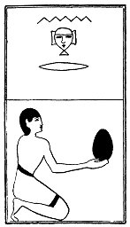

  
[Intangible Textual Heritage](../../index)  [Egypt](../index.md) 
[Index](index)  [Previous](lfo055)  [Next](lfo057.md) 

------------------------------------------------------------------------

p. 114

### THE FIFTY-SEVENTH CEREMONY.

Two Nehra cakes with the formula:--

"Osiris Unas, the Eye of Horus hath been presented unto thee, and there
hath been brought unto thee that which is intended for thy mouth."

 

   
The Sem priest presenting two Nehra cakes.

 

------------------------------------------------------------------------

[Next: The Fifty-eighth Ceremony](lfo057.md)
