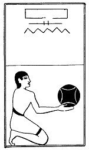

  
[Intangible Textual Heritage](../../index)  [Egypt](../index) 
[Index](index)  [Previous](lfo057)  [Next](lfo059) 

------------------------------------------------------------------------

p. 115

### THE FIFTY-NINTH CEREMONY.

Four Peten cakes, with the formula:--

"Osiris Unas, the Eye of Horus hath been presented unto thee, the
glorious one; \[these cakes\] have been baked thereby."

 

   
The Sem priest presenting the Peten, or Pasen, cakes.

 

------------------------------------------------------------------------

[Next: The Sixtieth Ceremony](lfo059)
