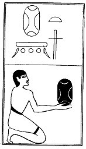

  
[Intangible Textual Heritage](../../index)  [Egypt](../index) 
[Index](index)  [Previous](lfo059)  [Next](lfo061) 

------------------------------------------------------------------------

p. 116

### THE SIXTY-FIRST CEREMONY.

Four Amta cakes, with the formula:--

"Osiris Unas, thine eye hath been presented that thou mayest take
possession of it."

 

   
The Sem priest presenting the Am-ta cakes.

 

------------------------------------------------------------------------

[Next: The Sixty-second Ceremony](lfo061)
