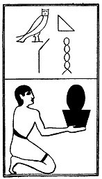

  
[Intangible Textual Heritage](../../index)  [Egypt](../index.md) 
[Index](index)  [Previous](lfo062)  [Next](lfo064.md) 

------------------------------------------------------------------------

### THE SIXTY-FOURTH CEREMONY.

Four cakes made of fine, white flour (*qemh*), with the formula:--

"Osiris Unas, the Eye of Horus, which was fettered by him \[i.e., by
Set\], hath been presented unto thee."

 

   
The Sem priest presenting the cakes of Qemh.

 

------------------------------------------------------------------------

[Next: The Sixty-fifth Ceremony](lfo064.md)
