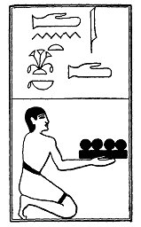

  
[Intangible Textual Heritage](../../index)  [Egypt](../index) 
[Index](index)  [Previous](lfo063)  [Next](lfo065) 

------------------------------------------------------------------------

p. 118

### THE SIXTY-FIFTH CEREMONY.

Four Atet cakes, with the formula:--

"Osiris Unas, the Eye of Horus hath been captured and placed for thee in
thy mouth."

 

   
The Sem priest presenting the Atet, or Atent, cakes.

 

------------------------------------------------------------------------

[Next: The Sixty-sixth Ceremony](lfo065)
