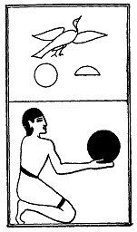

  
[Intangible Textual Heritage](../../index)  [Egypt](../index.md) 
[Index](index)  [Previous](lfo064)  [Next](lfo066.md) 

------------------------------------------------------------------------

### THE SIXTY-SIXTH CEREMONY.

Four Pat cakes, with the formula:--

"Osiris Unas, the Eye of Horus hath been presented unto thee; \[it is\]
thy cake which thou eatest."

 

   
The Sem priest presenting the Pat cakes.

 

------------------------------------------------------------------------

[Next: The Sixty-seventh Ceremony](lfo066.md)
