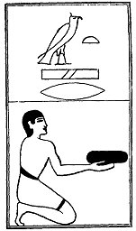

  
[Intangible Textual Heritage](../../index)  [Egypt](../index) 
[Index](index)  [Previous](lfo065)  [Next](lfo067) 

------------------------------------------------------------------------

p. 119

### THE SIXTY-SEVENTH CEREMONY.

Four Ashert cakes, with the formula:--

"Osiris Unas, the Eye of Horus, which was put under restraint by him
\[i.e., by Set\], hath been presented unto thee."

 

   
The Sem priest presenting the Ashert cakes.

 

------------------------------------------------------------------------

[Next: The Sixty-eighth Ceremony](lfo067)
