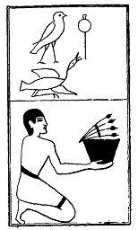

  
[Intangible Textual Heritage](../../index)  [Egypt](../index.md) 
[Index](index)  [Previous](lfo066)  [Next](lfo068.md) 

------------------------------------------------------------------------

### THE SIXTY-EIGHTH CEREMONY.

Four onions, or bunches of onions, with the formula:--

"Osiris Unas, his \[i.e., Horus's\] teeth, which are white and
health-giving, have been brought unto thee."

 

   
The Sem priest presenting the onions.

 

------------------------------------------------------------------------

[Next: The Sixty-ninth Ceremony](lfo068.md)
