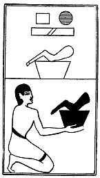

  
[Intangible Textual Heritage](../../index)  [Egypt](../index) 
[Index](index)  [Previous](lfo067)  [Next](lfo069) 

------------------------------------------------------------------------

p. 120

### THE SIXTY-NINTH CEREMONY.

A haunch of beef, with the formula:--

"Osiris Unas, accept (?) the haunch of beef \[as\] the "Eye of Horus."

 

   
The Sem priest presenting the haunch of beef.

 

------------------------------------------------------------------------

[Next: The Seventieth Ceremony](lfo069)
