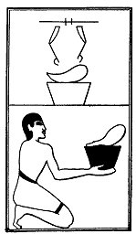

  
[Intangible Textual Heritage](../../index)  [Egypt](../index) 
[Index](index)  [Previous](lfo069)  [Next](lfo071) 

------------------------------------------------------------------------

### THE SEVENTY-FIRST CEREMONY.

A breast of an animal, with the formula:--

"Osiris Unas, the Eye of Horus hath been presented unto thee, so that it
may embrace thee."

 

   
The Sem priest presenting the breast.

 

------------------------------------------------------------------------

[Next: The Seventy-second Ceremony](lfo071)
