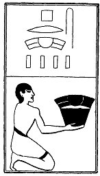

  
[Intangible Textual Heritage](../../index)  [Egypt](../index) 
[Index](index)  [Previous](lfo071)  [Next](lfo073) 

------------------------------------------------------------------------

### THE SEVENTY-THIRD CEREMONY.

Four ribs of beef (?), with the formula:--

"Osiris Unas, the enemies have been presented unto thee \[for they are
thine, and thou hast smitten them\]."

 

   
The Sem priest presenting four ribs of beef.

 

------------------------------------------------------------------------

[Next: The Seventy-fourth Ceremony](lfo073)
