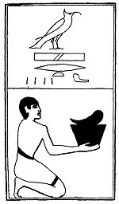

  
[Intangible Textual Heritage](../../index)  [Egypt](../index) 
[Index](index)  [Previous](lfo072)  [Next](lfo074) 

------------------------------------------------------------------------

p. 123

### THE SEVENTY-FOURTH CEREMONY.

\[Four\] pieces of roasted flesh, with the formula:--

"Osiris Unas, the things which are ordained for thee have been presented
unto thee."

 

   
The Sem priest presenting four pieces of roast meat,

 

------------------------------------------------------------------------

[Next: The Seventy-fifth Ceremony](lfo074)
