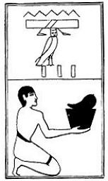

  
[Intangible Textual Heritage](../../index)  [Egypt](../index) 
[Index](index)  [Previous](lfo074)  [Next](lfo076) 

------------------------------------------------------------------------

p. 124

### THE SEVENTY-SIXTH CEREMONY.

A spleen, with the formula:--

"Osiris Unas, the Eye of Horus hath been presented unto thee, so that
thou mayest go (?) with it."

 

   
The Sem priest presenting a spleen.

 

------------------------------------------------------------------------

[Next: The Seventy-seventh Ceremony](lfo076)
