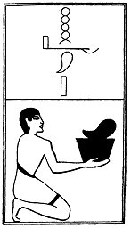

  
[Intangible Textual Heritage](../../index)  [Egypt](../index.md) 
[Index](index)  [Previous](lfo075)  [Next](lfo077.md) 

------------------------------------------------------------------------

### THE SEVENTY-SEVENTH CEREMONY.

A fore-quarter of an animal, with the formula:--

"Osiris Unas, the Eye of Horus hath been presented unto thee in the form
of his fore-quarter \[i.e., the fore-quarter, or shoulder, of Set\]."

 

   
The Sem priest presenting a fore-quarter of beef.

 

------------------------------------------------------------------------

[Next: The Seventy-eighth Ceremony](lfo077.md)
