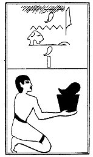

  
[Intangible Textual Heritage](../../index)  [Egypt](../index.md) 
[Index](index)  [Previous](lfo076)  [Next](lfo078.md) 

------------------------------------------------------------------------

p. 125

### THE SEVENTY-EIGHTH CEREMONY.

Slices of meat from the fore-quarter, with the formula:--

"Osiris Unas, accept(?) the Eye of Horus, which is in the form of the
fore-quarter of Set."

 

   
The Sem priest presenting joints from the forepart of a bull.

 

------------------------------------------------------------------------

[Next: The Seventy-ninth Ceremony](lfo078.md)
