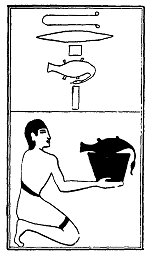

  
[Intangible Textual Heritage](../../index)  [Egypt](../index.md) 
[Index](index)  [Previous](lfo078)  [Next](lfo080.md) 

------------------------------------------------------------------------

p. 126

### THE EIGHTIETH CEREMONY.

A Therp goose, with the formula:--

"Osiris Unas, this \[goose\] hath been presented unto thee according to
thy heart's desire."

 

   
The Sem priest presenting a Therp goose.

 

------------------------------------------------------------------------

[Next: The Eighty-first Ceremony](lfo080.md)
