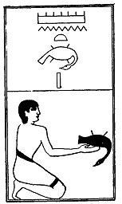

  
[Intangible Textual Heritage](../../index)  [Egypt](../index.md) 
[Index](index)  [Previous](lfo081)  [Next](lfo083.md) 

------------------------------------------------------------------------

### THE EIGHTY-THIRD CEREMONY.

A dove, with the formula:--

"Osiris Unas, the Eye of Horus hath been presented unto thee, the
glorious one, the dove which is thine."

 

   
The Sem priest presenting a dove.

 

------------------------------------------------------------------------

[Next: The Eighty-fourth Ceremony](lfo083.md)
