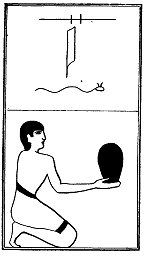

  
[Intangible Textual Heritage](../../index)  [Egypt](../index) 
[Index](index)  [Previous](lfo082)  [Next](lfo084) 

------------------------------------------------------------------------

p. 128

### THE EIGHTY-FOURTH CEREMONY.

A Saf cake, with the formula:--

"Osiris Unas, the Eye of Horus, which was put under restraint by him
\[i.e., by Set\], hath been presented unto thee."

 

   
The Sem priest presenting a Saf cake.

 

------------------------------------------------------------------------

[Next: The Eighty-fifth Ceremony](lfo084)
