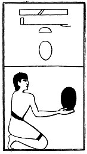

  
[Intangible Textual Heritage](../../index)  [Egypt](../index.md) 
[Index](index)  [Previous](lfo083)  [Next](lfo085.md) 

------------------------------------------------------------------------

### THE EIGHTY-FIFTH CEREMONY.

Two Shat cakes, (or, honey-cakes), with the formula:--

"Osiris Unas, the Eye of Horus hath been presented unto thee, and it
shall not be cut off from him by thee(?)."

 

   
The Sem priest presenting two Shat cakes.

 

------------------------------------------------------------------------

[Next: The Eighty-sixth Ceremony](lfo085.md)
