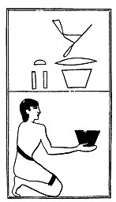

  
[Intangible Textual Heritage](../../index)  [Egypt](../index) 
[Index](index)  [Previous](lfo087)  [Next](lfo089) 

------------------------------------------------------------------------

### THE EIGHTY-NINTH CEREMONY.

Two vessels of Tchesert drink, with the formula:--

"Osiris Unas, the Eye of Horus hath been presented unto thee\[, and
there is power to it in thine hand\]." [1](#fn_77)

 

   
The Sem priest presenting two vessels of Tchesert drink.

 

------------------------------------------------------------------------

### Footnotes

[130:1](lfo088.htm#fr_77) The words in brackets
are from the text of Peta-Amen-apt.

------------------------------------------------------------------------

[Next: The Ninetieth Ceremony](lfo089)
