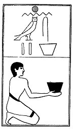

  
[Intangible Textual Heritage](../../index)  [Egypt](../index.md) 
[Index](index)  [Previous](lfo088)  [Next](lfo090.md) 

------------------------------------------------------------------------

p. 131

### THE NINETIETH CEREMONY.

Two vessels of Khenemes drink, with the formula:--

"Osiris Unas, the Eye of Horus hath been presented unto thee, and the
fire of wrath rageth in him \[i.e., Set\] against thee."

 

   
The Sem priest presenting two vessels of Khenemes drink.

 

------------------------------------------------------------------------

[Next: The Ninety-first Ceremony](lfo090.md)
