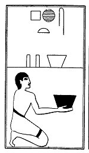

  
[Intangible Textual Heritage](../../index)  [Egypt](../index.md) 
[Index](index)  [Previous](lfo090)  [Next](lfo092.md) 

------------------------------------------------------------------------

p. 132

### THE NINETY-SECOND CEREMONY.

Two vessels of Sekhpet grain, with the formula:--

"Osiris Unas, thou art filled with that which hath been pressed out and
bath come forth from thee."

 

   
The Sem priest presenting two vessels of Sekhpet grain.

 

------------------------------------------------------------------------

[Next: The Ninety-third Ceremony](lfo092.md)
