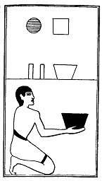

  
[Intangible Textual Heritage](../../index)  [Egypt](../index) 
[Index](index)  [Previous](lfo091)  [Next](lfo093) 

------------------------------------------------------------------------

### THE NINETY-THIRD CEREMONY.

Two vessels of Pekh grain, with the formula:--

"Osiris Unas, thou art filled with that which hath been pressed out and
bath come forth from thee."

 

   
The Sem priest presenting two vessels of Pekh grain.

 

------------------------------------------------------------------------

[Next: The Ninety-fourth Ceremony](lfo093)
