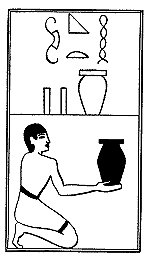

  
[Intangible Textual Heritage](../../index)  [Egypt](../index) 
[Index](index)  [Previous](lfo092)  [Next](lfo094) 

------------------------------------------------------------------------

p. 133

### THE NINETY-FOURTH CEREMONY.

Two vessels of Nubian beer, with the formula:--

"Osiris Unas, thou art filled with that which hath been pressed out and
bath come forth from thee."

 

   
The Sem priest presenting two vessels of Nubian beer.

 

------------------------------------------------------------------------

[Next: The Ninety-fifth Ceremony](lfo094)
