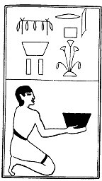

  
[Intangible Textual Heritage](../../index)  [Egypt](../index.md) 
[Index](index)  [Previous](lfo094)  [Next](lfo096.md) 

------------------------------------------------------------------------

p. 134

### THE NINETY-SIXTH CEREMONY.

Two vessels of wine of the North, with the formula:--

"Osiris Unas, \[there hath been presented unto thee that which filled
thy father, and\] [1](#fn_78.md) thy mouth hath
been opened thereby."

 

   
The Sem priest presenting two vessels of wine of the North.

 

------------------------------------------------------------------------

### Footnotes

[134:1](lfo095.htm#fr_78.md) The words in brackets
are from the text of Peta-Amen-apt.

------------------------------------------------------------------------

[Next: The Ninety-seventh Ceremony](lfo096.md)
