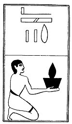

  
[Intangible Textual Heritage](../../index)  [Egypt](../index.md) 
[Index](index)  [Previous](lfo095)  [Next](lfo097.md) 

------------------------------------------------------------------------

### THE NINETY-SEVENTH CEREMONY.

Two vessels of white wine, with the formula:--

"Osiris Unas, the Eye of Horus, the glorious one,

p. 135

which he \[i.e., Set\] devoured and afterwards vomited, [1](#fn_79.md) hath been presented unto thee."

 

   
The Sem priest presenting two vessels of white wine.

 

------------------------------------------------------------------------

### Footnotes

[135:1](lfo096.htm#fr_79.md) According to the *Book
of the Dead*, Chapter CVIII., Ra. drove an iron harpoon into Set, and he
vomited all that he had eaten.

------------------------------------------------------------------------

[Next: The Ninety-eighth Ceremony](lfo097.md)
