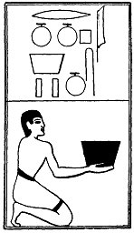

  
[Intangible Textual Heritage](../../index)  [Egypt](../index) 
[Index](index)  [Previous](lfo098)  [Next](lfo100) 

------------------------------------------------------------------------

### THE ONE HUNDREDTH CEREMONY.

Two vessels of Senu wine, or wine of Syene, or Aswan, and the formula:--

"Osiris Unas, the Eye of Horus, which hath no like, hath been presented
unto thee, and it is to thee."

 

   
The Sem priest presenting two vessels of Senu wine.

 

------------------------------------------------------------------------

[Next: The One Hundred and First Ceremony](lfo100)
