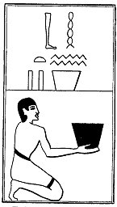

  
[Intangible Textual Heritage](../../index)  [Egypt](../index.md) 
[Index](index)  [Previous](lfo099)  [Next](lfo101.md) 

------------------------------------------------------------------------

p. 138

### THE ONE HUNDRED AND FIRST CEREMONY.

Two vessels of Hebnent wine, with the formula:--

"Osiris Unas, the Eye of Horus hath been presented unto thee, and it
hath overthrown them \[i.e., the companions of Set\]."

 

   
The Sem priest presenting two vessels of Hebnent wine.

 

------------------------------------------------------------------------

[Next: The One Hundred and Second Ceremony](lfo101.md)
