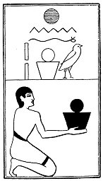

  
[Intangible Textual Heritage](../../index)  [Egypt](../index) 
[Index](index)  [Previous](lfo100)  [Next](lfo102) 

------------------------------------------------------------------------

### THE ONE HUNDRED AND SECOND CEREMONY.

Two vessels, or baskets, of Khenfu cakes, with the formula:--

"Osiris Unas, the Eye of Horus hath been presented unto thee, which hath
been made in the form of these scale-shaped cakes for thee."

 

   
The Sem priest presenting two baskets of Khenfu cakes.

 

------------------------------------------------------------------------

[Next: The One Hundred and Third Ceremony](lfo102)
