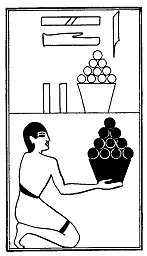

  
[Intangible Textual Heritage](../../index)  [Egypt](../index.md) 
[Index](index)  [Previous](lfo101)  [Next](lfo103.md) 

------------------------------------------------------------------------

p. 139

### THE ONE HUNDRED AND THIRD CEREMONY.

Two vessels of Ashet fruit, with the formula:--

"Osiris Unas, the Eye of Horus, which hath been snatched out of the hand
of Set, hath been presented unto thee."

 

   
The Sem priest presenting two vessels of Ashet fruit.

 

------------------------------------------------------------------------

[Next: The One Hundred and Fourth Ceremony](lfo103.md)
