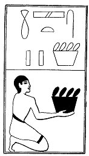

  
[Intangible Textual Heritage](../../index)  [Egypt](../index.md) 
[Index](index)  [Previous](lfo103)  [Next](lfo105.md) 

------------------------------------------------------------------------

p. 140

### THE ONE HUNDRED AND FIFTH CEREMONY.

Two vessels of Green Seshet grain, with the formula:--

"Osiris Unas, the Eye of Horus hath been presented unto thee, the Green
One, the Glorious One, and it shall serve for thy food."

 

   
The Sem priest presenting two vessels of green Seshet grain.

 

------------------------------------------------------------------------

[Next: The One Hundred and Sixth Ceremony](lfo105.md)
