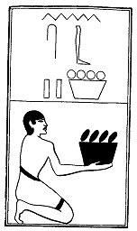

  
[Intangible Textual Heritage](../../index)  [Egypt](../index) 
[Index](index)  [Previous](lfo107)  [Next](lfo109) 

------------------------------------------------------------------------

### THE ONE HUNDRED AND NINTH CEREMONY.

Two vessels of Nebes fruit (mulberries?), with the formula:--

"Osiris Unas, the Eye of Horus, which burneth with fire against them
\[i.e., the enemies of Set\], hath been presented unto thee."

 

   
The Sem priest presenting two vessels of mulberries.

 

------------------------------------------------------------------------

[Next: The One Hundred and Tenth Ceremony](lfo109)
