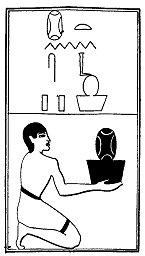

  
[Intangible Textual Heritage](../../index)  [Egypt](../index) 
[Index](index)  [Previous](lfo108)  [Next](lfo110) 

------------------------------------------------------------------------

p. 143

### THE ONE HUNDRED AND TENTH CEREMONY.

Two vessels of Nebes cakes, with the formula:--

"Osiris Unas, thine eyes have been made to open, and thou seest with
them."

 

   
The Sem priest presenting two vessels of mulberry cakes.

 

------------------------------------------------------------------------

[Next: The One Hundred and Eleventh Ceremony](lfo110)
