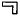

  
[Intangible Textual Heritage](../../index)  [Egypt](../index) 
[Index](index)  [Previous](lfo114) 

------------------------------------------------------------------------

p. 204

# THE LITURGY OF FUNERARY OFFERINGS.

### II. FROM THE TOMB OF PETA-AMEN-AP.

1\. THE CHAMBER WHEREIN THE CEREMONY TUAT SHALL BE PERFORMED HAVING BEEN
PROVIDED WITH OFFERINGS, THE ALTAR SHALL BE PURIFIED FOR THE KA (OR THE
DOUBLE) OF THE CHIEF KHER HEB OF NEB-HETEPET, THE PRIEST PETA-AMEN-AP.

The following shall be recited by the priest four times:--

"2. O Osiris, that which is hateful hath been seized and carried off for
thee. O chief KHER HEB PETA-AMEN-AP, that which is spoken in thy name
Thoth

p. 205

goeth about with and carrieth it to Osiris. What hath been spoken in

"3. the name of the chief KHER HEB PETA-AMEN-AP \[of\] evil hath been
brought, and I have placed it for thee in thy hand."

Here water shall be sprinkled, and the following words shall be recited
four times:--

"the fluid \[of life\] shall not be destroyed in thee, and thou shalt
not be destroyed in it."

During the recital of the following words incense shall be burned.

"4. Let him that advanceth advance with his KA. Horus advanceth with his
KA. Set advanceth with his KA. Thoth advanceth with his KA. Sep
advanceth with his KA. Khenti-maati advanceth with his KA. Osiris
advanceth with his KA. Let thy

p. 206

"5. Tet advance with thy KA. Hail, chief KHER HEB PETA-AMEN-AP! The arm
of thy KA is before thee, the arm of thy KA is behind thee. Hail, chief
KHER PETA-AMEN-AP! The foot of thy KA is before thee, the foot of thy Ka

"6. is behind thee. Hail, chief KHER PETA-AMEN-AP! I have given unto
thee the Eye of Horus, thy face is filled therewith, and the perfume of
the Eye of Horus is to thee."

The priest shall say the following words four times, and a libation,
made with one grain of Shet-pet incense and one grain of incense of
Nekheb, shall be poured out during their recital.

"7. This libation is for thee, O Osiris, this libation

p. 207

is for thee, O chief KHER HEB PETA-AMEN-AP, Coming forth from thy son,
coming forth from Horus.

"8. I have come, and I have brought unto thee the Eye of Horus, that thy
heart may be refreshed thereby. I have brought it unto thee under thy
feet, and have presented unto thee the efflux which cometh forth
therefrom.

"9. No stoppage of thy heart shall arise therefrom, and there shall be a
coming forth to thee through the word which is spoken (or the voice)."

\_\_\_\_\_\_\_\_\_\_\_\_\_\_\_\_\_\_\_\_\_

Here pour out water in which a cake of incense of Nekhebet of the South
hath been dissolved, and say:--

"10. \[Cleansing by\] *semmanu* (i.e., water of natron)! \[Cleansing
by\] *semmanu*! Open thy mouth, O chief

p. 208

\[paragraph continues\] KHER HEB PETA-AMEN-AP, and taste thou the taste
thereof in the divine hall. An emission of Horus

"11. is the cleansing water of natron, an emission of Set is the
cleansing water of natron, and the cleansing water of natron stablisheth
the heart of the Two Divine Lords. Thou art cleansed with natron, and
thou art a pure being among the divine Followers of Horus."

Here shall be poured out water in which a cake of incense of the North
from Shet-pet hath been dissolved.

"12. Thou art purified with natron, and Horus is purified with natron.
Thou art purified with natron, and Set is purified with natron. Thou art
purified with natron, and Thoth is purified with natron. Thou art
purified with natron, and Sep is purified with natron. Thou art purified
with natron, and thou art stablished among them."

p. 209

"13. Thy mouth is the mouth of a sucking calf on the day of his birth."

Here take a cake of incense, and lift it up to the face, and say:--

"14. Thou art purified with natron, and Horus is purified with natron.
Thou art purified with natron and Set is purified with natron. Thou art
purified with natron, and Thoth is purified with natron. Thou art
purified with natron, and Sep is purified with natron. Thou art purified
with natron, and thy KA is purified with natron. Thou art purified with
natron. Thou art purified with natron. Thou art purified with natron, O
thou who art stablished among

"15. the gods thy brethren, Thou art purified in respect of thy head.
Thou art purified in respect of thy mouth. Thy bones have been made pure
wholly.

p. 210

\[paragraph continues\] Thou art filled by that which cometh to thee, O
PETA-AMEN-AP I have given unto thee the Eye of Horus, and thy face is
filled therewith, and it spreadeth abroad its odour."

Here the priest shall take the instrument Kef-pesesh (i.e., "Overcomer
of the division"), and shall say:--

16\. Hail, chief KHER HEB PETA-AMEN-AP, thy two jaw-bones which were
separated have been established (i.e., restored to their former state).

Here the priest shall take the 
 *of iron of the South and the*   *of iron of the North, and
shall say*:--

"17. Hail, chief KHER HEB PETA-AMEN-AP! Thy

p. 211

mouth hath been opened for thee, O Erpa, <u>H</u>â Prince, chief KHER
HEB PETA-AMEN-AP.

"18. Hail, chief KHER HEB PETA-AMEN-AP! Thy mouth hath been opened for
thee, O Erpa, <u>H</u>â Prince, chief KHER HEB PETA-AMEN-AP."

Here shall the priest take cakes of cheese (?) of the South and of the
North, and say:--

"19. Hail, chief KHER HEB PETA-AMEN-AP, the Eye of Horus hath been
presented unto thee, and he cometh with it. I have brought it unto thee,
place, thou it in thy mouth."

Here shall the priest take Sheku cakes, and say:--

"20. Hail, chief KHER HEB PETA-AMEN-AP! Sheku cakes have been presented
unto thee, O Osiris, chief KHER HEB PETA-AMEN-AP."

p. 212

Here shall the priest take a vessel of milk and a vessel of water, and
say:--

"21. \[That which floweth\] from the breast of Horus, and is of his
body, hath been presented unto thee for thy mouth. That which cometh
from the breast of thy sister Isis, the emission of the mother, 22. hath
been seized by thee for thy mouth, and thou openest thy mouth by means
of it, O chief KHER HEB PETA-AMEN-AP."

Here shall the priest pour out fresh water of the North and of the
South, and say:--

"23. This \[is\] a libation unto thee, Osiris, a libation unto thee, O
chief KHER HEB PETA-AMEN-AP, which cometh forth from thy son. 24. I have
come and I have brought unto thee the Eye of Horus whereby thy heart
shall be refreshed. I have brought it to

p. 213

thy feet, and have presented unto thee that which bath flowed forth from
thee. No stoppage of thy heart \[shall there be\] to thee. Having it,
25. a going forth \[of things (or, persons)\] shall there be to thee
through the word."

The above shall be said four times.

\_\_\_\_\_\_\_\_\_\_\_\_\_\_\_\_\_\_\_\_\_

Here shall the priest take a black vessel and a white vessel, each
containing one hathes measure, on the right and left, and say:--

"26. That which cometh forth from the two Eyes of Horus, the White and
the Black, thou hast taken possession of, and when they are \[set\]
before thee they illumine for thee thy face."

p. 214

Here shall the priest take a cake of Hem bread of the journey for the
lifting up of the face, and say:--

"27. Ra, (i.e., Day) maketh an offering unto thee in the sky. The South
and the North make an offering unto thee. Kerh (i.e., the Night) maketh
an offering unto thee, and the Day maketh an offering unto thee. The
South and the North make an offering unto thee. An offering is brought
unto thee. An offering 28. thou seest, of an offering thou hearest.
There is an offering before thee, an offering behind thee, an offering
with thee."

Here shall the priest present five bunches of onions, and say:--

"29. O Osiris, the chief KHER HEB PETA-AMEN-AP,

p. 215

are presented unto thee the white teeth of Horus for the journey, so
that they may fill thy mouth."

Here shall the priest offer one Uten cake \[*as an offering*\] *for the
lifting up of the face, and shall say four times*:--

"30, 31. 'SUTEN TA HETEP' for the KA of the chief KHER HEB
PETA-AMEN-AP."

And he shall say four times:--

"'SUTEN TA HETEP' for the KA of the chief KHER HEB PETA-AMEN-AP."

And the KHER HEB shall say, whilst the SMER priest bringeth the two
halves of the Uten cake for the opening of the mouth, four times:--

"O Osiris, the chief KHER HEB PETA-AMEN-AP, the Eye of Horus hath been
presented unto thee, thy bread which thou eatest, and thy mouth hath
been opened thereby."

p. 216

Here shall the priest offer a white vessel containing a hathes of wine,
and say:--

"32. O chief KHER HEB PETA-AMEN-AP, the Eye of Horus hath been presented
unto thee, snatched from the hand of Set. Thou hast seized it for thy
mouth, and thou hast opened thy mouth therewith."

Here shall the priest offer a black vessel containing a hathes of wine,
and say:--

"33. O chief KHER HEB PETA-AMEN-AP, thy mouth is opened through that
which floweth from thee."

Here shall the priest offer a black vessel containing a hent of beer,
and say:--

"34. O chief KHER HEB PETA-AMEN-AP, there is presented

p. 217

unto thee that which hath been pressed \[out of thee\] and cometh forth
from thee."

Here shall the priest offer the equipment of the table of offerings, the
great one, for the lifting up of the face, [1](#fn_84) *and shall say*:--

"35, 36. O RA, may the worship which thou hast in heaven, may the
worship which thou hast from the Company of the Gods, be to the Chief
KHER HEB, the divine scribe and prophet of the Lady of Hetep,
PETA-AMEN-AP, and may everything be for the KA of the chief KHER HEB
PETA-AMEN-AP, and everything for his body, and everything every day."

Then shall the priest offer a Tept loaf, and say:--

"37. O chief KHER HEB PETA-AMEN-AP, the Eye of

p. 218

\[paragraph continues\] Horus hath been presented unto thee \[as\] thy
food (for thy tasting)."

Then shall the priest offer an Ah cake, and say:--

"38. The Ah food is spread out before thee like a field."

Then shall the priest offer a breast joint, and say:--

"39. O chief KHER HEB PETA-AMEN-AP, the Eye of Horus hath been presented
unto thee that it may be united unto thee."

Then shall the priest offer a white vessel containing a hent of wine,
and say:--

"40. O chief KHER HEB PETA-AMEN-AP, the Eye of Horus hath been presented
unto thee, which was won from the hand of Set, and was rescued for thee,
and thou dost open thy mouth with it."

p. 219

Then shall the priest offer a black vessel containing a hent of beer,
and say:--

"41. O chief KHER HEB PETA-AMEN-AP, there hath been presented Unto thee
that which hath been pressed out, and cometh forth from Osiris."

Then shall the priest offer an iron vessel containing a hent of beer,
and say:--

"42. O chief KHER HEB PETA-AMEN-AP, the Eye of Horus hath been presented
unto thee in the iron \[vessel\],which is \[ordained\] for thee, wherein
no iron cometh, it belongeth. to thee."

Then shall the priest offer a hetemet vessel containing one hent of
beer, and say:--

"43. O chief KHER HEB PETA-AMEN-AP, the Eye of Horus hath been presented
unto thee, so that thou mayest be filled thereby."

p. 220

Then shall the priest pour out a vessel of water in which three cakes of
natron have been dissolved, and say:--

"44. This \[is\] a libation unto thee, O Osiris, a libation unto thee, O
chief KHER HEB PETA-AMEN-AP, which hath come forth from thy son, which
hath come forth from Horus. 45. I have come, and I have brought unto
thee the Eye of Horus, whereby thy heart shall be refreshed. I have
brought it to thy feet, and presented unto thee that which hath flowed
46. and come forth from thee. No stoppage of thy heart \[shall there
be\] to thee with the things which come forth at the word."

The above (lines 44-46) *shall be said four times*.

\_\_\_\_\_\_\_\_\_\_\_\_\_\_\_\_\_\_\_\_\_

p. 221

Here shall the priest offer Seth heb ointment, and say:--

"47. O chief KHER HEB PETA-AMEN-AP, thine eye hath been filled (i.e.,
smeared) with *metchet* ointment."

Here shall the priest offer Heken ointment, and say:--

"48. O chief KHER HEB PETA-AMEN-AP, thine eye hath been filled (i.e.,
smeared) and no injury shall \[come\] to thy face."

Here shall the priest offer Seft ointment, and say:--

"49. O chief KHER HEB PETA-AMEN-AP, the Eye of Horus hath been presented
unto thee, and \[Set\] hath been made weak for thee thereby."

p. 222

Here shall the priest offer Nem ointment, and say:--

"50. O chief KHER HEB PETA-AMEN-AP, the Eye of Horus hath been presented
unto thee that it may unite itself unto thee."

Here shall the priest offer Tua ointment, and say:--

"51. O chief KHER HEB PETA-AMEN-AP, the Eye of Horus hath been presented
unto thee. It hath been brought \[unto thee\] that thou mayest worship
(or, give thanks to) the gods by means of it."

Here shall the priest offer the finest cedar oil and the finest oil of
the Thehennu, and say:--

"52. O ye oils which are on the forehead of Horus, O ye oils which are
on the forehead of Horus, place ye yourselves on the forehead of the
chief KHER HEB

p. 223

\[paragraph continues\] PETA-AMEN-AP! 53. Make ye him to \[smell\] sweet
in possessing you, make ye him to be a KHU (or, glorious) possessing
you, make ye him to have the mastery over his body \[again\], and make
ye him to have openings \[before\] his eyes. And let all the Spirits
(KHU) see 54. him, and let them hear his name. Behold, O Osiris, chief
KHER HEB PETA-AMEN-AP, the Eye of Horus hath been brought unto thee, and
it hath been seized for thee that it may be before thee."

Here shall the priest offer one bag of uatch eye-paint and one bag of
mestem eye-paint, and say:--

"55. O Osiris PETA-AMEN-AP, I have painted the

p. 224

\[paragraph continues\] Eye of Horus for thee with mestem so that there
may be health to thy face."

Here shall the priest offer swathings, and say:--

"56. Mayest thou watch in peace. The goddess Taatet watcheth in peace.
The goddess Taatet watcheth in peace. The Eye of Horus which is in the
city of Tep-Pe watcheth in peace. The Eye of Horus which is in the
temple houses 57. of Net (Neith) watcheth in peace. Receive the
milk-\[white\] and bleached swathings of the goddess UR-A. Cause ye, O
swathings, that the lands may bow themselves before PETA-AMEN-AP even as
they bow themselves before Horus, and make the lands to be in awe of the
OSIRIS PETA-AMEN-AP, 58. as they are in awe of Set.

p. 225

\[paragraph continues\] Let them tarry with PETA-AMEN-AP in his
divinity. Open ye his way so that he may be at the head of the Spirits
(KHU), and let him stand at the head of the Spirits, O Anpu
(Anubis)-Khent-Amenti, to the front, to the front--to the Osiris
PETA-AMEN-AP."

Here shall the priest set fire to the incense, and say:--

"59. Let him advance! Let him advance with his KA! \[As\] Horus
advanceth with his KA, \[as\] Set advanceth with his KA, \[as\] Thoth
advanceth with his KA, \[as\] Sep advanceth with his Ka, \[as\]
Khenti-maati advanceth 60. with his KA, \[so\] may advance thy backbone
with thy KA.

p. 226

"Hail, PETA-AMEN-AP! The arm of thy KA is before thee, the arm of thy KA
is behind thee.

"Hail, PETA-AMEN-AP! The foot of thy KA is before thee, the foot of thy
KA is behind thee.

"Hail, PETA-AMEN-AP! The eye of Horus hath been presented unto thee, and
thy face is filled therewith, and the perfume of the Eye of Horus
spreadeth itself over thee."

Here shall the priest pour out a vase of water wherein two cakes of
natron have been dissolved, and say:--

"62. This \[is\] a libation unto thee, O Osiris, a libation

p. 227

unto thee, O chief KHER HEB PETA-AMEN-AP, which hath come forth from thy
son, which hath come forth from Horus. I have come and I have brought
unto thee 63. the Eye of Horus, whereby thy heart shall be refreshed. I
have brought it to thy feet, and have presented unto thee that which
hath flowed forth and come out from thee. No stoppage of thy heart
\[shall there be\] to thee. \[Possessing it\] a going forth of things
(or, persons) shall be to thee at the \[sound of\] the voice."

The above (lines 62, 63) *shall be recited four times*.

### PART II.

Here shall be set forth the food and drink and the things which are to
be placed on the altar, and one shall enter with the offerings of food.
And the priest shall say:--

"64. It is Thoth who returneth bringing it (i.e.,

p. 228

"he Eye of Horus). *And then shall be said*: "He cometh forth with the
Eye of Horus. 65. He hath given the Eye of Horus, and he is content
therewith."

Here shall the priest present two cakes, and say:--

"66. O chief KHER HEB PETA-AMEN-AP, the Eye of Horus hath been presented
unto thee, and he is content therewith."

Here shall the priest present two vessels \[of beer\] *in the usekh
chamber, and say*:--

"67. O chief KHER HEB PETA-AMEN-AP, the Eye of Horus hath been presented
unto thee, and he is content therewith."

p. 229

He who sitteth down by the offering shall say:--

"68. I have seated myself with it."

Here shall the priest present for the Ush a Tua cake and a Shens cake,
and say:--

"69. O Osiris, the chief KHER HEB PETA-AMEN-AP, the Eye of Horus hath
been presented unto thee, and it hath been offered to thee for thy
mouth."

Here shall the priest present a Tut cake, and say:--

"70. O Osiris, the chief KHER HEB PETA-AMEN-AP, the Eye of Horus hath
been presented unto thee for the smiting down of Set."

Here shall the priest offer a Rethu cake, and say:--

"71. O Osiris, the chief KHER HEB PETA-AMEN-AP, the Eye of Horus hath
been presented unto thee which was chained up \[by Set\]."

p. 230

Here shall the priest offer a nemset vessel of Tcheser drink, and say:--

"72. O Osiris, the chief KHER HEB PETA-AMEN-AP, the Eye of Horus hath
been presented unto thee, which entered into Set."

Here shall the priest offer a nemset vessel of Khenemes beer, and say:--

"73. O Osiris, the chief KHER HEB PETA-AMEN-AP, the Eye of Horus hath
been presented unto thee, which hath been smitten, for thy mouth."

Here shall the priest lift up a cake and a vessel of beer, and say:--

"74. O Osiris, the chief KHER HEB PETA-AMEN-AP, the Eye of Horus hath
been presented unto thee, it

p. 231

hath been lifted for thee to thy face, Osiris, lifting \[it\] to thy
face, O PETA-AMEN-AP. May thy soul advance from afar off. 75. Fix thy
gaze intently on that which cometh forth from it. That which is corrupt
in thee hath been washed away, O PETA-AMEN-AP, and thy mouth hath been
opened by the Eye of Horus."

Here shall the priest offer as a shebu a Tua cake, and a Shens cake, and
say:--

"76. Let there be praise to thyself and to thy KA, O Osiris, which hath
been cut away from the hand of him that doeth violence to the dead, O
KHER HEB PETA-AMEN-AP. Thou hast received 77. all these cakes which have
come forth from the Eye of Horus."

p. 232

And he shall say:--

"O Chief KHER HEB PETA-AMEN-AP, I have brought unto thee that which was
mixed for thee, so that thou mayest be filled with that which hath been
pressed out and cometh forth from thee."

Here shall the priest offer the Sut joint of meat, and as he presenteth
it four times to Peta-Amen-ap, he shall say four times:--

"78. O chief KHER HEB PETA-AMEN-AP, the Sut joint of meat hath been
presented unto thee \[as\] the Eye of Horus."

Here shall the priest offer two vases of water, and as he presenteth
them to Peta-Amen-ap four times, he shall say four times:--

"79. O chief KHER HEB PETA-AMEN-AP, the water which is herein is offered
unto thee."

p. 233

Here shall the priest offer two vessels of cakes of cleansing natron,
and as he presenteth them four times to Peta-Amen-ap, he shall say four
times:--

80\. O chief KHER HEB PETA-AMEN-AP, the Eye of Horus hath been presented
unto thee that it may purify thy mouth."

Here shall the priest offer for the Ush a Tua cake and a Shens cake, and
as he presenteth them four times to Peta-Amen-ap, he shall say four
times:--

"81. O chief KHER HEB PETA-AMEN-AP, the Eye of Horus hath been
p-resented unto thee, and it hath been offered unto thee for thy mouth."

Here shall the priest offer a Tut cake, and as he presenteth it to
Peta-Amen-ap four times, he shall say four times:--

82\. O chief KHER HEB PETA-AMEN-AP, the Eye of

p. 234

\[paragraph continues\] Horus hath been presented unto thee, which
struck down Set."

Here shall the priest offer a Rethu cake, and as he presenteth it to
Peta-Amen-ap four times, he shall say four times:--

"83. O chief KHER HEB PETA-AMEN-AP, the Eye of Horus hath been presented
unto thee, which was put under restraint \[by Set\]."

Here shall the priest offer a Hutcha cake, and as he presenteth it to
Peta-Amen-ap four times, he shall say four times:---

"84. O chief KHER HEB PETA-AMEN-AP, the Eye of Horus hath been presented
unto thee, that thou mayest seize it for thy mouth."

p. 235

Here shall the priest offer a Neher cake, and as he presenteth it to
Peta-Amen-ap four times, he shall say four times:--

"85. O chief KHER HEB PETA-AMEN-AP, there hath been brought unto thee
that which is intended for thy mouth."

Here shall the priest offer a Tept cake, and as he presenteth it to
Peta-Amen-ap four times, he shall say four times:--

"86. O chief KHER HEB PETA-AMEN-AP, the Eye of Horus hath been presented
unto thee, that thou mayest taste \[it\]."

Here shall the priest offer a Pasen cake, and as he presenteth it to
Peta-Amen-ap four times, he shall say four times:--

"87. O chief KHER HEB PETA-AMEN-AP, the Eye of Horus, the glorious one,
hath been presented unto thee; it hath been baked thereby."

p. 236

Here shall the priest offer a Shens cake, and as he presenteth it to
Peta-Amen-ap four times, he shall say four times:--

"88. O chief KHER HEB PETA-AMEN-AP, thou hast received thy head."

Here shall the priest offer an Am-ta cake, and as he presenteth it to
Peta-Amen-ap four times, he shall say four times:--

"89. O Chief KHER HEB PETA-AMEN-AP, the Eye of Horus hath been presented
unto thee \[that\] thou mayest seize it."

Here shall the priest offer a Khenf cake, and as he presenteth it to
Peta-Amen-ap four times, he shall say four times:--

90\. O chief KHER HEB PETA-AMEN-AP, the Eye of

p. 237

\[paragraph continues\] Horus hath been presented unto thee, which hath
been made in the form of a fish scale for thee."

Here shall the priest offer a cake of Hebnen paste, and as he presenteth
it four times, he shall say four times:--

"91. O chief KHER HEB PETA-AMEN-AP, the Eye of Horus hath been presented
unto thee, so that it may well up before thee."

Here shall the priest offer a cake made of fine white flour, and as he
presenteth it to Peta-Amen-ap four times, he shall say four times:--

"92. O chief KHER HEB PETA-AMEN-AP, the Eye of Horus hath been presented
unto thee, which was fettered \[by Set\]."

p. 238

Here shall the priest offer an Aten cake, and as he presenteth it to
Peta-Amen-ap four times, he shall say four times:--

"93. O chief KHER HEB PETA-AMEN-AP, the Eye of Horus hath been presented
unto thee, and placed for thee in thy mouth."

Here shall the priest offer a cake (Paut), and as he presenteth it to
Peta-Amen-ap four times, he shall say four times:--

"94. O chief KHER HEB PETA-AMEN-AP, the Eye of Horus hath been presented
unto thee, thy cake which thou eatest."

Here shall the priest offer a baked cake (Ta asher), and as he
presenteth it to Peta-Amen-ap four times, he shall say four times:--

"95. O chief KHER HEB PETA-AMEN-AP, there hath been presented unto thee
that which is destined for thee."

p. 239

Here shall the priest offer a bunch of onions, and as he presenteth them
to Peta-Amen-ap four times, he shall say four times:--

"96. O chief KHER HEB PETA-AMEN-AP, the white teeth of Horus have been
presented unto thee, which are strength\[-giving\]."

Here shall the priest offer a haunch of beef, and as he presenteth it to
Peta-Amen-ap four times, he shall say four times:--

"97. O chief KHER HEB PETA-AMEN-AP, the thigh hath been presented unto
thee \[as\] the Eye of Horus."

Here shall the priest offer an Aa joint, and as he presenteth it to
Peta-Amen-ap four times, he shall say four times:--

"98. O chief KHER HEB PETA-AMEN-AP, the mark of that which is abominable
is burnt into the *Aa* joint."

p. 240

Here shall the priest offer a joint from the breast of the animal, and
as he presenteth it to Peta-Amen-ap four times, he shall say four
times:--

"99. O chief KHER HEB PETA-AMEN-AP, the Eye of Horus hath been presented
unto thee so that it may embrace thee."

Here shall the priest offer the Sut joint, and as he presenteth it to
Peta-Amen-ap four times, he shall say four times:--

"100. O chief KHER HEB PETA-AMEN-AP, the Sut joint hath been presented
unto thee as the Eye of Horus."

Here shall the priest offer four ribs of the animal, and as he
presenteth them, to Peta-Amen-ap four times, he shall say four times:--

"101. O chief KHER HEB PETA-AMEN-AP, the enemies have been presented
unto thee, for they are thine, and thou hast smitten them."

p. 241

Here shall the priest offer four pieces of roasted flesh, and as he
presenteth them to Peta-Amen-ap four times, he shall say four times:--

"102. O chief KHER HEB PETA-AMEN-AP, there have been presented unto thee
the things which are ordained for thee."

Here shall the priest offer a liver, and as he presenteth it to
Peta-Amen-ap four times, he shall say four times:--

"103. O chief KHER HEB PETA-AMEN-AP, the Eye of Horus hath been
presented unto thee, that thou mayest go about with it."

Here shall the priest offer three pieces of the joint Ne\[*n*\]*shem,
and as he presenteth them to Peta-Amen-ap four times, he shall say four
times*:--

"104. O chief KHER HEB PETA-AMEN-AP, the Eye of

p. 242

Horus hath been presented unto thee, and one cometh unto thee with it."

Here shall the priest offer the <u>H</u>â joint (shoulder), and as he
presenteth it to Peta-Amen-ap four times, he shall say four times:--

"105. O chief KHER HEB PETA-AMEN-AP, the Eye of Horus hath been
presented unto thee in the form of his forepart (i.e., shoulder of
Set)."

Here shall the priest offer the flesh of the shoulder, and as he
presenteth it to Peta-Amen-ap four times, he shall say four times:--

"106. O chief KHER HEB PETA-AMEN-AP, the Eye of Horus there hath been
presented unto thee as the shoulder of Set."

p. 243

Here shall the priest offer a goose, and as he presenteth it unto
Peta-Amen-ap four times, he shall say four times:--

"107. O chief KHER HEB PETA-AMEN-AP, a *Sera* goose hath been presented
unto thee instead of the heads of the followers of Set."

Here shall the priest offer a Therp goose, and as he presenteth it to
Peta-Amen-ap four times, he shall say four times:--

"108. O chief KHER HEB PETA-AMEN-AP, this \[goose\] according to the
desire of \[thy\] heart hath been presented unto thee."

Here shall the priest offer a Set goose, and as he presenteth it to
Peta-Amen-ap four times, he shall say four times:--

"109. O chief KHER HEB PETA-AMEN-AP, the Eye of Horus hath been
presented unto thee, and one beareth it unto thee."

p. 244

Here shall the priest offer a Sert goose, and as he presenteth it unto
Peta-Amen-ap four times, he shall say four times:--

"110. O chief KHER HEB PETA-AMEN-AP, have been presented unto thee the
things which come for thee."

Here shall the priest offer a dove, and as he presenteth it to
Peta-Amen-ap four times, he shall say four times:--

"111. O chief KHER HEB PETA-AMEN-AP, the Eye of Horus hath been
presented unto thee, the glorious (c one, the dove which is ordained (?)
for thee"

Here shall the priest offer some Saf meal, and as he presenteth it to
Peta-Amen-ap four times, he shall say four times:--

"112. O chief KHER HEB PETA-AMEN-AP, the Eye of Horus, which was
fettered by him \[i.e., Set\], hath been presented unto thee."

p. 245

Here shall the priest offer some Shat dough, and as he presenteth, it to
Peta-Amen-ap four times, he shall say four times:--

"113. O chief KHER HEB PETA-AMEN-AP, the Eye of Horus hath been
presented unto thee, and thou shalt not participate in its cutting off."

Here shall the priest offer two vessels of Nepat grain, and as he
presenteth, them to Peta-Amen-ap four times, he shall say four times:--

"114. O chief KHER HEB PETA-AMEN-AP, the Eye of Horus, which hath been
reckoned up, \[hath been presented unto thee\]."

Here shall the priest offer two vessels of Mest grain, and as he
presenteth them to Peta-Amen-ap four times, he shall say four times:--

115, O chief KHER HEB PETA-AMEN-AP, the Eye of

p. 246

\[paragraph continues\] Horus hath been presented unto thee, and that
which floweth from it \[hath been brought to thee\]."

Here shall the priest offer two vessels of Tchesert beer, and as he
presenteth them to Peta-Amen-ap four times, he shall say four times:--

"116. O chief KHER HEB PETA-AMEN-AP, the Eye of Horus hath been
presented unto thee, \[which\] entered into Set."

Here shall the priest offer two vessels of Tchesert beer, and as he
presenteth them to Peta-Amen-ap four times, he shall say four times:---

"117. O chief KHER HEB PETA-AMEN-AP, the Eye of Horus hath been
presented unto thee, and there is power to it in thine hand."

p. 247

Here shall the priest offer two vessels of Khenemes beer, and as he
presenteth them to Peta-Amen-ap four times, he shall say four times:--

"118. O chief KHER HEB PETA-AMEN-AP, the Eye of Horus hath been
presented unto thee, and the fire of wrath rageth in him against thee."

Here shall the priest offer two vessels of Heqt beer, and as he
presenteth them to Peta-Amen-ap four times, he shall say four times:--

"119. O chief KHER HEB PETA-AMEN-AP, \[thou art\] filled with that which
hath been pressed out and hath come forth from thee."

Here shall the priest offer two vessels of Sekh-pet grain, and as he
presenteth them to Peta-Amen-ap four times, he shall say four times:--

"120. O chief KHER HEB PETA-AMEN-AP, \[thou art\] filled with that which
hath been pressed out and hath come forth from thee."

p. 248

Here shall the priest offer two vessels of Pekh grain, and as he
presenteth them to Peta-Amen-ap four times, he shall say four times:--

"121. O chief KHER HEB PETA-AMEN-AP, thou art filled with that which
hath been pressed out and hath come forth from thee."

Here shall the priest offer two vessels of Heqt and Nubian beer, and as
he presenteth them to Peta-Amen-ap four times, he shall say four
times:--

"122. O chief KHER HEB PETA-AMEN-AP, thou art filled with that which
hath been pressed out and hath come forth from thee."

Here shall the priest offer two baskets of figs, and as he presenteth
the in to Peta-Amen-ap four times, he shall say four times:--

123\. O chief KHER HEB PETA-AMEN-AP, the breast

p. 249

of Horus hath been presented unto thee, and the gods eat it together
with thee."

Here shall the priest offer two vessels of wine of the North, and as he
presenteth them to Peta-Amen-ap four times, he shall say four times:--

"124. O chief KHER HEB PETA-AMEN-AP, there hath been presented unto thee
that which filled thy father, and thy mouth hath been opened thereby."

Here shall the priest offer two measures of white wine, and as he
presenteth them to Peta-Amen-ap four times, he shall say four times:---

"125. O chief KHER HEB PETA-AMEN-AP, the Eye of Horus hath been
presented unto thee, which was vomited by him \[i.e., Set\], the
glorious one which he devoured."

p. 250

Here shall the priest offer two measures of Amt wine, and as he
presenteth them to Peta-Amen-ap four times, he shall say four times:--

"126. O chief KHER HEB PETA-AMEN-AP, the child (i.e., pupil) which is in
the Eye of Horus hath been presented unto thee, and thou hast opened thy
mouth by means of it."

Here shall the priest offer two measures of Hetem wine, and as he
presenteth them to Peta-Amen-ap four times, he shall say four times:--

"127. O chief KHER HEB PETA-AMEN-AP, the Eye of Horus which was snared
in a net hath been presented unto thee, and thou hast opened thy mouth
by means of it."

Here shall the priest offer two measures of Senu wine, and as he
presenteth them to Peta-Amen-ap four times, he shall say four times:--

"128. O chief KHER HEB PETA-AMEN-AP, the Eye of Horus hath been
presented unto thee, there is nothing like unto it, and it belongeth
unto thee."

p. 251

Here shall the priest offer two measures of Hebnent wine, and as he
presenteth them to Peta-Amen-ap four times, he shall say four times:--

"129. O chief KHER HEB PETA-AMEN-AP, the Eye of Horus hath been
presented unto thee, and it hath brought about their overthrow (i.e., of
the companions of Set)."

Here shall the priest offer two measures of Khenfu cakes, and as he
presenteth them to Peta-Amen-ap four times, he shall say four times:--

"130. O chief KHER HEB PETA-AMEN-AP, the Eye of Horus hath been
presented unto thee which is made in the form of scale-shaped \[cakes\]
for thee."

Here shall the priest offer two measures of Ashet fruit, and as he
presenteth them to Peta-Amen-ap four times, he shall say four times:--

"131. O chief KHER HEB PETA-AMEN-AP, the Eye of

p. 252

\[paragraph continues\] Horus hath been presented unto thee, which was
snatched out of the hand of Set."

Here shall the priest offer two measures of White Seshet grain, and as
he presenteth them, to Peta-Amen-ap four times, he shall say four
times:--

"132. O chief KHER HEB PETA-AMEN-AP, the Eye of Horus hath been
presented unto thee, the White one, and it shall serve for thy food."

Here shall the priest offer two measures of Green Seshet grain, and as
he presenteth them to Peta-Amen-ap four times, he shall say four
times:--

"133. O chief KHER HEB PETA-AMEN-AP, the Eye of Horus hath been
presented unto thee, the Green one, and it shall serve for thy food."

p. 253

Here shall the priest offer two measures of roasted Set grain, and as he
presenteth them, to Peta-Amen-ap four times, he shall say four times:--

"134. O chief KHER HEB PETA-AMEN-AP, the Eye of Horus, the glorious one,
hath been presented unto thee, and it shall repulse attack on thee."

Here shall the priest offer two measures of roasted Set grain, and as he
presenteth them to Peta-Amen-ap four times, he shall say four times:--

"135. O chief KHER HEB PETA-AMEN-AP, the Eye of Horus, the protected
one, hath been presented unto thee, and it shall repulse attack on
thee."

Here shall the priest offer two measures of Babat grain, and as he
presenteth them to Peta-Amen-ap four times, he shall say four times:--

"136. O chief KHER HEB PETA-AMEN-AP, the Eye of Horus hath been
presented unto thee, and it is from the hand of Baba."

p. 254

Here shall the priest offer two measures of Nebes fruit (*mulberries*?),
*and as he presenteth them to Peta-Amen-ap four times, he shall say four
times*:--

"137. O chief KHER HEB PETA-AMEN-AP, the Eye of Horus hath been
presented unto thee, which burned with fire against them (i.e., the
fiends of Set),"

Here shall the priest offer two measures of Nebes cakes, and as he
presenteth them to Peta-Amen-ap four times, he shall say four times:--

"138. O chief KHER HEB PETA-AMEN-AP, thine eyes have been opened, and
thou seest with them."

Here shall the priest offer two measures of Hua grain, and as he
presenteth them to Peta-Amen-ap four times, he shall say four times:--

139\. O chief KHER HEB PETA-AMEN-AP, the Eye of

p. 255

\[paragraph continues\] Horus hath been presented unto thee, the
glorious one who was in his (i.e., Set's) throat."

Here shall the priest offer two measures of all kinds of sweet things,
and as he presenteth them to Peta-Amen-ap four times, he shall say four
times:--

"140. O chief KHER HEB PETA-AMEN-AP, the Eye of Horus hath been
presented unto thee, which is sweet in everything that belongeth to it."

Here shall the priest offer a basket of all kinds of spring products,
and as he presenteth it to Peta-Amen-ap four times, he shall say four
times:--

"141. O chief KHER HEB PETA-AMEN-AP, the Eye of Horus hath been
presented unto thee, and thou hast had experience of it."

p. 256

Here shall the priest offer a measure of gifts of all kinds, and as he
presenteth it to Peta-Amen-ap four times, he shall say four times:--

"142. O chief KHER HEB PETA-AMEN-AP, the Eye of Horus hath been
presented unto thee, and there hath gone down into the throat for thee
that which belongeth to thee.

"143. Hail, chief KHER HEB PETA-AMEN-AP, one standeth and sitteth down
by the thousands of cakes, and \[vessels of\] beer, and roasted meat, by
thine altar in Amentet, which is filled with holy offerings for the
meals of the dead."

------------------------------------------------------------------------

### Footnotes

[217:1](lfo115.htm#fr_84) Perhaps, "to be lifted
up before the face."
