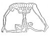

  
[Intangible Textual Heritage](../../index)  [Egypt](../index.md) 
[Index](index)  [Next](pyt01.md) 

------------------------------------------------------------------------

# The Pyramid Texts

## Translation by Samuel A. B. Mercer

###### *Professor Emeritus of Semitic Languages and Egyptology*

###### *Trinity* *College in the University of Toronto*

[  
Click to enlarge](img/title.jpg.md)

#### LONGMANS, GREEN & CO.

#### NEW YORK, LONDON, TORONTO

\[1952\]

###### Scanned at Intangible Textual Heritage, May 2004. John Bruno Hare, redactor. This text is in the public domain because it was not registered or renewed in a timely fashion at the US Copyright Office. GATT renewal does not apply to this work because it was published simultaneously in Toronto and New York. These files may be used for any non-commercial purpose, provided this notice of attribution is left intact in all copies.

   
Image: excerpts from verso (note 'Published simultaneously')

*Dedicated to the Zion Research Foundation  
by whose generosity  
the publication of this work has been translated  
from dream into reality*

------------------------------------------------------------------------

[Next: Preface](pyt01.md)
