  
[Intangible Textual Heritage](../../index)  [Egypt](../index.md) 
[Index](index)  [Previous](trs01)  [Next](trs03.md) 

------------------------------------------------------------------------

*The Rosetta Stone*, by E.A.W. Budge, \[1893\], at Intangible Textual
Heritage

------------------------------------------------------------------------

Greek writers upon Egyptian
hieroglyphics.To **Hecataeus** of Miletus, [1](#fn_5.md) who visited Egypt between B.C. 513-501, we
owe, through **Herodotus**, much knowledge of Egypt, and he must be
considered the earliest Greek writer upon Egypt. **Hellanitus** of
Mytilene, B.C. 478-393, shows in his Αιγυπτιακὰ that he has some
accurate knowledge of the meaning of some hieroglyphic words. [2](#fn_6.md) Democritus wrote upon the hieroglyphics of
Meroë, [3](#fn_7.md) but this work is lost.
**Herodotus** says that the Egyptians used two quite different kinds of
writing, one of which is called sacred (hieroglyphic), the other
common [4](#fn_8) (demotic.md). **Diodorus** says
that the Ethiopian letters are called by the Egyptians
"hieroglyphics." [5](#fn_9.md) **Strabo**, speaking
of the obelisks at Thebes, says that there are inscriptions upon them
which proclaim the riches and power of their kings, and that their rule
extends even to Scythia, Bactria, and India. [6](#fn_10.md) **Chaeremon** of Naucratis, who lived in
the first half of the first century after Christ, [7](#fn_11.md) and who must be an entirely different
person from Chaeremon the companion of Aelius Gallus (B.C. 25),

p. 113

Greek writers upon Egyptian
hieroglyphics.derided by Strabo, [1](#fn_12.md) and charged with lying by Josephus, [2](#fn_13.md) wrote a work on Egyptian
hieroglyphics [3](#fn_14.md), περὶ τῶν ἱερῶν
γραμμάτων, which has been lost. He appears to have been attached to the
great library of Alexandria, and as he was a "sacred scribe," it may
therefore be assumed that he had access to many important works on
hieroglyphics, and that he understood them. He is mentioned by
Eusebius [4](#fn_15.md) as Χαιρήμων ὁ
ἱερογραμματεύς, and by Suidas, [5](#fn_16.md) but
neither of these writers gives any information as to the contents of his
work on hieroglyphics, and we should have no idea of the manner of work
it was but for the extract preserved by John
Tzetzes on Egyptian hieroglyphics.**John Tzetzes** (Τζέτζης, born
about AḌ. 1110, died after AḌ. 1180). Tzetzes was a man of considerable
learning and literary activity, and his works [6](#fn_17.md) have value on account of the lost books
which are quoted in them. In his *Chiliades* [7](#fn_18) (Bk. V., line 395.md) he speaks of ὁ
Αἰγύπτιος ἱερογραμματεὺς Χαιρήμων, and refers to Chaeremon's διδάγματα
τῶν ἱερῶν γραμμάτων. In his Exegesis of Homer's Iliad he gives an
extract from the work itself, and we are able to see at once that it was
written by one who was able to give his information at first hand. This
interesting extract was first brought to the notice of the world by the
late Dr. Birch, who published a paper on it in the *Transactions of the
Royal Society of Literature*, Vol. III., second series, 1850, pp.
385-396. In it he quoted the Greek text of the extract, from the edition
of Tzetzes' *Exegesis*, first published by Hermann, [8](#fn_19.md) and added remarks and hieroglyphic
characters illustrative of it, together with the scholia of Tzetzes, the
text of which he emended in places. As this extract is so important for
the history of

p. 114

the study of hieroglyphics, it is given here, together with the scholia
on it, from the excellent edition of the Greek text, by Lud. Bachmann,
*Scholia in Homeri Iliadem*, Lipsiae, 1835, pp. 823, § 97 and 838, with
an English translation.

Extract from Tzetzes' work on the Iliad

[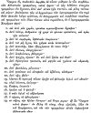  
Click to enlarge](img/11400.jpg.md)  
  

Translation of the extract."Now, Homer
says this as he was accurately instructed in all learning by means of
the symbolic Ethiopian characters. For the Ethiopians do not use
alphabetic characters, but depict animals of all sorts instead, and
limbs and members of these animals; for the sacred scribes in former
times desired

p. 115

to conceal their opinion about the nature of the gods, and therefore
handed all this down to their own children by allegorical methods and
the aforesaid symbols and characters, as the sacred scribe Chaeremon
says."

Accuracy of Tzetzes' statements proved.1.
"And for *joy*, they would depict a woman beating a tambourine."

\[The drum or tambourine was used in the temples for festival services,
and a woman beating a tambourine is the determinative of the words  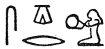 *seḳer*, "to beat a
tambourine," and  
*ṭechennu*.\]

2\. "For *grief*, a man clasping his chin in his hand and bending
towards the ground."

\[A man, seated, with his hand to his mouth,  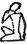 is the determinative of the
word  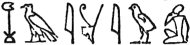 *chaȧnȧu*, "grief."
A seated woman with head bent and hands thrown up before her face, is
the determinative of  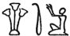
*ḥath*, "to weep."\]

3\. "For *misfortune*, an eye weeping."

\[The weeping eye  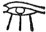 is the
determinative of the common word 
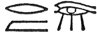 *rem*," to weep."\]

4, "For *want*, two hands stretched out empty."

\[Compare  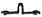, *ȧt*, "not to
have," "to be without." Coptic 
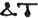.\]

5\. "For *rising*, a snake coming out of a hole."

\[Compare  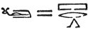 *per*," to
come forth, to rise" (of the sun) \]

6\. "For *setting*, \[the same\] going in."

\[Compare  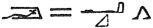 *āq*, "to
enter, to set" (of the sun).\]

7\. "For *vivification*, a frog." [1](#fn_20.md)

\[The frog  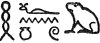, *ḥefennu*,
means 100,000, hence fertility and abundance of life.\]

p. 116

Accuracy of Tzetzes' statements proved.8.
"For soul, a hawk; and also for *sun* and *god*."

\[Compare  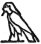 *ba*, "soul,"
 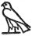 *neter*, "god," and
 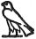 *Ḥeru*, "Horus" or "the
Sun-god."\]

9\. "For a female-bearing woman, and *mother* and *time* and *sky*, a
vulture."

\[ 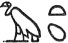 *mut*, "mother," is
the common meaning of a vulture, and at times the goddess Mut seems to
be identified with  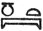
*nut*, "the sky." Horapollo says that the vulture also meant "year" (ed.
Leemans, p. 5), and this statement is borne out by the evidence of the
hieroglyphics, where we find that 
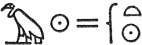 *renpit*, "year."\]

10\. "For *king*, a bee."

\[Compare  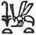 *suten net*,
"king of the North and South."\]

11\. "For *birth* and *natural growth*, and males, a beetle."

\[The beetle  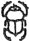 *xeperȧ*
was the emblem of the god *Cheperȧ* 
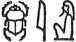, who is supposed to have created or evolved himself,
and to have given birth to gods, men, and every creature and thing in
earth and sky. The word  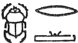
means "to become," and in late texts 
 *cheperu* may be fairly well rendered by
"evolutions." The meaning male comes, of course, from the idea of the
ancients that the beetle had no female. See *infra*, under *Scarab*.\]

12\. "For *earth*, an ox."

\[ 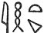 *ȧḥet* means field,
and  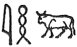 *ȧḥ* means "ox"; can
Chaeremon have confused the meanings of these two words, similar in
sound?\]

13\. "And the fore part of a lion signifies *dominion* and *protection*
of every kind."

p. 117

Accuracy of Tzetzes' statements proved.

\[Compare  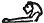 *ḥā*, "chief,
that which is in front, duke, prince."\]

14\. "A lion's tail, necessity."

\[Compare   *peḥ*, "to
force, to compel, to be strong."\]

15, 16. "A stag, *year;* likewise the *palm*."

\[Of the stag meaning "year" I can give no example. The palm branch
  or   *renpit*, is the common word
for "year."\]

17\. "The boy signifies *growth*."

\[Compare  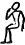 which is the
determinative of words meaning "youth" and juvenescence.\]

18\. "The old man, *decay*."

\[Compare  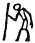, the
determinative of  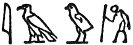 *ȧan*,
"old age."\]

19\. "The bow, the *swift* power."

\[The Egyptian word for bow is 
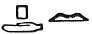 *peṭ*. Compare 
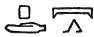 *peṭ*, "to run, to flee away."\]

"And others by the thousand. And by means of these characters Homer says
this. But I will proceed in another place, if you please, to explain the
pronunciation of those characters in Ethiopic fashion, as I have learnt
it from Chaeremon." [1](#fn_21.md)

Extract from Tzetzes.In another
place [2](#fn_22.md) Tzetzes says, "Moreover, he
was not uninitiated into the symbolic Ethiopian characters, the nature
of which we will expound in the proper places. All this demonstrates
that Homer was instructed in Egypt," ναὶ μὴν οὐδὲ τῶν Αἰθιοπικῶν
συμβολικῶν γραμμάτων ἀμύητος γέγονε, περὶ ὧν ἐν τοῖς οἰκείοις τόποις
διδάξομεν ὁποῖα εἰσι. καὶ ταῦτα δὲ τὸν Ὅμηρον ἐν Αἰγύπτῳ παιδευθῆναι
παραδεικνύουσι and upon this the scholia on Tzetzes say:— Περὶ τῶν
Αἰθιοπικῶν γραμμάτων Διό\[δωρος\] μὲν ἐπεμνήσθη, καὶ μερικῶς εἶπεν, ἀλλ᾽
ὥσπερ ἐξ ἀκοῆς ἄλλου μαθὼν καὶ οὐκ

p. 118

ἀκριβῶς αὐτὸς ἐπιστάμενος \[εἰ\] καί τινα τούτων καέλεξεν ὥσπερ ἐν οἷς
ὀ͂ιδε παῤῥησιάζεται. Χαιρήμων δὲ ὁ ἱερογραμματεὺς ὅλην βίβλον περὶ τῶν
τοιούτων γραμμάτων συνέταξεν. ἅτινα, ἐν τοῖς τρο\[σφόροις\] τόποις τῶν
Ὁμηρείων ἐπῶν ἀ\[κρι\]βέστερον καὶ πλατυτέρωσ ἐρῶ [1](#fn_23.md) "Diodorus made mention of the Ethiopian
characters and spoke particularly, yet as though he had learnt by
hearsay from another and did not understand them accurately himself,
although he set down some of them, as though he were talking confidently
on subjects that he knew. But Chaeremon the sacred scribe compiled a
whole book about the aforesaid characters, which I will discuss more
accurately and more fully in the proper places in the Homeric poems." It
is much to be regretted that Chaeremon's work, if he ever fulfilled his
promise, has not come down to us.

Greek translation of Egyptian text by
Hermapion.One of the most valuable extracts from the works of
Greek and Roman writers on Egypt is that from a translation of an
Egyptian obelisk by **Hermapion**, preserved by Ammianus
Marcellinus; [2](#fn_24.md) unfortunately, however,
neither the name of Hermapion's work nor the time in which he lived is
known. This extract consists of the Greek translation of six lines of
hieroglyphics: three lines are from the south side of the obelisk, one
line from the east side, and a second and a third line from the other
sides. A comparison of the Greek extract with any inscription of Rameses
II. on an obelisk shows at once that Hermapion must have had a certain
accurate knowledge of hieroglyphics; his translation of the lines,
however does not follow consecutively. The following examples will show
that the Comparison of Greek translation with the
Egyptian text.Greek, in many cases, represents the Egyptian very
closely. Λέγει Ἥλιος βασιλεῖ Ῥαμέστῃ· δεδώρημαί σοι ἀνὰ πᾶσαν οἰκουμένην
μετὰ χαρᾶς βασιλεύιν, ὃν Ἥλιος φιλεῖ =

 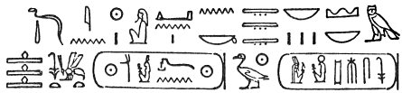

"Says Rā, I give to thee all lands and foreign countries with rest of
heart, O king of the north and south, Usr-maāt-Rā-setep-en-Rā,

p. 119

son of the Sun, Rameses, beloved of Ȧmen-Rā." Θεογέννητος κτιστὴς τῆς
οἰκουμένης =  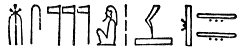 "born the
gods, possessor of the two lands" (*i.e.*, the world). Ὁ ἑστὼς ἐπ᾽
ἀληθείας δεσπότης διαδήματος, τὴν Αἴγυπτον δοξάσας κεκτημένος, ὁ
ἀγλαοποιήσας Ἡλίου πόλιν = 
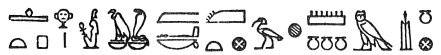 "\[the mighty bull\], resting upon Law, lord of
diadems, protector of Egypt, malting splendid Heliopolis with
monuments." Ἥλιος θεὸς μέγας δεσπότης οὐραννοῦ =  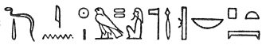 "Says Rā Harmachis, the great
god, lord of heaven," πληρώσας τὸν νεὼν τοῦ φοίνικος ἀγαθῶν, ᾧ οἱ θεοὶ
ζωῆς χρόνον ἐδωρήσαντο =  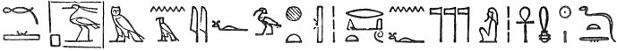
"filling the temple of the *bennu* (phœnix) with his splendours, may the
gods give to him life like the Sun for ever," etc.

Flaminian obelisk.The Flaminian obelisk,
from which the Egyptian passages given above are taken, was brought from
Heliopolis to Rome by Augustus, and placed in the Circus Maximus, [1](#fn_25.md) whence it was dug out; it now stands in
the Piazza del Popolo at Rome, where it was set up by Pope Sixtus V. in
1589. [2](#fn_26.md) This obelisk was originally
set up by Seti I., whose inscriptions occupy the middle column of the
north, south, and west sides; the other columns of hieroglyphics record
the names and titles of Rameses II. who, in this case, appropriated the
obelisk of his father, just as he did that of Thothmes III. The obelisk
was found broken into three pieces, and in order to render it capable of
sustaining itself, three palms’ length was cut from the base. The texts
have been published by Kircher, *Oedipus Aegyptiacus*, t. iii. p. 213;
by Ungarelli, *Interpretatio Obeliscorum Urbis*, Rome, 1842, p. 65,
*sqq*.,

p. 120

plate 2; and by Bonomi, who drew them for a paper on this obelisk by the
Rev. G. Tomlinson in Trans. Royal Soc. Lit., Vol. I. Second Series, p.
176 ff. For an account of this obelisk, see Zoëga, *De Origine et Usu
Obeliscorum*, Rome, 1797, p. 92.

Champollion's estimate of Clement's statements on
hieroglyphics.The next Greek writer whose statements on Egyptian
hieroglyphics are of value is Clement of Alexandria, who flourished
about AḌ. 191-220. According to Champollion, "un seul auteur grec, . . .
. . . . . . a démêlé et signalé, dans l’écriture égyptienne sacrée, les
élémens phonétiques, lesquels en sont, pour ainsi dire, le principe
vital [1](#fn_27.md) . . . . . Clément d’Alexandrie
s’est, lui seul, occasionnellement attaché à en donner une idée claire;
et ce philosophe chrétien était, bien plus que tout autre, en position
d’en être bien instruit. Lorsque mes recherches et l’étude constante des
monuments égyptiens m’eurent conduit aux résultats précédemment exposés,
je dus revenir sur ce passage de Saint Clément d’Alexandrie, que j’ai
souvent cité, pour savoir si, à la faveur des notions que j’avais tirées
d’un examen soutenu des inscriptions hiéroglyphiques, le texte de
l’auteur grec ne deviendrait pas plus intelligible qu’il ne l’avait paru
jusquelà. J’avoue que ses termes me semblèrent alors si positifs et si
clairs, et les idées qu’il renferme si exactement conformes à ma théorie
de l’écriture hiéroglyphique, que je dus craindre aussi de me livrer à
une illusion et à un entraînement dont tout me commandait de me
défier." [2](#fn_28.md) From the above it will be
seen what a high value Champollion placed on the statements concerning
the hieroglyphics by Clement, and they have, in consequence, formed the
subject of various works by eminent authorities. In his *Précis* (p.
328), Champollion gives the extract from Clement with a Latin
translation and remarks by Letronne. [3](#fn_29.md)
Dulaurier in his *Examen d’un passage des Stromates de Saint Clément
d’Alexandrie*, Paris, 1833, again published the passage and gave many
explanations of words in it, and commented learnedly upon it. (See also

p. 121

\[paragraph continues\] Bunsen's
*Aegyptens Stelle*, Bd. I., p. 240, and Thierbach, *Erklärung auf das
Aegyptische Schriftwesen*, Erfurt, 1846.) The passage is as
follows [1](#fn_30.md):—

Clement of Alexandria on hieroglyphics.

[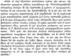  
Click to enlarge](img/12100.jpg.md)

Translation of extract from Clement."For
example, those that are educated among the Egyptians first of all learn
that system of Egyptian characters which is styled EPISTOLOGRAPHIC;
secondly, the HIERATIC, which the sacred scribes employ; lastly and
finally the HIEROGLYPHIC. The hieroglyphic sometimes speaks plainly by
means of the letters of the alphabet, and sometimes uses symbols, and
when it uses symbols, it sometimes (*a*) speaks plainly by imitation,
and sometimes (*b*) describes in a figurative way, and sometimes (c)
simply says one thing for another in accordance with certain secret
rules. Thus (*a*) if they desire to write *sun* or *moon*, they make a
circle or a crescent in plain imitation of the form. And when (*b*) they
describe figuratively (by transfer and transposition without violating
the natural meaning of words), they completely alter some things and
make manifold changes in the form of others. Thus, they hand

p. 122

down the praises of their kings in myths about the gods which they write
up in relief. Let this be an example of the third form (*c*) in
accordance with the secret rules. While they represent the stars
generally by snakes’ bodies, because their course is crooked, they
represent the sun by the body of a beetle, for the beetle moulds a ball
from cattle dung and rolls it before him. And they say that this animal
lives under ground for six months, and above ground for the other
portion of the year, and that it deposits its seed in this globe and
there engenders offspring, and that no female beetle exists."

Three kinds of Egyptian writing.From the
above we see that Clement rightly stated that the Egyptians had three
kinds of writing:—epistolographic, hieratic and hieroglyphic. The
epistolographic is that kind which is now called "demotic," and which in
the early days of hieroglyphic decipherment was called "enchorial." The
hieratic is the kind commonly found on papyri. The hieroglyphic kind is
described as, I. *cyriologic*, that is to say, by means of figurative
phonetic characters, *e.g.*, 
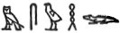 *emsuḥ*, "crocodile," and II. *symbolic*, that is to
say, by actual representations of objects, *e.g.*,  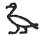 "goose,"   "bee," and so on The symbolic
division is subdivided into three parts: I. *cyriologic by imitation*,
*e.g.*,  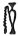, a vase with
water flowing from it represented a "libation "; II. *tropical*, *e.g.*,
 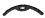, a crescent moon to
represent "month,"  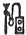, a
reed and palette to represent "writing" or "scribe"; and III.
*enigmatic*, *e.g.*,  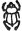, a
beetle, to represent the "sun." [1](#fn_31.md) In
modern Egyptian Grammars the matter is stated more simply, and we see
that hieroglyphic signs are used in two ways: I. Ideographic, II.
Phonetic.  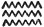 *māu*,
"water," is an instance of the first method, and  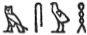 *m-s-u-ḥ*, is an instance of
the second. Ideographic signs are used as *determinatives*, and are
either *ideographic* or *generic*. Thus after  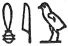 *mȧu*, "cat," a cat  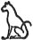 is placed, and is an
*ideographic* determinative; but 
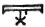, heaven with a star in it, written after a  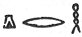 *ḳerḥ*, is a

p. 123

*generic* determinative. Phonetic signs are either *Alphabetic* as  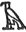 *a*,  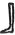 *b*,   *k*, or *Syllabic*, as   *men*,   *chen*, etc.

Porphyry the Philosopher, who died about AḌ. 305, says of
Pythagoras: [1](#fn_32.md)—

[  
Click to enlarge](img/12305.jpg.md)

Pythagoras and hieroglyphics.

"And in Egypt he lived with the priests and learnt their wisdom and the
speech of the Egyptians and three sorts of writing, epistolographic and
hieroglyphic and symbolic, which sometimes speak in the common way by
imitation and sometimes describe one thing by another in accordance with
certain secret rules." Here it seems that Porphyry copied Clement
inaccurately. Thus he omits all mention of the Egyptian writing called
"hieratic," and of the subdivision of hieroglyphic called "cyriologic,"
and of the second sub- division of the symbolic called "tropic." The
following table, based on Letronne, will make the views about
hieroglyphic writing held by the Greeks plain:— Letronne's summary.

 

------------------------------------------------------------------------

### Footnotes

[112:1](trs02.htm#fr_5.md) See *De rerum
Aegyptiacarum scriptoribus Graecis ante Alexandrum Magnum*, in
*Philologus*, Bd. X. s. 525.

[112:2](trs02.htm#fr_6.md) See the instances quoted
in *Philologus*, Bd. X. s. 539.

[112:3](trs02.htm#fr_7.md) Περὶ ἐν Μερόῃ ἱερῶν
γραμμάτων. Diogenes Laertius, *Vit. Democ*., ed. Isaac Casaubon, 1593,
p. 661.

[112:4](trs02.htm#fr_8.md) Καὶ τὰ μὲν αὐτῶν ἱρὰ, τὰ
δὲ δημοτικὰ καλὲεται. Herodotus, II. 36, ed. Didot, p. 84.

[112:5](trs02.htm#fr_9.md) Diodorus, III. 4, ed.
Didot, p. 129.

[112:6](trs02.htm#fr_10.md) Strabo, XVII. I, § 46,
ed. Didot, p. 693•

[112:7](trs02.htm#fr_11.md) According to Mommsen he
came to Rome, as tutor to Nero, in the reign of Claudius. *Provinces of
Rom*e, Vol. II. pp. 259, 273.

[113:1](trs02.htm#fr_12.md) Γελώμενος δὲ τὸ πλέον
ὡς ἀλαζὼν καὶ ἰδιώτησ. Strabo, XVII. 1, § 29, ed. Didot, p. 685.

[113:2](trs02.htm#fr_13.md) *Contra Apion*., I. 32
ff. On the identity of Chaeremon the Stoic philosopher with Chaeremon
the ἱερογραμματεὺς, see Zeller, *Hermes*, XI.

[113:3](trs02.htm#fr_14.md) 431. His other lost
work, Αἰγυπτιακά, treated of the Exodus.

[113:4](trs02.htm#fr_15.md) *Praep. Evang.*, v. 10,
ed. Gaisford, t. 1, p. 421.

[113:5](trs02.htm#fr_16.md) Sub voce Ἱερογλυφικά.

[113:6](trs02.htm#fr_17.md) For an account of them
see Krumbacher, *Geschichte aer Byzantinischen Literatur*, München,
1891, pp. 235-242.

[113:7](trs02.htm#fr_18.md) Ed. Kiessling, Leipzig,
1826, p. 191.

[113:8](trs02.htm#fr_19.md) Draconis Stratonicensis
Liber de Metris Poeticis. Joannis Tzetzae Exegesis in Homeri Iliadem.
Primum edidit . . . God. Hermannus, Lipsiae, 1812.

[115:1](trs02.htm#fr_20.md) But compare Horapollo,
(ed. Leemans, p. 33), Ἄπλαστον δὲ ἄνθρωπον γράφοντες, βάτραχον
ζωγραφοῦσιν.

[117:1](trs02.htm#fr_21.md) Hermann, p. 123, ll.
2-29; Bachmann, p. 823, ll. 12-34.

[117:2](trs02.htm#fr_22.md) Hermann, p. 17, ll.
21-25; Bachmann, p. 755, ll. 9-12.

[118:1](trs02.htm#fr_23.md) Hermann, p. 146, ll.
12-22; Bachmann, p. 838, ll. 31-37.

[118:2](trs02.htm#fr_24.md) Liber XVII. 4.

[119:1](trs02.htm#fr_25.md) Qui autem notarum
textus obelisco incisus est veteri, quem videmus in Circo etc. Ammianus
Marcellinus, XVII. 4, § 17. It seems to be referred to in Pliny, XXXVI.
29.

[119:2](trs02.htm#fr_26.md) For a comparative table
of obelisks standing in 1840, see Bonomi, *Notes on Obelisks*, in
*Trans. Royal Soc. Lit.*, Vol. I. Second Series, p. 158.

[120:1](trs02.htm#fr_27.md) *Précis du Système
hiéroglyphique des anciens Egyptiens*, Paris, 1824, p. 321.

[120:2](trs02.htm#fr_28.md) *Précis*, p. 327.

[120:3](trs02.htm#fr_29.md) See also *Œuvres
Choisies*, t. I. pp. 237-254.

[121:1](trs02.htm#fr_30.md) *Clem. Alex.,* ed.
Dindorf, t. III. *Strom*. lib. V. §§ 20, 21, pp. 17, 18.

[122:1](trs02.htm#fr_31.md) Champollion, Précis, p.
278.

[123:1](trs02.htm#fr_32.md) Porphyry, *De Vita
Pythagorae*, cd. Didot, § 11, p. 89, at the foot.

------------------------------------------------------------------------

[Next: Post-Antiquity writings on Hieroglyphics](trs03.md)
