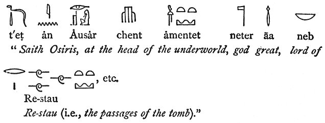

  
[Intangible Textual Heritage](../../index)  [Egypt](../index.md) 
[Index](index)  [Previous](trs02)  [Next](trs04.md) 

------------------------------------------------------------------------

*The Rosetta Stone*, by E.A.W. Budge, \[1893\], at Intangible Textual
Heritage

------------------------------------------------------------------------

Horapollo on hieroglyphics.The next writer
of importance on hieroglyphics is **Horapollo**, who towards the close
of the IVth century of our era composed a work called Ἱερογλυφικά; this
book was translated into Greek by one Philip, of whom nothing is known.
Wiedemann thinks that it was originally written in Coptic, which, in the
middle ages, was usually called

p. 124

\[paragraph continues\] "Egyptian," and
not in ancient Egyptian. [1](#fn_33.md) In this
work are given the explanations of a number of ideographs which occur,
for the most part, in Ptolemaïc inscriptions; but, like the list of
those given by Chaeremon, no *phonetic* values of the signs are given.
Nevertheless the list is of considerable interest. The best edition of
Horapollo is that of Conrad Leemans, [2](#fn_34.md)
but the text was edited in a handy form, with an English translation and
notes by Samuel Sharpe and Dr. Birch, by J. Cory, in 1840.

Mediaeval writers on hieroglyphics.In more
modern times the first writer at any length on hieroglyphics was
Athanasius Kircher, the author of some ponderous works [3](#fn_35.md) in which he pretended to have found the
key to the hieroglyphic inscriptions, and to translate them. Though a
man of great learning, it must be plainly said that, judged by scholars
of to-day, he would be considered an impostor. In his works on
Coptic [4](#fn_36.md) there are, no doubt, many
interesting facts, but mixed with them is such an amount of nonsense
that Kircher and Jablonski.Jablonski says
touching one of his statements, "Verum hic ut in aliis plurimis fucum
lectoribus fecit Jesuita ille, et fumum vendidit"; from the same writer
also, Kircher's arrogant assertions called forth the remark, "Kircherus,
in quo semper plus inest ostentationis, quam solidae eruditionis." [5](#fn_37.md) It is impossible to understand what
grounds Kircher had for his statements and how he arrived at his
results; as for his translations, they have *nothing* correct in them.
Here is one taken at random from *Oedipus* 

p. 125

\[paragraph continues\] *Aegyptiacus*, t.
III, p. 431, where he gives a translation of an inscription (A) printed
on the plate between pp. 428 and 429. The hieroglyphics are written on a
Ptaḥ-Seker-Osiris figure and read:—

 

and his translation runs:—"Vitale providi Numinis dominium, quadruplicem
Mundani liquoris substantiam dominio confert Osiridis, cujus unà cum
Mendesio foecundi Numinis dominio, benefica virtute influente, omnia
quae in Mundo sunt, vegetantur, animantur, conservantur." Other writers
on hieroglyphics whose works Kircher consulted were John Peter Bolzanius
Valerianus, [1](#fn_38.md) and Mercati, [2](#fn_39.md) but no good results followed their
investigations. In the year 1770 Joseph de GuignesDe Guignes and Zoëga. determined the existence
of groups of characters having determinatives, [3](#fn_40.md) and four years later he published his
*Mémoire*, [4](#fn_41.md) in which he tried to
prove that the epistolographic and symbolic characters of the Egyptians
were to be found in the Chinese characters, and that the Chinese nation
was nothing but an Egyptian colony. In 1797 Zoëga made a step in the
right direction, and came to the conclusion [5](#fn_42.md) that the hieroglyphics were letters and
that the cartouches contained royal names. A few years later Silvestre de Sacy and Akerblad.Silvestre de Sacy
published a

p. 126

letter on the inscriptions on the Rosetta Stone, [1](#fn_43.md) and the work of this learned man was soon
after followed by that of Akerblad who, in a letter to M. de Sacy [2](#fn_44.md) discussed the demotic inscription on the
recently discovered Rosetta Stone, and published an alphabet of the
demotic characters, from which a large number were adopted in after
times by Young and Champollion. It would seem that Akerblad never gained
the credit which was due to him for his really clever work, and it will
be seen from the facts quoted in the following pages, how largely the
success of Young's labours on the Demotic inscription on the Rosetta
Stone depended on those of Akerblad. But side by side with the letters
of de Sacy and Akerblad and the learned works of Young and Champollion,
there sprang into existence a mass of literature full of absurd
statements and theories written by men having no qualifications for
expressing opinions on hieroglyphic matters. Absurd theories of the contents of Egyptian
texts.Thus the Comte de Pahlin in his *De l’étude des
Hiéroglyphes*, [3](#fn_45.md) hesitated not to say
that the inscription on one of the porticoes of the Temple at Denderah
contained a translation of the hundredth Psalm, composed to invite all
people to enter into the house of the Lord. The same author said that to
produce the books of the Bible, which were written on papyri, it was
only necessary to translate the Psalms of David into Chinese and to
write them in the ancient characters of that language. [4](#fn_46.md) Lenoir considered the Egyptian
inscriptions to contain Hebrew compositions, [5](#fn_47.md) and Lacour thought that they contained
Biblical phrases. [6](#fn_48.md) Worse than all
these wild theories was the belief in the works of the Kircher school of
investigators, and in the accuracy of the statements made by Warburton's views on an Egyptian
alphabet.Warburton, [7](#fn_49.md) who, it
must be confessed,

p. 127

seems to have recognized the existence of alphabetic characters, but who
in no way deserves the praise of Bailey, the Cambridge prize essayist,
"Vir singulari quodam ingenii acumine praeditus, Warburtonus; qui primus
certe recentiorum ad rectam harum rerum cognitionem patefecit
viam." [1](#fn_50.md)

------------------------------------------------------------------------

### Footnotes

[124:1](trs03.htm#fr_33.md) *Aegyptische
Geschichte*, p. 151. The sepulchre of Gordian was inscribed in
*Egyptian*. "Gordiano sepulchrum milites apud Circeium castrum fecerunt
in finibus Persidis, titulum hujus modi addentes et Graecis, et Latinis,
et Persicis, et Judaicis, et Aegyptiacis literis, ut ab omnibus
legeretur." Erasmus, *Hist. Rom. Scriptorum*, Basle, 1533, p. 312, at
the top.

[124:2](trs03.htm#fr_34.md) Horapollinis Niloi
Hieroglyphica. edidit, diversorum codicum recenter collatorum,
priorumque editionum varias lectiones et versionem latinam subjunxit,
adnotationem, item hieroglyphicorum imagines et indices adjecit CḶ.
Amstelod, 1835.

[124:3](trs03.htm#fr_35.md) *Obeliscus Pamphilius,
. . . . . . . Hieroglyphicis involuta Symbolis, detecta e tenebris in
lucem asseritur*, Rome, 1650, fol. *Oedipus Aegyptiacus*, hoc est,
universalis hieroglyphicae veterum doctrinae, temporum injuria obolitae
instauratio. Rome, 1652-54. Tomi I–IV, fol.

[124:4](trs03.htm#fr_36.md) *Prodromus Coptus*,
Rome, 1636. *Lingua Aegyptiaca restituta*. Rome, 1643.

[124:5](trs03.htm#fr_37.md) Jablonski, *Opuscula*,
t. I. ed. Water, 1804, pp. 157, 211.

[125:1](trs03.htm#fr_38.md) *Hieroglyphica, seu de
sacris Aegptiorum aliarumque gentium litteris Commentatorium libri VII.,
duobus aliis ab eruditissimo viro annexis*, etc., Basil., 1556.

[125:2](trs03.htm#fr_39.md) *Degli Obelischi di
Roma*, Rome, 1589.

[125:3](trs03.htm#fr_40.md) Essai sur le moyen de
parvenir à la lecture et à l’intelligence des Hiéroglyphes égyptiens.
(In *Mémoires de l’Académie des Inscriptions*, t. XXXIV. pp. 1-56.)

[125:4](trs03.htm#fr_41.md) *Ibid*., t. XXXIX. p. 1
ff.

[125:5](trs03.htm#fr_42.md) *De Usu et Origine
Obeliscorum*, Rome, 1797, fol., p. 465.

[126:1](trs03.htm#fr_43.md) *Lettre au Citoyen
Chaptal, au sujet de l’Inscription égyptienne du Monument trouvé à
Rosette*, Paris, 1802.

[126:2](trs03.htm#fr_44.md) *Lettre sur
l’inscription égyptienne de Rosette*, Paris, 1802.

[126:3](trs03.htm#fr_45.md) Published at Paris in 5
vols., 18i2.

[126:4](trs03.htm#fr_46.md) *Lettres sur les
Hiéroglyphes*, Weimar, 1802.

[126:5](trs03.htm#fr_47.md) *In Nouvelle
explication des Hiéroglyphes*, Paris, 1809-10, 4 vols.; and *Nouveaux
Essais sur les Hiéroglyphes*, Paris, 1826, 4 vols.

[126:6](trs03.htm#fr_48.md) See his *Essai sur les
Hiéroglyphes égyptiens*, Bordeaux, 1821.

[126:7](trs03.htm#fr_49.md) In his *The Divine
Legation of Moses demonstrated, to which is adjoint an Essay on Egyptian
Hieroglyphics*, London, 1738, 2 vols.

[127:1](trs03.htm#fr_50.md) *Hieroglyphicorum Origo
et natura*, Cambridge, 1816, p. 9.

------------------------------------------------------------------------

[Next: Young and Champollion](trs04.md)
