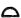

  
[Intangible Textual Heritage](../../index)  [Egypt](../index.md) 
[Index](index)  [Previous](trs04)  [Next](trs06.md) 

------------------------------------------------------------------------

*The Rosetta Stone*, by E.A.W. Budge, \[1893\], at Intangible Textual
Heritage

------------------------------------------------------------------------

Champollion's alphabet.Briefly, the way in
which Champollion recovered the greater part of the Egyptian alphabet is
as follows. It will be remembered that, on account of breakages, the
only name found on the Rosetta Stone is that of Ptolemy. Shortly before
Champollion published his letter to M. Dacier, he had published an
account of an obelisk, [2](#fn_68.md) recently
brought to London, which was inscribed with the name of a Ptolemy,
written with the same characters as that on the Rosetta Stone, and also
contained within a cartouche. It was followed by a second cartouche,
which should contain the name of a queen. The obelisk was said to have
been fixed in a socket, bearing a Greek inscription containing a
petition of the priests of Isis at Philae, addressed to Ptolemy, to
Cleopatra his sister, and to Cleopatra his wife. Now, he argued, if this
obelisk and the hieroglyphic inscription which it bears are really the
result of the petition of the priests, who in the Greek speak The names Ptolemy and Cleopatra.of the
dedication of a similar monument, it follows of necessity that the
cartouche must contain the name of a Cleopatra. The names of Ptolemy and
Cleopatra having, in the Greek, some letters which are similar, may be
used for comparing

p. 145

the hieroglyphics which are used in each; and if the characters which
are similar in these two names express the same sound in each cartouche,
their purely phonetic character is at once made clear. A previous
comparison of these two names written in the demotic character shows
that when they are written phonetically several characters, exactly
alike, are used in each. The analogy of the demotic, hieratic, and
hieroglyphic methods of writing in a general way, leads us to expect the
same coincidence and the same conformity in these same names, written
hieroglyphically. The names Ptolemaios and Cleopatra written in
hieroglyphics are as follows:—

No. 1, PTOLEMY.

 

No. 2, CLEOPATRA.

 

Recovery of the Egyptian alphabet.Now in
No. 2 cartouche, sign No. 1, which must represent K, is not found in
cartouche No. 1. Sign No. 2, a lion lying down, is identical with sign
No. 4 in cartouche No. 1. This clearly is L. Sign No. 3, a pen,
represents the short vowel E; two of them are to be seen in character
No. 6 in No. 1 cartouche, and considering their position their value
must be ΑΙ of αιος. Sign No. 4 is identical with No. 3 in No. 1
cartouche, and must have the value O in each name. Sign No. 5 is
identical with sign No. 1 of No. 1 cartouche, which being the first
letter of the name of Ptolemy must be P. Sign No. 6 is not found in No.
I cartouche, but it must be A, because it is the same sign as sign No.
9, which ends the name **ΚΛΕΟΠΑΤΡΑ**; we know that signs 10 and 11
always accompany feminine proper names, because we see them following
the names of goddesses like 
 Isis, and 
 Nephthys. Sign No. 7, an open stretched out hand,
must be T. It does not occur in No. 1 cartouche, but we find from other
cartouches that   takes
the place of  , and the
reverse. Sign No. 8 must be R; it is not in No. 1 cartouche,

The name Berenice.

p. 146

and ought not to be there. In No. 1 cartouche sign No. 7 must be S,
because it ends the name which in Greek ends with S. Thus from these two
cartouches we may collect twelve characters of the Egyptian alphabet,
viz., A, AI, E, K, K, L, M, O, P, R, S, T. Now let us take another
cartouche from the *Description de l’Egypte*, t. III. pl. 38, No. 13,
and try to make it out; it The name
Alexander.reads:—

No. 3.

 

Now signs Nos. 1, 2, 4, 5, 7, and 8, we know from cartouches Nos. 1 and
2, and we may write down their values thus:

**ΑΛ..ΣΕ..ΤΡ**.

The only Greek name which contains these letters in this order is
Alexander, therefore let us assign to the signs  , 
, and  
the value of K, N and S respectively. We find on examination that the
whole group corresponds, letter for letter, with the group which stands
in the demotic text of a papyrus in the place of the Greek name
**ΑΛΕΧΑΝΔΡΟΣ**. We have, then, gained three new phonetic signs K, N, and
S, and have determined the value of fifteen in all.

Again, let us take the cartouche of another lady:—

 

Now signs Nos. 2, 3, 4, 6, and 7 we know, and we may write them down
thus:—

**. ΡΝΑΙ . .**

The only female name which contains these letters in this order is that
of Berenice, and to   and
  we may therefore assign
the values B and K respectively. Thus we have gained two more signs.

p. 147

If we take two other cartouches, viz.:—

  and
 

we find that we are able to read the first at once KAISRS, which is
clearly Καισαρος or Caesar; in the second the only sign we do not know
is  . Writing down the
values we know we have AṬAKRTR, which is clearly Αυτοκρατορ; thus the
value of the second character must be U. In this manner Champollion
worked through the names of all the Ptolemies and the Roman Emperors,
and eventually succeeded in making out the value of one hundred and
eleven signs. At the foot of Plate I., in his *Lettre à Monsieur
Dacier*, he writes his own name in hieroglyphics thus:—

 

The following are the letters of the Egyptian alphabet with their values
as now accepted by Egyptologists:—

 

------------------------------------------------------------------------

### Footnotes

[144:2](trs05.htm#fr_68.md) *Observations sur
l’Obélisque Egyptien de l’île de Philæ*, in *Revue encyclopédique*,
Mars, 1822.

------------------------------------------------------------------------

[Next: Opinions of Egyptologists on Young and Champollion](trs06.md)
