  
[Intangible Textual Heritage](../../index)  [Egypt](../index.md) 
[Index](index)  [Previous](tut07)  [Next](tut09.md) 

------------------------------------------------------------------------

p. 75

# DEVELOPMENT OF THE CULT OF ATEN UNDER AMENHETEP IV.

Amenhetep III was succeeded by his son by his beloved wife Ti, who came
to the throne under the name of Amenhetep IV. He reigned about seventeen
years, and died probably before he was thirty. The accuracy of the
latter part of this statement depends upon the evidence derived from the
mummy of a young man which was found in the Tomb of Queen Ti, and is
generally believed to be that of Amenhetep IV. It is thought that this
mummy was taken from a royal tomb at Tall al-'Amarnah in mistake for
that of Ti, and transported to Thebes, where it was buried as her mummy.
Dr. Elliot Smith examined the skeleton, and decided that it was that of
a man 25 or 26 years of age, "without excluding the possibility that he
may have been several years older." His evidence [1](#fn_42.md) is very important, for he adds, "The
cranium, however, exhibits in an unmistakable manner the distortion
characteristic of a condition of hydrocephalus." So then if the skeleton
be that of Amenhetep IV, the king suffered from water on the brain; and
if he was 26 years old when he died he must have begun to reign at the
age of nine or ten. But there is the possibility that he did not begin
to reign until he was a few years older.

Even had his father lived, he was not the kind of man to teach his son
to emulate the deeds of warrior Pharaohs like Thothmes III,

p. 76

and there was no great official to instruct him in the arts of war, for
the long peaceful reign of Amenhetep III made the Egyptians forget that
the ease and luxury which they then enjoyed had been purchased by the
arduous raids and wars of their forefathers. To all intents and
purposes, Ti ruled Egypt for several years after her husband's death,
and the boy-king did for a time at least what his mother told him. His
wife, Nefertiti, who was his father's daughter probably by a
Mesopotamian woman, was no doubt chosen for him by his mother, and it is
quite clear from the wall-paintings at Tall al-'Amarnah that he was very
much under their influence. His nurse's husband, Ai, was a priest of
Aten, and during his early years he absorbed from this group of persons
the fundamentals of the cult of Aten and much knowledge of the religious
beliefs of the Mitannian ladies at the Egyptian Court. These sank into
his mind and fructified, with the result that he began to abominate not
only Amen, the great god of Thebes, but all the old gods and goddesses
of Egypt, with the exception of the solar gods of Heliopolis. In many
respects these gods resembled the Aryan gods worshipped by his
grandmother's people, especially Varuna, to whom, as to Ra, human
sacrifices were sometimes offered, and to them his sympathy inclined.
But besides this he saw, as no doubt many others saw, that the priests
of Amen were usurping royal prerogatives, and by their wealth and
astuteness were becoming the dominant power in the land. Even at that
time the revenues of Amen could hardly be told, and the power of his
priests pervaded the kingdom from Napata in the South to Syria in the
North.

During the first five or six years of his reign Amenhetep IV, probably
as the result of the

 

 [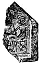  
Click to enlarge](img/pl07.jpg.md)  
*Plate VII*.  
Portion of a painted stone tablet with a portrait figure of Amenhetep IV
in hollow relief. On him shine the rays of Aten which terminate in human
hands. British Museum, No. 24431.

 [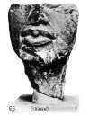  
Click to enlarge](img/pl08.jpg.md)  
*Plate VIII*.  
Portion of a head of a portrait figure of Amenhetep IV.  
British Museum, No. 13366.

 

p. 77

skilful guidance of his mother, made little or no change in the
government of the country. But his actions in the sixth and following
years of his reign prove that whilst he was still a mere boy he was
studying religious problems with zeal, and with more than the usual
amount of boyish understanding. He must have been precocious and clever,
with a mind that worked swiftly; and he possessed a determined will and
very definite religious convictions and a fearless nature. It is also
clear that he did not lightly brook opposition, and that he believed
sincerely in the truth and honesty of his motives and actions. But with
all these gifts he lacked a practical knowledge of men and things. He
never realized the true nature of the duties which as king he owed to
his country and people, and he never understood the realities of life.
He never learnt the kingcraft of the Pharaohs, and he failed to see that
only a warrior could hold what warriors had won for him. Instead of
associating himself with men of action, he sat at the feet of Ai the
priest, and occupied his mind with religious speculations; and so,
helped by his adoring mother and kinswomen, he gradually became the
courageous fanatic that the tombs and monuments of Egypt show him to
have been. His physical constitution and the circumstances of his
surroundings made him what he was. In recent years he has been described
by such names as "great idealist," "great reformer," the "world's first
revolutionist," the "first *individual* in human history," etc. But, in
view of the known facts of history, and Dr. Elliot Smith's remarks
quoted above on the distortion of the skull of Amenhetep IV, we are
fully justified in wondering with Dr. Hall if the king "was not really
half insane." [1](#fn_43.md) None but a man half
insane

p. 78

would have been so blind to facts as to attempt to overthrow Amen and
his worship, round which the whole of the social life of the country
centred. He

 

 [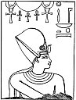  
Click to enlarge](img/07800.jpg.md)  
Aten, the great god, lord of heaven, from whom proceeds "life"; beneath
is Amenhetep IV who is here represented conventionally as a Pharaoh.

 

suffered from religious madness at least, and spiritual arrogance and
self-sufficiency made him oblivious to everything except his own
feelings and emotions.

p. 79

Once having made up his mind that Amen and all the other "gods" of Egypt
must be swept away, Amenhetep IV determined to undertake this work
without delay. After years of thought he had come to the conclusion that
only the solar gods, Tem, Ra and Horus of the Two Horizons were worthy
of veneration, and that some form of their worship must take the place
of that of Amen. The form of the Sun-god which he chose for worship was
ATEN, *i.e.*, the solar Disk, which was the abode of Tem and later of Ra
of Heliopolis. But to him the Disk was not only the abode of the
Sun-god, it was the god himself, who, by means of the heat and light
which emanated from his own body, gave life to everything on the earth.
To Aten Amenhetep ascribed the attributes of the old gods, Tem, Ra,
Horus, Ptah, and even of Amen, and he proclaimed that Aten was "One" and
"Alone." But this had also been proclaimed by all the priesthoods of the
old gods, Tem, Khepera, Khnem, Ra, and, later, of Amen. The worshippers
of every great god in Egypt had from time immemorial declared that their
god was "One." "Oneness" was an attribute, it would seem, of everything
that was worshipped in Egypt, just as it is in some parts of India. It
is inconceivable that Amenhetep IV knew of the existence of other suns
besides the sun he saw, and it was obvious that Aten, the solar disk,
was one alone, and without counterpart or equal. Some light is thrown
upon Amenhetep's views as to the nature of his god by the title which he
gave him. This title is written within two cartouches and reads:--

"The Living Horus of the two horizons, exalted in the Eastern Horizon in
his name of Shu-who-is-in-the-Disk."

 

p. 80

It is followed by the words, "ever-living, eternal, great living Disk,
he who is in the Set Festival, [1](#fn_44.md) lord
of the Circle (*i.e.*, everything which the Disk shines on in every
direction), lord of the Disk, lord of heaven, lord of the earth."
Amenhetep IV worshipped Horus of the two horizons as the "Shu who was in
the disk." If we are to regard "Shu" as an ordinary noun, we must
translate it by "heat," or "heat and light," for the word has these
meanings. In this case Amenhetep worshipped the solar heat, or the heat
and light which were inherent in the Disk. Now, we know from the Pyramid
Texts that Tem or Tem-Ra created a god and a goddess from the emanations
or substance of his own body, and that they were called "Shu" and
"Tefnut," the former being the heat radiated from the body of the god,
and the latter the moisture. Shu and Tefnut created Geb (the earth) and
Nut (the sky), and they in turn produced Osiris, the god of the river
Nile, Set, the god of natural decay and death, and their shadowy
counterparts, Isis and Nephthys. But, if we regard "Shu" as a proper
name in the title of Amenhetep's god, we get the same result, and can
only assume that the king deified the heat of the sun and worshipped it
as the one, eternal, creative, fructifying and life-sustaining force.
The old Heliopolitan tradition made Tem or Tem-Ra, or Khepera, the
creator of Aten the Disk, but this view Amenhetep IV rejected, and he
asserted that the Disk was self-created and self-subsistent. The common
symbol of the solar gods was a

p. 81

disk encircled by a serpent, but when Amenhetep adopted the disk as the
symbol of his god, he abolished the serpent and treated the disk in a
new and original fashion. From the disk, the circumference of which is
sometimes hung round with symbols of "life," ☥ he made a series of rays
to descend, and at the end of each ray was

 

 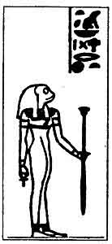  
The frog-headed goddess Heqit, one of the Eight Members of the Ogdoad of
Thoth.

 

a hand, as if the ray was an arm, bestowing "life" on the earth. This
symbol never became popular in the country, and the nation as a whole
preferred to believe that the Sun-god travelled across the sky in two
boats, the Sektet and the Atet. The form of the old Heliopolitan cult of
the Sun-god that was evolved by Amenhetep could never have appealed to
the Egyptians, for it was

p. 82

too philosophical in character and was probably based upon esoteric
doctrines that were of foreign origin. <u>H</u>er and Suti, the two
great overseers of the temples of Amen at Thebes, were content to follow
the example of their king Amenhetep III, and bow the knee to Aten and,
like other officials, to sing a hymn in his praise. But they knew the
tolerant character of their master's religious views, and that outwardly
at least he was a loyal follower of Amen, whose blood, according to the
dogma of his priests, flowed in the king's veins. To Amenhetep III a god
more or less made no difference, and he considered it quite natural that
every priesthood should extol and magnify the power of its god. He was
content to be a counterpart of Amen, and to receive the official worship
due to him as such. But with his son it was different. The heat of Aten
gave him life and maintained it in him, and whilst that was in him Aten
was in him. The life of Aten was his life, and his life was Aten's life,
and therefore he was Aten; his spiritual arrogance made him believe that
he was an incarnation of Aten, *i.e.*, that he was God--not a mere "god"
or one of the "gods" of Egypt--and that his acts were divine. He felt
therefore that he had no need to go to the temple of Amen to receive the
daily supply of the "fluid of life," which not only maintained the
physical powers of kings, but gave them wisdom and understanding to rule
their country. Still less would he allow the high priest of Amen to act
as his vicar. Finally he determined that Amen and the gods must be done
away and all the dogmas and doctrines of their priesthoods abolished,
and that Aten must be proclaimed the One, self-created, self-subsisting,
self-existing god, whose son and deputy he was.

Without, apparently, considering the probable

 

 [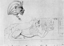  
Click to enlarge](img/pl09.jpg.md)  
*Plate IX.*  
Sphinx, with the head of Amenhetep IV, making an offering of Maat to
Aten.

 

 [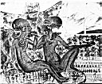  
Click to enlarge](img/pl10.jpg.md)  
*Plate X.*  
Two of the daughters of Amenhetep IV.  
Reproduced by permission of the Egyptian Exploration Society.  
From a bas-relief now in the Ashmolean Museum, Oxford.

 

p. 83

effect of his decision when translated into action, he began to build
the temple of Gem-Aten in Per-Aten, at Thebes. In it was a chamber or
shrine, in which the *ben*, or *benben*, *i.e.*, the "Sun-stone," was
placed, and in doing this he followed the example of the priests of
Heliopolis. The site he selected for this temple was a piece of ground
about half way between the Temple of Karnak and the Temple of Luxor. He
decided that this temple should be the centre of the worship of Aten,
which should henceforward be the one religion of his country. The effect
of the king's action on the priests of Amen and the people of Thebes can
be easily imagined when we remember that with the downfall of Amen their
means of livelihood disappeared. But Amenhetep was the king, the blood
of the Sun-god was in his veins, and Pharaoh was the master and owner of
all Egypt, and of every person and thing in it. Priests and people were
alike unable to resist his will, and, though they cursed Aten and his
fanatical devotee, they could not prevent the confiscation of the
revenues of Amen and the abolition of his services. Not content with
this, Amenhetep caused the name of Amen to be obliterated on the
monuments, and in some cases even his father's name, and the word for
"gods" was frequently cut out. Not only was there to be no Amen, but
there were to be no gods; Aten was the only god that was to be
worshipped.

The result of the promulgation of this decree can be easily imagined.
Thebes became filled with the murmurings of all classes of the followers
of Amen, and when the temple of Aten was finished, and the worship of
the new god was inaugurated,

p. 84

these murmurings were changed to threats and curses, and disputes
between the Amenites and Atenites filled the city. What exactly happened
is not known and never will be known, but the result of the confusion
and uproar was that Amenhetep IV found residence in Thebes impossible,
and he determined to leave it, and to remove the Court elsewhere.
Whether he was driven to take this step through f ear for the personal
safety of himself and his family, or whether he wished still further to
insult and injure Amen and his priesthood, cannot be said, but the
reason that induced him to abandon his capital city and to destroy its
importance as such must have been very strong and urgent. Having decided
to leave Thebes he sought for a site for his new capital, which he
intended to make a City of God, and found it in the north, at a place
which is about 160 miles to the south of Cairo and 50 miles to the north
of Asyut. At this point the hills on the east bank of the Nile enclose a
sort of plain which is covered with fine yellow sand. The soil was
virgin, and had never been defiled with temples or other buildings
connected with the gods of Egypt whom Amenhetep IV hated, and the plain
itself was eminently suitable for the site of a town, for its surface
was unbroken by hills or reefs of limestone or sandstone. This plain is
nearly three miles from the Nile in its widest part and is about five
miles in length. The plain on the other side of the river, which
extended from the Nile to the western hills, was very much larger than
that on the east bank, and was also included by the king in the area of
his new capital. He set up large stelæ on the borders of it to mark the
limits of the territory of Aten, and had inscriptions cut upon them
stating this fact.

p. 85

We have already seen that Amenhetep IV had, whenever possible, caused
the name of Amen to be chiselled out from stelæ, statues, and other
monuments, and even from his father's cartouches, whilst at the same
time the name of Amen formed part of his name as the son of Ra. It was
easy to remedy this inconsistency, and he did so by changing his name
from Amenhetep, which means "Amen is content," to AAKHUNATEN,  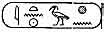 a name which by analogy should
mean something like "Aten is content." This meaning has already been
suggested by more than one Egyptologist, but there is still a good deal
to be said for keeping the old translation, "Spirit of Aten." I
transcribe the new name of Amenhetep IV, Aakhunaten, not with any wish
to add another to the many transliterations that have been proposed for
it, but because it represents with considerable accuracy the
hieroglyphs. The Pyramid Texts show that the phonetic value of  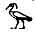 was  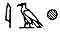 or  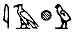. The first sign represents a
short vowel, a, e, or i; the second a, like the Hebrew *aleph*, the
third *kh*, and the fourth *u*; therefore the phonetic value of in
Pyramid times was aakh, or aakhu, but in later times the *a* was
probably dropped, and then the value of 
 would be *akh*, as Birch read it sixty years ago. If
this were so, the name will be correctly transliterated by "Akhenaten."
How the name was pronounced we do not know and never shall know, but
there is no good ground for thinking that "Ikhnaton" or "Ikh-en-aton"
represents the correct pronunciation. In passing

p. 86

we may note that *Aten* has nothing to do with the Semitic *'adhon*,
"lord."

At this time Amenhetep IV adopted two titles in connection with his new
name, *i.e.*, "Ankh-em-Maat" and "Aa-em-aha-f," the former meaning,
"Living in Truth" and the latter "great in his life period." What is
meant exactly by

<table data-cellspacing="0" data-border="0" data-cellpadding="9" width="798">
<colgroup>
<col style="width: 50%" />
<col style="width: 50%" />
</colgroup>
<tbody>
<tr class="odd">
<td width="50%" data-valign="TOP">
 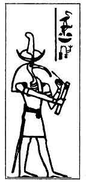 
Thoth, lord of the writing of the god, <em>i.e.</em>, hieroglyphs. He was the of the primeval God, and translated into speech the will of this God.
</td>
<td width="50%" data-valign="TOP">
 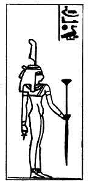 
Maat, the goddess of truth, reality, law, both physical and spiritual, order, rectitude, uprightness, integrity, etc.
</td>
</tr>
</tbody>
</table>

 

"living in truth" is not clear. *Maat* means what is straight, true,
real, law, both physical and moral, the truth, reality, etc. He can
hardly have meant "living in or by the law," for he was a law to
himself, but he may have meant that in Atenism he had found the truth or
the "real" thing, and that all else in religion was a phantom,

p. 87

a sham. Aten lived in *maat*, or in truth and reality, and the king,
having the essence of Aten in him, did the same. The exact meaning which
Amenhetep IV attached to the other title, "great in his life-period," is
also not clear. He, as was every Pharaoh who preceded him, was a "son of
Ra," but he did not claim, as they did, to "live like Ra for ever," and
only asserted that his life-period was great. Amenhetep IV called his
new capital Aakhutaten, *i.e.*, "the Horizon of Aten," and he and his
followers regarded it as the one place in which Aten was to be found. It
was to them the visible symbol of the splendour and benevolence and love
of the god, the sight of it rejoiced the hearts of all beholders, and
its loveliness, they declared, was beyond compare. It was to them what
Babylon was to the Babylonians, Jerusalem to the Hebrews, and Makkah to
the Arabs; to live there and to behold the king, who was Aten's own son,
bathed in the many-handed, life-giving rays of Aten, was to enjoy a
foretaste of heaven, though none of the writers of the hymns to Aten
deign to tell us what the heaven to which they refer so glibly was like.
Having taken up his a ode in this city, Amenhetep set to work to
organize the cult of Aten, and to promulgate his doctrine, which, like
all writers of moral and religious aphorisms, he called his "Teaching,"
*Sbait*.

Having appointed himself High Priest, he, curiously enough, adopted the
old title of the High Priest of Heliopolis and called himself "Ur-maa,"
*i.e.*, the "Great Seer." But he did not at the same time institute the
old

p. 88

 

 [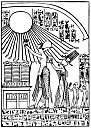  
Click to enlarge](img/08800.jpg.md)  
Amenhetep IV, accompanied by his queen and family, making offerings to
Aten.

 

p. 89

semi-magical rites and ceremonies which the holders of the title in
Heliopolis performed. He did not hold the office very long, but
transferred it to Merira, one of his loyal followers.

When still a mere boy, probably before he ascended the throne and
rejected his name of Amenhetep, he seems to have dreamed of building
temples to Aten, and so when he took up his residence in his new city he
at once set to work to build a sanctuary for that god. Among his devoted
followers was one Bek, an architect and master builder, who claims to
have been a pupil of the king, and who was undoubtedly a man of great
skill and taste. Him the king sent to Sun, the Syene of the Greek
writers, to obtain stone for the temple of Aten, and there is reason to
think that, when the building was finished, its walls were most
beautifully decorated with sculptures and pictures painted in bright
colours. A second temple to Aten was built for the Queen-mother Ti, and
a third for the princess Baktenaten, one of her daughters; and we should
expect that one or more temples were built in the western half of the
city across the Nile. With the revenues filched from Amen Aakhunaten
built several temples to Aten in the course of his reign. Thus he
founded Per-gem-Aten in Nubia at a place in the Third Cataract;
Gem-pa-Aten em. Per-Aten at Thebes; Aakhutaten in Southern Anu
(Hermonthis); the House of Aten in Memphis; and Res-Ra-em-Anu. It will
be noticed that no mention is made of Aten in the name of this last
temple of Aten. He also built a temple to Aten in Syria, which is
mentioned on one of the Tall

p. 90

 

 [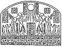  
Click to enlarge](img/09000.jpg.md)  
Amenhetep IV and his queen and family worshipping Aten.

 

p. 91

al-'Amarnah tablets in the British Museum under the form
Hi-na-tu-na. [1](#fn_45.md)

As the buildings increased in Aakhutaten and the cult of Aten developed,
the king's love for his new city grew, and he devoted all his time to
the worship of his god. Surrounded by his wife and family and their
friends, and his obedient officials, who seem to have been handsomely
rewarded for

 

 [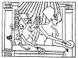  
Click to enlarge](img/09100.jpg.md)  
Amenhetep IV and his Queen Nefertiti bestowing gold-collars upon
favourite courtiers. Between the king and queen is the princess
Ankh-s-en-pa-Aten, who married Tutankhamen, and behind the queen are two
of her other daughters.

 

their devotion, the king had neither wish nor thought for the welfare of
his kingdom, which he allowed to manage itself. His religion and his
domestic happiness filled his life, and the inclinations and wishes of
the ladies of his court had more weight with him than the counsels and
advice of his ablest officials. We know nothing of the forms and
ceremonies of the Aten worship, but hymns

p. 92

and songs and choruses must have filled the temple daily. And the stele
of Tutankhamen proves (see [p. 9](tut04.htm#page_9).md) that a considerable
number of dancing men and acrobats were maintained by the king in
connection with the service of Aten. Not only was the king no warrior,
he was not even a lover of the chase. As he had no son to train in manly
sports and to teach the arts of government and war, for his offspring
consisted of seven daughters, [1](#fn_46.md) his
officers must: have wondered how long the state in which they were then
living would last. The life in the City of Aten was no doubt pleasant
enough for the Court and the official classes, for the king was generous
to the officers of his government in the City, and, like the Pharaohs of
old, he gave them when they died tombs in the hills in which to be
buried. The names of many of these officers are well known, *e.g.*,
Merira I, Merira II, Pa-nehsi (the Negro), Hui, Aahmes, Penthu, Mahu,
Api, Rames, Suti, Nefer-kheperu-her-sekheper, Parennefer, Tutu, Ai, Mai,
Ani, etc. [2](#fn_47.md)

p. 93

 

 [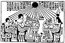  
Click to enlarge](img/09300.jpg.md)  
Amenhetep IV and his Queen Nefertiti and some of the daughters seated
with the rays of Aten falling upon them. The queen wears the disk, horns
and plumes of Hathor and Isis. The abnormal development of the lower
part of the body seems to be a characteristic of every member of the
royal family.

 

p. 94

The tombs of these men are different from all others of the same class
in Egypt. The walls are decorated with pictures representing (1) the
worship of Aten by the king and his mother; (2) the bestowal of gifts on
officials by the king; (3) the houses, gardens and estates of the
nobles; (4) domestic life, etc. The hieroglyphic texts on the walls of
the tombs contain the names of those buried in them, the names of the
offices which they held under the king, and fulsome adulation of the
king, and of his goodness, generosity and knowledge. Then there are
prayers for funerary offerings, and also Hymns to Aten. The long Hymn in
the tomb of Ai is not by the king, as was commonly supposed; it is the
best of all the texts of the kind in these tombs, and many extracts from
it are found in the tombs of his fellow officials. A shorter Hymn occurs
in some of the tombs, and of this it is probable that Aakhunaten was the
author. We look in vain for the figures of the old gods of Egypt, Ra,
Horus, Ptah, Osiris, Isis, Anubis, and the cycles of the gods of the
dead and of the Tuat (Underworld), and not a single ancient text,
whether hymn, prayer, spell, incantation, litany, from the Book of the
Dead in any of its Recensions is to be found there. To the Atenites the
tomb was a mere hiding place for the dead body, not a model of the Tuat,
as their ancestors thought. Their royal leader rejected all the old
funerary Liturgies like the "Book of Opening the Mouth," and the
"Liturgy of funerary offerings," and he treated with silent contempt
such works as the "Book of the Two Ways," the "Book of the Dweller in
the Tuat," and the "Book of Gates." Thus it would appear that he
rejected *en bloc* all funerary rites and ceremonies, and disapproved of
all services of commemoration of the dead, which were so

p. 95

dear to the hearts of all Egyptians. The absence of figures of Osiris in
the tombs of his officials and all mention of this god in the
inscriptions found in them suggests that he disbelieved in the Last
judgment, and in the dogma of rewards for the righteous and punishments
for evil doers. If this were so, the Field of Reeds, the Field of the
Grasshoppers, the Field of Offerings in the

 

 [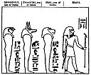  
Click to enlarge](img/09500.jpg.md)  
The four grandsons of Horus the Aged. They were the gods of the four
cardinal points, and later, as the sons of Osiris, protected the viscera
of the dead.

 

\[paragraph continues\] Elysian Fields, and the Block of Slaughter with
the headsman Shesmu, the five pits of the Tuat, and the burning of the
wicked were all ridiculous fictions to him. Perhaps they were, but they
were ineradicably fixed in the minds of his subjects, and he gave them
nothing to put in the place of these fictions. The cult of Aten did not
satisfy them, as history shows, for right or wrong, the

p. 96

\[paragraph continues\] Egyptian, being of African origin, never
understood or cared for philosophical abstractions. Another question
arises: did the Atenites mummify their dead? It is clear from the
existence of the tombs in the hills about Aakhunaten that important
officials were buried; but what became of the bodies of the working
class folk and the poor? Were they thrown to the jackals "in the bush"?
All this suggests that the Atenites adored and enjoyed the heat and
light which their god poured upon them, and that they sang and danced
and praised his beneficence, and lived wholly in the present. And they
worshipped the triad of life, beauty and colour. They abolished the
conventionality and rigidity in Egyptian painting and sculptures and
introduced new colours into their designs and crafts, and, freed from
the control of the priesthoods, artists and workmen produced
extraordinarily beautiful results. The love of art went hand in hand
with their religion and was an integral part of it. We may trace its
influence in the funerary objects, even of those who believed in Osiris
and were buried with the ancient rites and ceremonies especially in
figures, vases, etc., made of pottery. Perhaps the brightly coloured
vignettes, which are found in the great rolls of the Book of the Dead
that were produced at this period, were painted by artists who copied
the work of Atenite masters.

Now whilst Aakhunaten was organizing and developing the cult of Aten,
and he and his Court and followers were passing their days and years in
worshipping their god and in beautifying their houses, what was
happening to the rest of Egypt? Tutankhamen tells us that the revenues
of the gods were diverted to the service of Aten, that the figures of
the gods had disappeared from their thrones, that the temples were
deserted, and that

p. 97

the Egyptians generally were living in a state of social chaos. For the
first twelve years; or so of Aakhunaten's reign the tribute of the
Nubians was paid, for the Viceroy of Nubia had at hand means for making
the tribes bring gold, wood, slaves, etc., to him. In the north of Egypt
General

 

 [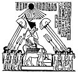  
Click to enlarge](img/09700.jpg.md)  
Amenhetep IV seated on his portable lion-throne beneath the rays of
Aten; he holds in his hands the old Pharaonic symbols of
sovereignty  and
dominion 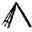.

 

\[paragraph continues\] Heremheb, the Commander-in-Chief, managed to
maintain his lord's authority, but there is no doubt, as events showed
when he became king of Egypt, that he was not a wholly sincere
worshipper of Aten, and that his sympathies lay with the priesthoods of
Ptah of Memphis and

p. 98

\[paragraph continues\] Ra of Heliopolis. The Memphites and the
Heliopolitans must have resented bitterly the building of temples to
Aten in their cities, and there can be little doubt that that astute
soldier soon came to an understanding with them. Moreover, he knew
better than his king what was happening in Syria, and how the Khabiru
were threatening Phœnicia from the south, and how the Hittites were
consolidating their position in Northern Syria, and increasing their
power in all directions. He, and every one in Egypt who was watching the
course of events, must have been convinced that no power which the king
could employ could stop the spread of the revolt in Western Asia, and
that the rule of the Egyptians there was practically at an end.

When the king as Amenhetep IV ascended the throne, all his father's
friends in Babylonia, Assyria, Mitanni, the lands of the Kheta and
Cyprus hastened to congratulate him, and all were anxious to gain and
keep the friendship of the new king of Egypt. Burraburiyash, king of
Karduniash, hoped that the new king and he would always exchange
presents, and that the old friendship between his country and Egypt
would be maintained. Ashuruballit sent him gifts and asked for 20
talents of gold in return. Tushratta, king of Mitanni, addressed him as
"my son-in-law," sent greetings to Queen Ti, and spoke with pride of the
old friendship between Mitanni and Egypt. He also wrote to Queen Ti, and
again refers to the old friendship. But Aakhunaten did not respond in
the manner they expected, and letters sent by them to him later show
that the gifts which he sent were mean and poor. Clearly he lacked the
open-handedness and generosity of his father Amenhetep III. As years
went on, the governors of the towns and

p. 99

cities that were tributaries of Egypt wrote to the king protesting their
devotion, fidelity and loyalty, many of them referring to favours
received and asking for new ones. Very soon these protestations of
loyalty were coupled with requests for

 

 [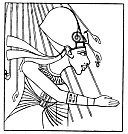  
Click to enlarge](img/09900.jpg.md)  
The rays of Aten giving "life" ☥ to Amenhetep IV whilst he is bestowing
gifts on his favourite courtiers.

 

\[paragraph continues\] Egyptian soldiers to be sent to protect the
king's possessions. Thus one Shuwardata writes: To the king, my lord, my
gods and my Sun. Thus saith Shuwardata, the slave: Seven times and seven
times did I fall down at the feet of the king

p. 100

my lord, both upon my belly and upon my back. Let the king, my lord,
know that I am alone, and let the king, my lord, send troops in great
multitudes, let the king, my lord, know this. [1](#fn_48.md)

The people of Tunip, who were vassals of Thothmes III, wrote and told
the king that Aziru had plundered an Egyptian caravan, and that if help
were not sent Tunip would fall as Ni had already done. Rib-Adda of
Byblos writes: We have no food to eat and my fields yield no harvest
because I cannot sow com. All my villages are in the hands of the
Khabiru. I am shut up like a bird in a cage, and there is none to
deliver me. I have written to the king, but no one heeds. Why wilt thou
not attend to the affairs of thy country? That "dog," Abd-Ashratum, and
the Khabiri have taken Shigata and Ambi and Simyra. Send soldiers and an
able officer. I beseech the king not to neglect this matter. Why is
there no answer to my letters? Send chariots and I will try to hold out,
else in two months' time Abd-Ashratum will be master of the whole
country. Gebal (Byblos) will fall, and all the country as far as

p. 101

\[paragraph continues\] Egypt will be in the hands of the Khabiri. We
have no grain; send grain. I have sent my possessions to Tyre, and also
my sister's daughters for safety. I have sent my own son to thee,
hearken to him. Do as thou wilt with me, but do not forsake thy city
Gebal. In former times when Egypt neglected our city we paid no tribute;
do not thou neglect it. I have sold my sons and daughters for food and
have nothing left. Thou sayest, "Defend thyself," but how can I do it?
When I sent my son to thee he was kept three months waiting for an
audience. Though my kinsmen urge me to join the rebels, I will not do
it.

Abi-Milki of Tyre writes: To the king, my lord, my gods, my Sun. Thus
saith Abi-Milki, thy slave. Seven times and seven times do I fall down
at the feet of the king my lord. I am the dust under the sandals of the
king my lord. My lord is the sun that riseth over the earth day by day,
according to the bidding of the Sun, his gracious Father. It is he in
whose moist breath I live, and at whose setting I make my moan. He
maketh all the lands to dwell in peace by the might of his hand; he
thundereth in the heavens like the Storm-god, so that the whole earth
trembleth at his thunder. . . . Behold, now, I said to the Sun, the
Father of the king my Lord, When shall I see the face of the king my
Lord? And now behold also I am guarding Tyre, the great city, for the
king my lord until the king's mighty hand shall come forth unto me to
give me water to drink and wood to warm myself withal. Moreover,
Zimrida, the king of Sidon, sendeth word day by day unto the traitor
Aziru, the son of Abd-Ashratum, concerning all that he hath heard from
Egypt. Now behold, I have written unto my lord, for it is well that he
should know this.

p. 102

In a letter from Lapaya the writer says: If the king were to write to me
for my wife I would not refuse to send her, and if he were to order me
to stab myself with a bronzed dagger I would certainly do so. Among the
writers of the Letters is a lady who reports the raiding of Ajalon and
Sarha by the Khabiri. All the letters tell the same story of successful
revolt on the part of the subjects of Egypt and the capture and
plundering and burning of towns and villages by the Khabiri, and the
robbery of caravans on all the trade routes. And whilst all this was
going on the king of Egypt remained unmoved and only occupied himself
with the cult of his god! The general testimony of the Tall al-'Amarnah
Letters proves that he took no trouble to maintain the friendly
relations that had existed between the kings of Babylonia and Mitanni
and his father. He seems to have been glad enough to receive embassies
and gifts from Mesopotamia, and to welcome flattering letters full of
expressions of loyalty and devotion to himself, but the gifts which he
sent back did not satisfy his correspondents. He sent little or no gold
to be used in decorating temples in Mesopotamia and for making figures
of gods, and some of the letters seem to afford instances of
double-dealing on the part of the king of Egypt. At all events, he waged
no wars in Mesopotamia, and when one city after another failed to send
tribute he made no attempt to force them to do so. It is uncertain how
much he really knew of what was happening in Western Asia, but when
Tushratta and others sent him dispatches demanding compensation for
attacks made upon their caravans, when passing through his territory, he
must have realized that the power of Egypt in that country had greatly
weakened. As the years went on he must have known that

p. 103

the Egyptians hated his god and loathed his rule, and such knowledge
must have, more or less, affected the health of a man of his physique
and character.

During the earlier years of his reign painters and sculptors gave him
the conventional form of an Egyptian king, but later he is represented
in an entirely different manner. He had naturally a long nose and chin
and thick, protruding lips, and he was somewhat round-shouldered, and
had a long slim body, and he must have had some deformity of knees and
thighs. On the bas-reliefs and in the paintings all these physical
characteristics are exaggerated, and the figures of the king are
undignified caricatures. [1](#fn_49.md) But these
must have been made with the king's knowledge and approval, and must be
faithful representations of him as he appeared to those who made them.
In other words, they are examples of the realism in art (which he so
strongly inculcated in the sculptors and artists who claimed to be his
pupils) applied to himself. History is silent as to the last years of
his reign, but the facts now known suggest that, overwhelmed by troubles
at home and abroad, and knowing that he had no son to succeed him, and
that he had failed to make the cult of Aten the national religion, his
proud and ardent spirit collapsed, and with it his health, and that he
became a man of sorrow. Feeling his end to be near, he appointed as
co-regent Sakara tcheser-kheperu, who had married his eldest

p. 104

daughter Merit-Aten, and died probably soon afterwards. He was buried in
a rock-hewn tomb, which he had prepared in the hills five miles away on
the eastern bank of the Nile instead of in the western hills, where all
the kings of the XVIIIth dynasty were buried. Even in the matter of the
position of his tomb he would not follow the custom of the country. This
tomb was found in 1887-8 by native diggers, who cut out the cartouches
of the king and sold them to travellers.

Under the section dealing with Amenhetep III reference has beep. made to
the series of large steatite scarabs on which this king commemorated in
writing noteworthy events in his life. Up to the present nothing has
been found at Tall al-'Amarnah or in Egypt which would lead us to
suppose that his son Amenhetep IV copied his example, but a very
interesting scarab found at Sadenga in the Egyptian Sudan [1](#fn_50.md) proves that he did, at least on one
occasion. This scarab is now in the British Museum (No. 51084). On one
side of the body of the scarab is the king's prenomen and on the other
is his nomen. the base, which is mutilated at the sides, are seven lines
of text.

p. 305

This inscription shows that the scarab was made for Amenhetep IV before
he adopted his new name of Aakhunaten. The last three lines give names
and titles of the king and his queen, and the first four contain an
address or prayer concerning some god. The breaks at the beginnings and
ends of the lines do not permit a connected translation to be made, but
the general meaning of the inscription is as follows:--

"The king of the South and of the North, Nefer-kheperu-Ra-ua-en-Ra,
giver of life, son of Ra, loving him, Amenhetep, God, Governor of
Thebes, great in the duration of his life, \[and\] the great royal wife
Nefertiti, living and young, say: Long live the Beautiful God, the great
one of roarings (thunders?) in the great and holy name of . . . Dweller
in the Set Festival like Ta-Thunen, the lord of . . . the Aten (Disk) in
heaven, stablished of face, gracious (or pleasant) in Anu (On)." This
address or prayer seems to have been made to some Thunder-god, whose
name was great and holy: the ordinary god of the thunder in Egypt was
Aapep, who in this character is called "Hemhem-ti." The mention of
Tathunen is

p. 106

interesting, for he was, of course, one of the "gods" whom Amenhetep IV
at a later period of his life wished to abolish. Can this inscription
represent an attempt to assimilate an indigenous Sudani Thunder-god with
Aten? The writer of one of the Tall al-'Amarnah Letters quoted above
([p. 101](#page_101).md) speaks of the Thundering of Amenhetep IV, and says
that when he thunders all the people quake with fear. From this it seems
that some phase of Aten was associated in the minds of foreigners with
the Thunder-god, but there is no evidence to show who that god was.

The facts known about the life and reign of Aakhunaten seem to me to
prove that from first to last he was a religious fanatic, intolerant,
arrogant and obstinate, but earnest and sincere in his seeking after God
and in his attempts to make Aten the national god of Egypt. Modern
writers describe him as a "reformer," but he reformed nothing. He tried
to force the worship of "Horus of the Two Horizons in his name of Shu
(*i.e.*, Heat) who is in the Aten" upon his people and failed. When he
found that his subjects refused to accept his personal views about an
old, perhaps the oldest, solar god, whose cult had been dead for
centuries, he abandoned the capital of his great and warlike ancestors
in disgust, and like a spoilt child, which no doubt he was, he withdrew
to a new city of his own making. Like all such religious megalomaniacs,
so long as he could satisfy his own peculiar aspirations and gratify his
wishes, no matter at what cost, he was content. Usually the harm which
such men do is limited in character and extent, but he, being a king,
was able to inflict untold misery on his country during the seventeen
years of his reign. He spent the revenues of his country on the cult of
his god, and in satisfying

p. 107

his craving for beauty in shape and form, and for ecstatic religious
emotion; Though lavish in the rewards in good gold and silver to all
those who ministered to this craving, he was mean and niggardly when it
came to spending money for the benefit of his country. The Tall
al-'Amarnah Letters make this fact quite clear. The peoples of Western
Asia might think and say that the King of Egypt had "turned Fakir," but
there was little asceticism in his life. His boast of "living in
reality," or "living in truth," which suggests that he lived a perfectly
natural and simple life, seeing things as they really were, on the face
of it seems to be ludicrous. Aakhunaten had much in common with Hakim,
the Fatimid Khalifah of Egypt (A.D. 996-1021). Each was the son of a
wealthy, pleasure-loving, luxurious father, and each succeeded to the
throne when he was a boy. Each had a strange face, each was moved to
break with tradition and introduce new ideas, but the spirit in which
each made changes was that of a mad reformer. Christians and Jews were
to Al-Hakim what the Amenites were to Aakhunaten. Both king and Khalifah
were pious in an intolerant and arrogant fashion, and each was a builder
of places for worship. Each thought that he was the incarnation of God,
and each usurped the attributes of the Deity, and prescribed rules for
worship. Each was a patron of the arts, but there is no evidence that
the Pharaoh encouraged learned men to flock to his Court as did the
Khalifah. Al-Hakim frequently had his enemies murdered, and in his fits
of rage had people killed wholesale. Though we have no knowledge that
such atrocities were committed at Aakhutaten, yet it would be rash to
assume that persons who incurred the king's displeasure

p. 108

in a serious degree were not removed by the methods that have been well
known at Oriental Courts from time immemorial.

Aakhunaten was succeeded by his co-regent Sakara, whose reign was
probably very short and unimportant. He was the son-in-law of the king
and a devoted worshipper of Aten, whose cult he wished to make
permanent. Nothing is known of his acts or whether deposition or death
removed him from the throne. He was succeeded by Tutankhamen, whose
reign has been already described. The short reign of Ai, who had married
the nurse of Amenhetep IV, and was Master of the Horse, followed, and he
was succeeded by Her-em-heb, a military officer who served in the north
of Egypt during the reign of Aakhunaten. The restoration of the cult of
Amen begun by Tutankhamen was finally confirmed by him, and the triumph
of Amen was complete. The immediate result of this was the decline and
fall of the cult of Aten, and the city "Horizon of Aten" lost all its
importance and fell into decay. The artisan classes, finding no work,
migrated to Thebes and other places where they could ply their crafts in
the service of Amen, and many of the Atenites abandoned their god and
transferred their worship to Amen. It is probable that the temples and
houses of the officials were plundered by the mob, who treated them in
the way that the property of an overthrown religious faction has always
been treated in the East. The forsaken city soon fell into ruins and was
never rebuilt or again inhabited. A liberal estimate for the life of the
city is 50 years.

The remains of Aakhutaten are marked to-day by the ruins and rock-hewn
tombs which lie near the Arab villages of Hagg Kandil and At-Tall, and
are commonly known as "Tall

p. 109

al-'Amarnah." In 1887 this name was in common use among the Egyptians of
Upper Egypt, and I asked Mustafa Agha, H.B.M.'s Vice-Consul at Luxor, to
explain it. He said that the Bani 'Amran Arabs settled at At-Tall
(ordinarily pronounced At-Tell, or even At-Till), and that for many
years the Village was known as "Tall Bani 'Amran." When most of the Bani
'Amran left the place and returned to the desert, the village was called
"Tall al-'Amarnah" (pronounced Tellel-'Amarnah). The site, which is a
very large one, needs careful excavation from one end to the other, for
only here can possibly be found material for the real history of
Amenhetep IV and his reign. The discoveries already made there prove
this, for over three hundred Letters and Despatches written in cuneiform
from kings and governors in Western Asia were found on the site by a
woman in 1887, [1](#fn_51.md) and she sold them to
a neighbour for 10 piastres (2*s*.). As a result of the woman's
discovery Petrie made excavations at Tall al-'Amarnah and succeeded in
finding several small fragments and chips of lists of signs and words,
etc., and some beautifully painted pavements. [2](#fn_52.md) The Deutsche Orient-Gesellschaft began to
excavate there in 1913, and in the year following they discovered a
number of very important objects, among which may be specially mentioned
a cuneiform tablet and a marvellously beautiful head of Queen Nefertiti,
which is now in the Museum at Berlin. This head is the finest example
known of the painted sculpture work from Tall al-'Amarnah, and should
have been

p. 110

kept in Egypt and placed in the Egyptian Museum at Cairo. This oversight
on the part of the officials of the Cairo Museum seems to require an
explanation. Among the cuneiform fragments discovered by the German
excavators at Tall al-'Amarnah in 1913 was one which was inscribed with
a legend describing the expedition of Sargon of Akkad to Asia Minor. The
original text of the legend of the "King of the Battle" is published by
Schroeder in *Vorderasiatische Schriftdenkmäler*, xii, pp. 2-4, and it
has been translated by Weidner under the title of *Der Zug Sargons von
Akkad nach Kleinasien*.

In the winter of 1920-21 the Egypt Exploration Society sent out an
expedition to Tall al-'Amarnah, under the direction of Prof. T. E. Peet,
to carry on the work of excavation from the point where the Germans left
it in 1914. During the course of the work a considerable number of very
interesting objects were found, including a fragment of a cuneiform
tablet, inscribed with a list of signs, and some fine examples of
variegated glass vessels and pottery. The data he collected [1](#fn_53.md) answered a number of questions and settled
some difficulties, and the Society determined to continue their
excavation of the site. In 1922 Mr. Woolley succeeded Prof. Peet as
Director of the Expedition, and continued the work as long as funds
permitted. The discovery made by Lord Carnarvon and Mr. Howard Carter in
December, 1922, has stirred up public interest in all that concerns the
reigns of Tutankhamen and his predecessor Amenhetep IV, the notorious
"Heretic King." It is more necessary now than ever that excavations
should be carried on until

p. 111

the ruins at Tall al-'Amarnah have been thoroughly cleared and examined.
In order to do this the Egypt Exploration Society must be liberally
supported, and everyone who is interested in the History and Religion of
the ancient Egyptians should subscribe to this work. Like everything
else, the cost of excavating sites has increased in recent years, and
subscriptions to the Society have not increased in proportion to the
expenses. The President of the Society is the Right Hon. General J.
Grenfell Maxwell, G.C.B., who is himself an ardent collector of Egyptian
antiquities, and the Hon. Secretary is Dr. H. R. Hall, Deputy Keeper of
the Department of Egyptian and Assyrian Antiquities in the British
Museum. The excavations and other operations of the Society are
conducted with strict regard to efficient economy, and all the objects
obtained from the excavations are distributed *gratis* among Museums.

HYMNS TO ATEN.

The first Hymn (A) is put into the mouth of Aakhunaten, and is known as
the "Shorter Hymn to Aten." Several copies of it have been found in the
tombs at Tall al-'Amarnah. Texts of it have been published by Bouriant,
Daressy, Piehl and others, but the most correct version is that copied
from the tomb of Api and published by Mr. N. de G. Davies. [1](#fn_54) The second Hymn (B.md) is found in the tomb
of Ai, and is known as the "Longer Hymn to Aten." The text was first
published by Bouriant in *Mission Archéologique*, tom. I, p. 2, but
badly, and he revised it in his *Monuments du Culte d'Atonou*, I., pl.
xvi. A good

p. 112

text with a Latin translation was published by Breasted in his *De
Hymnis in Solem sub rege Amenophide IV conceptis*, Berlin, 1894, and
English versions of most of it were given by him in his *History of
Egypt*, p. 315, and in other publications. Other versions and extracts
have been published by Griffith, *World's Literature*, p. 5225;
Wiedemann, *Religion*, pp. 40-42; Hall, *Ancient History*, p. 306;
Erman, *Religion*, p. 64, etc. The best text yet published is that of
Davies [1](#fn_55.md) and that, with a few trivial
alterations, is reproduced in the following pages. In recent years this
Hymn has been extolled as a marvellously beautiful religious
composition, and parts of it have been compared with some of the Hebrew
Psalms. In consequence it has been regarded as an expression of sublime
human aspirations, and the outcome of a firm belief in a God who was a
counterpart of the Yahweh of the Hebrews and identical with God
Almighty. But if we examine the Hymn., line by line, and compare it with
the Hymns to Ra, Amen and other gods, we find that there is hardly an
idea in it which is not borrowed from the older Egyptian religious
books. Aten is called the eternal, almighty, self-produced, living, or
self-subsisting, creator of heaven and earth and all that is in them,
and "one god alone." His heat and light are the sources of all life and
only for these and the material benefits that they confer on man and
beast is Aten praised in these hymns. There is nothing spiritual in
them, nothing to appeal to man's higher nature. The language in which
they are written is simple and clear, but there is nothing remarkable
about the phraseology, unless the statements are dogmatic declarations
like

p. 113

the articles of a creed. A very interesting characteristic of the hymns
to Aten is the writer's insistence on the beauty and power of light, and
it may be permitted to wonder if this is not due to Mitannian influence,
and the penetration into Egypt of Aryan ideas concerning Mitra, Varuna,
and Surya or Savitri, the Sun-god. Aten, or Horus of the Two Horizons,
corresponds closely to Surya, the rising and setting sun, Ra to Savitri,
the sun shining in full strength, "the golden-eyed, the golden-handed,
and golden tongued." "As the Vivifier and Quickener, he raises his long
arms of gold in the morning, rouses all beings from their slumber,
infuses energy into them, and buries them in sleep in the
evening." [1](#fn_56.md) Surya, the rising and
setting sun, like Aten, was the great source of light and heat, and
therefore Lord of life itself. He is the Dyaus Pitar, the
"Heaven-Father." Aten, like Surya, was the "fountain of living
Light," [2](#fn_57.md), with the all-seeing, eye,
whose beams revealed his presence, and "gleaming like brilliant flames
" [3](#fn_58.md) went to nation after nation. Aten
was not only the light of the sun which seems to give new life to man
and to ail creation, but the giver of light and all life in general. The
bringer of light and life to-day, he is the same who brought light and
life on the first of days, therefore Aten is eternal. Light begins the
day, so it was the beginning of creation; therefore Aten is the creator,
neither made with hands nor begotten, and is the Governor of the world.
The earth was fertilized by Aten, therefore he is the Father-Mother of
all creatures. His eye saw everything and knew everything. The hymns to
Aten suggest that

p. 114

\[paragraph continues\] Amenhetep IV and his followers conceived an
image of him in their minds and worshipped him inwardly. But the
abstract conception of thinking was wholly inconceivable to the average
Egyptian, who only understood things in a concrete form. It was probably
some conception of this kind that made the cult of Aten so unpopular
with the Egyptians, and caused its downfall. Aten, like Varuna,
possessed a mysterious presence, a mysterious power, and a mysterious
knowledge. He made the sun to shine, the winds were his breath, he made
the sea, and caused the rivers to flow. He was omniscient, and though he
lived remote in the heavens he was everywhere present on earth. And a
passage in the Rig-Veda would form an admirable description of him.

Light-giving Varuna! Thy piercing glance doth scan  
In quick succession all this stirring active world.  
And penetrateth, too, the broad ethereal space,  
Measuring our days and nights and spying out all creatures. [1](#fn_59.md)

But Varuna possessed one attribute, which, so far as we know, was
wanting in Aten; he spied out sin and judged the sinner. The early Aryan
prayed to him, saying, "Be gracious, O Mighty God, be gracious. I have
sinned through want of power; be gracious. What great sin is it, Varuna,
for which thou seekest in thy worshipper and friend? Tell me, O
unassailable and self-dependent god; and, freed from sin, I shall
speedily come to thee for adoration." [2](#fn_60.md)

p. 115

\[paragraph continues\] And Varuna was a constant witness of men's truth
and falsehood. The early Aryan also prayed to Surya, and addressed to
him the Gayatri, a formula which is the mother of the Vedas and of the
Brahmans. He said to the god, "May we attain the excellent glory of the
divine Vivifier: so may he enlighten or stimulate our understanding."
The words secured salvation for a man. [1](#fn_61.md) No consciousness of sin is expressed in
any Aten text now known, and the Hymns to Aten contain no petition for
spiritual enlightenment, understanding or wisdom. For what then did the
follower of Aten pray? An answer to this question is given in the
Teaching of Amenemapt, the son of Kanekht, who says:--

"Make the prayer which is due from thee to the Aten, when he is
rising,  
Say, Grant to me, I beseech, strength \[and\] health.  
He will give thy provision for the life.  
And thou shalt be safe from that which would terrify \[thee\]." [2](#fn_62.md)

------------------------------------------------------------------------

### Footnotes

[75:1](tut08.htm#fr_42.md) See Davis, The Tomb of
Queen Tiyi, London, 1910.

[77:1](tut08.htm#fr_43.md) Ancient History of the
Near East, p. 298.

[80:1](tut08.htm#fr_44.md) The object of this
festival seems to have been to prolong the life of the king, who dressed
himself as Osiris, and assumed the attributes of Osiris, and by means of
the rites and ceremonies performed became absorbed into the god. In this
way the king renewed his life and divinity.

[91:1](tut08.htm#fr_45.md) Babylonian Room,
Table-Case F. No. 72 (29855).

[92:1](tut08.htm#fr_46.md) The names of the seven
daughters of Aakhunaten were 1. Aten-merit, 2. Maket-Aten, 3.
Ankh-s-en-pa-Aten, 4. Nefer-neferu-Aten the little, 5. Nefer-neferu-Ra,
6. Setep-en-Ra, 7. Bakt-Aten. The first daughter married her father's
co-regent, Sakara. The second died young and was buried in a tomb in the
eastern hills. The third married Tutankhaten (Amen).

[92:2](tut08.htm#fr_47.md) The tombs of all these
have been admirably published by Davies, *The Rock Tombs of El-Amarna*.
Six vols. London, 1903-08.

[100:1](tut08.htm#fr_48.md) All these letters and
reports are written in cuneiform upon clay tablets, of which over three
hundred were found by a native woman at Tall al-'Amarnah in 1887-8.
Summaries of the contents of those in the British Museum were published
by Bezold and Budge in *Tell el-Amarna Tablets*, London, 1892, and by
Bezold in *Oriental Diplomacy*, London, 1893. The texts of all the
letters in London, Berlin, and Cairo were published, together with a
German translation of them, by Winckler; another German translation was
published by Knudtzon. The texts, with translations by Thureau-Dangin,
of the six letters acquired by the Louvre in 1918, are published in
*Revue d'Assyriologie*, Vol. XIX, Paris, 1921. Three of the letters are
from Palestinian governors and two from Syrian chiefs; the third is by
the King of Egypt and is addressed to Intaruda, governor of Aksaph.

[103:1](tut08.htm#fr_49.md) Some interesting
remarks by Dr. H. Asselbergs on the old and new style of bas-relief work
in the reign of Amenhetep IV, with a photographic reproduction of a
block published by Prisse in his *Monuments*, plate 10, No. 1, will be
found in *Aegyptische Zeitschrift*, Band 58 (1923), P. 36 ff.

[104:1](tut08.htm#fr_50.md) It was first Published
by Hall, Catalogue of Scarabs, p. 302.

[109:1](tut08.htm#fr_51.md) This discovery has been
attributed to Petrie by Mr. Garvin in the *Observer*, February 25, 1923.
I have told the true story of the "find" in my *Nile and Tigris*, Vol.
I, p. 140 ff.

[109:2](tut08.htm#fr_52.md) He dug there from
November, 1891, to the end of March, 1892. See his *Tell el Amarna*,
London, 1894, 4to.

[110:1](tut08.htm#fr_53.md) See his preliminary
Report in the *Journal of Egyptian Archæology*, Vol. VII (1921), p. 169
ff.

[111:1](tut08.htm#fr_54.md) For the published
literature see his *Rock Tombs*, Vol. IV, p. 28.

[112:1](tut08.htm#fr_55.md) *Ibid*., Vol. VI, pl.
xxvii.

[113:1](tut08.htm#fr_56.md) Wilkins, *Hindu
Mythology*, p. 33.

[113:2](tut08.htm#fr_57.md) See Martin, *Gods of
India*, p. 35.

[113:3](tut08.htm#fr_58.md) Monier-Williams,
*Indian Wisdom*, p. 19.

[114:1](tut08.htm#fr_59.md) Monier-Williams'
translation.

[114:2](tut08.htm#fr_60.md) Rig-Veda, VII, 86, 3-6.

[115:1](tut08.htm#fr_61.md) Martin, *The Gods of
India*, p. 39.

[115:2](tut08.htm#fr_62.md) *Hieratic Papyri in the
British Museum*, ed. Budge, 2nd Series, London, 1923, pl. 5.

------------------------------------------------------------------------

[Next: A.--A Hymn to Aten by the King](tut09.md)
