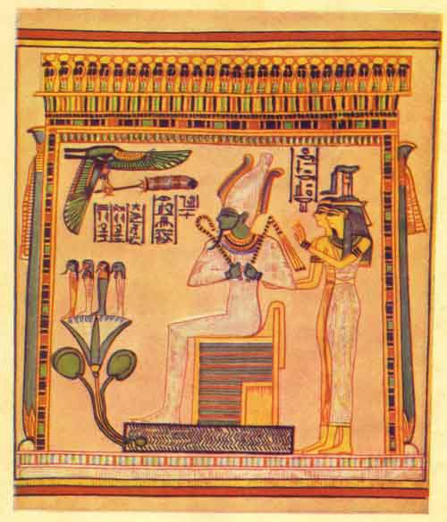

  
[Intangible Textual Heritage](../../index)  [Egypt](../index.md) 
[Index](index)  [Next](woe01.md) 

------------------------------------------------------------------------

##### The

# Wisdom of the Egyptians

##### The Story of the Egyptians, the Religion of the Ancient Egyptians, the Ptah-Hotep and the Ke'gemini, the "Book of the Dead," the Wisdom of Hermes Trismegistus, Egyptian Magic, the Book of Thoth

##### Edited, and with an Introduction

## By Brian Brown

#### New York: Brentano's

#### \[1923\]

###### This book is in the public domain because it was never registered or renewed at the US Copyright Office.

###### Scanned at Intangible Textual Heritage March 2003, J. Lelievre, redactor. This text is in the public domain. These files may be reproduced for any non-commercial purpose provided this notice of attribution is left intact.

   
OSIRIS KHENTI AMENTI, the Great God, seated in his shrine of fire. In
front of Osiris is the Eye of Horus and behind him stand the Godesses
ISIS and NEPHTHYS.

From the Papyrus of Hunefer in the British Museum

 

------------------------------------------------------------------------

[Next: Introduction](woe01.md)
