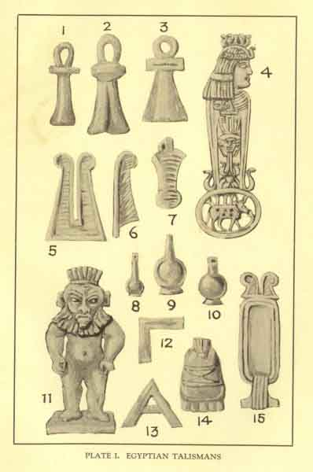
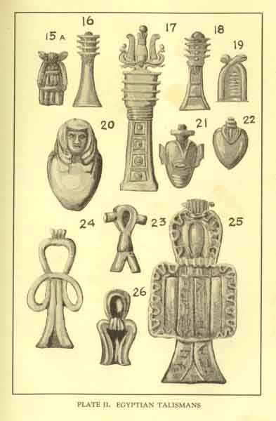
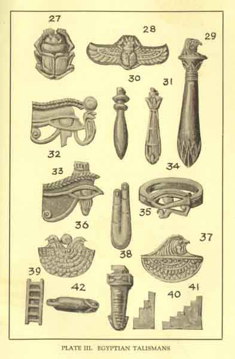
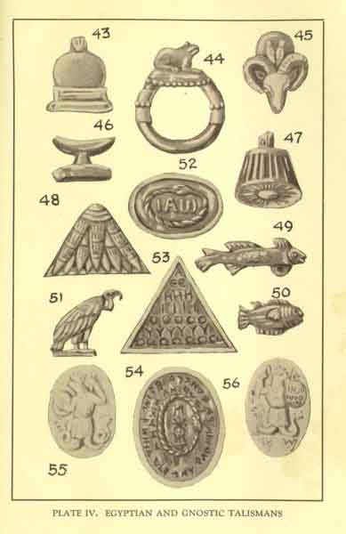

  
[Intangible Textual Heritage](../../index)  [Egypt](../index.md) 
[Index](index)  [Previous](woe07)  [Next](woe09.md) 

------------------------------------------------------------------------

p. 230

# CHAPTER VI

### EGYPTIAN MAGIC

TO the peoples of antiquity Egypt appeared as the very mother of magic.
In the mysterious Nile country they found a magical system much more
highly developed than any within their native knowledge, and the cult of
the dead, with which Egyptian religion was so strongly identified,
appeared to the foreigner to savour of magical practice. If the
materials of the magical papyri be omitted, the accounts which we
possess of Egyptian magic are almost wholly foreign, so that it is wiser
to derive our data concerning it from the original native sources if we
desire to arrive at a proper understanding of Egyptian sorcery.

Most of what has been written by Egyptologists on the subject of
Egyptian magic has been penned on the assumption that magic is either
merely a degraded form of religion, or its foundation. This is one of
the results of the archæologist entering a domain--that of
anthropology--where he is usually rather at a loss. For example, we find
Sir

p. 231

\[paragraph continues\] Gaston Maspero stating that "ancient magic was
the very foundation of religion. The faithful who desired to obtain some
favor from a god had no chance of succeeding except by laying hands on
the deity, and this arrest could only be effected by means of a certain
number of rites, sacrifices, prayers, and chants, which the god himself
had revealed and which obliged him to do what was demanded of
him." [1](#fn_50.md) Then we find Dr. Budge stating
that in the religious texts and works we see how magic is made to be the
handmaiden of religion, and that whereas non-Egyptian races directed
their art against the powers of darkness, and invoked a class of
benevolent beings to their aid, the Egyptians aimed at complete control
over their native deities.

Let us glance for a moment at the question of the origin of magic.
Considerable diversity of opinion exists regarding this subject among
present-day anthropologists, and the works of Frazer, Marett, Hubert,
and Mauss, etc., although differing widely as regards its foundations,
have thrown much light upon a hitherto obscure problem. All writers on
the subject, however, appear to have

p. 232

ignored one notable circumstance in connection with it--that is, the
element of wonder, which is the true fount and source of veritable
magic. According to the warring schools of anthropology, nearly all
magic is sympathetic or mimetic in its nature. For example, when the
barbarian medicine-man desires rain he climbs a tree and sprinkles water
upon the parched earth beneath, in the hope that the deity responsible
for the weather will do likewise; when the ignorant sailor desires wind,
he imitates the whistling of the gale. This system is universal, but if
our conclusions are well founded, the magical element does not reside in
such practices as these. It must be obvious, as Frazer has pointed out,
that when the savage performs an act of sympathetic magic he does not
regard it as magical--that is, to his way of thinking it does not
contain any element of wonder at all; he regards his action as a cause
which is certain to bring about the desired effect, exactly as the
scientific man of today believes that if he follows certain formulæ
certain results will be achieved. Now the true magic of wonder argues
from effect to cause; so it would appear as if sympathy magic were
merely a description of proto-science, due to mental processes entirely
similar to those by which scientific

p. 233

laws are produced and scientific acts are performed --that there is a
spirit of certainty about it which is not found, for example, in the
magic of evocation.

It would, however, be rash to attempt to differentiate sympathetic magic
entirely from what I would call the "magic of wonder" at this juncture;
indeed, our knowledge of the basic laws of magic is too slight as yet to
permit of such a process. We find considerable overlapping between the
systems. For example, one of the ways by which evilly disposed persons
could transform themselves into werewolves was by means of buckling on a
belt of wolfskin. Thus we see that in this instance the true
wonder-magic of animal transformation is in some measure connected with
the sympathetic process, the idea being that the donning of wolfskin, or
even the binding around one of a strip of the animal's hide, was
sufficient to bestow the nature of the beast upon the wearer. In
passing, I may say, for the sake of completeness, that I believe the
magic of wonder to be almost entirely spiritistic in its nature, and
that it consists of evocation and similar processes. Here, of course, it
may be quoted against me that certain incenses, planetary signs, and
other media known to possess affinities for certain supernatural beings
were brought into

p. 234

use at the time of their evocation. Once more I admit that the two
systems overlap; but that will not convince me that they are in essence
the same.

#### Antiquity of Egyptian Magic.

Like all magic, Egyptian magic was of prehistoric origin. As the savage
of today employs the sympathetic process, so did the savage of the
Egyptian Stone Age make use of it. That he also was fully aware of the
spiritistic side of magic is certain. Animism is the mother of
spiritism. The concept of the soul was arrived at at a comparatively
early period in the history of man. The phenomenon of sleep puzzled him.
Whither did the real man betake himself during the hours of slumber? The
Palæolithic man watched his sleeping brother, who appeared to him as
practically dead--dead, at least, to perception and the realities of
life. Something seemed to have escaped the sleeper; the real, vital, and
vivifying element had temporarily departed from him. From his own
experience the puzzled savage knew that life did not cease with sleep,
for in a more shadowy and unsubstantial sphere he re-enacted the scenes
of his everyday existence. If the man during sleep had experiences in
dreamland or in distant parts, it was only reasonable

p. 235

to suppose that his ego, his very self, had temporarily quitted the
body. Grant so much, and you have two separate entities, body and soul,
similar in appearance because the latter on the dream plane exercised
functions identical with those of the former on the corporeal plane.

#### The Wandering Spirit.

But prehistoric logic did not stop here. So much premised, it extended
its soul-theory to all animate beings, and even to things inanimate.
Where, for example, did the souls of men go after death? Their bodies
decayed, so it was only reasonable to suppose that they cast about them
for other corporeal media. Failing their ability to enter the body of a
new-born infant, they would take up their quarters in a tree, a rock, or
any suitable natural object, and the terrified savage could hear their
voices crying down the wind and whispering through the leaves of the
forest, possibly clamoring or entreating for that food and shelter which
they could not obtain in their disembodied condition. All nature, then,
we see became animate to early man, and not less so to the early
Egyptian than to others. But his hunting life had made prehistoric man
exceptionally cunning and resourceful, and it

p. 236

would soon occur to him--in what manner we do not presume to say, as the
point greatly requires elucidation--that we might possibly make use of
such wandering and masterless spirits as he knew were close to his call.
In this desire, it appears to me--if the statement be not a
platitude--we have one of the origins of the magic of wonder, and
certainly the origin of spiritism. Trading upon the wish of the
disembodied spirit to materialize, prehistoric man would construct a
fetish either in the human shape or in that of an animal, or in any
weird presentment that squared with his ideas of spiritual existence. He
usually made it of no great dimensions, as he did not believe that the
*alter ego*, or soul, was of any great size. By threats or coaxings he
prevailed upon the wandering spirit--whom he conceived as, like all the
dead, cold, hungry, and homeless--to enter the little image, which duly
became its corporeal abode, where its lips were piously smeared with the
blood of animals slain in the chase, and where it was carefully
attended. In return it was expected, by dint of its supernatural
knowledge, that the soul contained in the fetish should assist its
master or coadjutor in every possible way.

p. 287

#### Coercing the Gods.

Egyptian magic differed from most other systems in the circumstance that
the native magician attempted to coerce certain of the gods into action
on his behalf. Instances of this elsewhere are extremely rare, and it
would seem as if the deities of Egypt had evolved in many cases from
mere animistic conceptions. This is true in effect of all deities, but
at a certain point in their history most gods arrive at such a condition
of eminence that they soar far above any possibility of being employed
by the magician as mere tools for any personal purpose. We often,
however, find the broken-down, or deserted, deity coerced by the
magician. Of this class Beelzebub might be taken as a good example. A
great reputation is a hard thing to lose, and it is possible that the
sorcerer may descry in the abandoned, and therefore idle, god a very
suitable medium for this purpose. But we find the divinities of Egypt
frightened into using their power on behalf of some paltry sorcerer even
in the very zenith of their fame. One thing is of course essential to a
complete system of sorcery, and that is the existence of a number of
spirits, the detritus of a vanished or submerged religion.

p. 238

\[paragraph continues\] As we know, there were numerous strata in
Egyptian religion--more than one faith had obtained on the banks of the
Nile, and it may be that the worshippers of the deities of another as
magical on the first introduction of a new system; in fact, these may
have been interchangeable, and it is possible that by the time the
various gods became common to all the practice had become so universal
as to be impossible of abandonment.

If our conclusions are correct, it would seem that Maspero's statement
that magic is the foundation of religion is scarcely consonant with
fact. We have seen that at least the greater part of barbarian magic
so--called--that is, sympathetic magic--is probably not of the nature of
magic at all, so that the scope of his contention is considerably
lessened. Budge's dictum that the magic of every other nation of the
ancient East but the Egyptian was directed entirely against the powers
of darkness, and was invented to frustrate their fell designs by
invoking a class of benevolent beings, is so far an error in that the
peoples of the ancient Orient invoked evil beings equally with good. At
the same time it must be admitted that Egyptian magic had much more in
common with religion than most other magical systems, and this arose
from the

p. 239

extraordinary circumstances of the evolution of religion on Egyptian
soil.

### EGYPTIAN OCCULTISM AND SYMBOLISM

Of all civilizations known to us through history, that of ancient Egypt
is the most marvellous, most fascinating, and most rich in occult
significance: yet we have still much to discover, and although we have
the assurance of Herodotus that the Egyptians were "beyond measure
scrupulous in all matters appertaining to religion," the ancient
religions--or such fragments as survive--appear at first glance
confusing and even grotesque. It is necessary to remember that there was
an inner as well as an outer theology, and that the occult mysteries
were accessible only to those valiant and strenuous initiates who had
successfully passed through a prolonged purification and course of
preparation austere and difficult enough to discourage all save the most
persistent and exalted spirits.

It is only available to us to wander on the outskirts of Egyptian
mythology. The most familiar symbolic figures are those of Isis the moon
goddess, traditional queen of Egypt, and Osiris her husband; and when we
read that Isis was the sister, wife, and mother of Osiris we must seek
the inner

p. 240

meaning of the strange and impossible relationship. It has been lucidly
explained by Princess Karadja in her *King Solomon: a Mystic Drama*,
1912, pp. 130 to 131:

"Originally the dual souls are part of the same Divine Ego. They are
golden fruits upon the great Tree of Life: 'male and female He created
them.'

Isis is the *Sister* of Osiris because she is of Divine origin like
himself, and is a sprit of equal rank.

She is his *Wife*, because she alone can fill his highest cravings.

She is his *Mother* because it is the mission of Woman to restore Man
unto spiritual life."

How Osiris was slain by his brother Typhon--or Set--the spirit of evil,
and dismembered into fourteen fragments which were scattered and bidden
by the destroyer; how Isis, widowed and broken-hearted, sought patiently
until she found each fragment, and how Horus her son when he grew to
manhood challenged and conquered Typhon--all this is the figurative
rendering of the eternal battle between light and darkness.

Typhon or Set symbolises autumn, decay, and destruction, Osiris
springtime, light, and the fertilizing and growing powers of nature.
Isis is typified in many forms, but was especially revered as the
goddess of procreation, universal mother of the living, and protectress
of the spirits of the dead.

p. 241

Her symbol was the cow, and she is usually depicted wearing cow's horns,
and between them the orb of the moon.

But more ancient and more exalted than Osiris was Ra, the sun god, whose
worship was blended with that of Isis and her husband and son. The
priests of Ra established a famous temple at Heliopolis, and founded a
special system of solar worship. Just as the Emperor Constantine
subsequently fixed as saints' days in the Christian church the days
which had been dedicated to the ancient pagan gods, so the priests of Ra
adapted their cult to the tastes and notions of the people, and a whole
company of subordinate gods figured in the religions of lower Egypt for
many centuries. Sometimes divine virtues were portrayed in very material
forms.

Between 4000 and 2000 B.C., the worship of Amen, or Amen Ra, as the
greatest god of the Egyptians, was established at Thebes, which became
the centre of religious teaching. The priests grew more and more
powerful until finally the high priest of Amen--whose name means the
"*hidden one*"--became the king of upper Egypt. Amen was regarded as the
creator, with all the power and

p. 242

attributes of Ra the sun god, and as ruler of the lesser gods.

It has been asked why the Egyptians, who had no belief in a material
resurrection, took such infinite trouble to preserve the bodies of their
dead. They looked forward to a paradise in which eternal life would be
the reward of the righteous, and their creed inculcated faith in the
existence of a spiritual body to be inhabited by the soul which had
ended its earthly pilgrimage; but such beliefs do not explain the
attention bestowed upon the lifeless corpse. The explanation must be
sought in the famous Book of the Dead, representing the convictions
which prevailed throughout the whole of the Egyptian civilization from
pre-dynastic times. Briefly, the answer to our question is this: there
was a Ka or double, in which the heart-soul was located; this Ka,
equivalent to the astral body of modern occultists, was believed to be
able to come into touch with material things through the preserved or
mummified body. This theory accords with the axiom that each atom of
physical substance has its relative equivalent on the astral plane. It
will therefore be understood how, in the ancient religions, the image of
a god was regarded as a medium through which his powers could be
manifested.

p. 243

\[paragraph continues\] "As above, so below"; every living thing
possessed some divine attribute.

Faith in prayer was an essential article of the Egyptian religion, and
the spoken word of a priest was believed to have strong potency, because
it had been the words of Ra uttered by Thoth which brought the universe
into being. Amulets inscribed with words were consequently thought to
ensure the fulfilment of the blessing expressed, or the granting of the
bliss desired.

The *Book of the Dead* was not only a guide to the life hereafter,
wherein they would join their friends in the realms of eternal bliss,
but gave detailed particulars of the necessary knowledge, actions, and,
conduct during the earthly life to ensure a future existence in the
spirit world, where everlasting life was the reward of the good and
annihilation the fate of the wicked, thus showing that the belief in the
existence of a future life was ever before them. Various qualities,
though primarily considered a manifestation of the Almighty, were
attributed each to a special god who controlled and typified one
particular virtue. This partly accounts for the multiplied numbers of
the Egyptian gods, and with the further complications that resulted from
invasions and the adoption of

p. 244

alien beliefs, the religious philosophy of Egypt is not easy to follow,
and is often seemingly contradictory; but when we take into
consideration the vast period during which this empire flourished it is
natural that the external manifestations of faith should have varied as
time went on.

A knowledge of life, death, and resurrection of Osiris is assumed, and
his worship in association with Isis and Horus although not necessarily
under these names, is continuous. Horus is frequently alluded to as the
god of the ladder, and the mystic ladder seen by Jacob in his vision,
and the ladder of seven steps known to the initiates of Egypt, Greece,
Mexico, India, and Persia will be familiar to all students of occultism.

Throughout the whole of the Egyptian civilization, which lasted for at
least 6000 years, the influence and potency of amulets and talismans was
recognised in the religious services, each talisman and amulet having a
specified virtue.

Certain amulets not only were worn during life, but were even attached
to the dead body. They are described in the following notes

The *Crux Ansata*, or *Ankh* (see Illustrations Nos. 1, 2, 3, Plate
[I](#img_I).md), was known as the symbol of life, the loop at the top of
the cross consisting of the

 

   
Plate I: EGYPTIAN TALISMANS

 

p. 245

hieroglyphic Ru (O) set in an upright form, meaning the gateway, or
mouth, the creative power being signified by the loop which represents a
fish's mouth giving birth to water as the life of the country, bringing
the inundations and renewal of the fruitfulness of the earth to those
who depended upon its increase to maintain life. It was regarded as the
key of the Nile which overflowed periodically and so fertilized the
land.

It was also shown in the hands of the Egyptian kings, at whose
coronations it played an important part, and the gods are invariably
depicted holding this symbol of creative power; it was also worn to
bring knowledge, power, and abundance. Again, it had reference to the
spiritual life for it was from the Crux Ansata, or Ankh, that the symbol
of Venus originated, the circle over the cross being the triumph of
spirit, represented by the circle, over matter, shown by the cross.

The *Menat* (Illustrations Nos. 4, 7, Plate [I](#img_I).md), were specially
dedicated to Hathor, who was a type of Isis, and was worn for conjugal
happiness, as it gave power and strength to the organs of reproduction,
promoting health and fruitfulness. It frequently formed a part of a
necklace, and was elaborately ornamented; No, 4 from the British Museum,

p. 246

is a good specimen, the cow being an emblem of the maternal qualities
which were the attributes of the goddess, who stood for all that is good
and true in wife, mother, and daughter.

The *Two Plumes* (Illustration No. 5, Plate [I](#img_I).md), are sun
amulets and the symbols of Ra and Thoth, the two feathers being typical
of the two lives, spiritual and material. This was worn to promote
uprightness in dealing, enlightenment, and morality, being symbolical of
the great gods of light and air.

The *Single Plume* (Illustration No. 6, Plate [I](#img_I).md), was an
emblem of Maat, the female counterpart of Thoth, who wears on her head
the feather characteristic of the phonetic value of her name; she was
the personification of integrity, righteousness, and truth.

Illustrations Nos. 8, 9, 10, Plate [I](#img_I.md), show three forms of the
*Nefer*, a symbol of good luck, worn to attract success, happiness,
vitality, and friends.

The *Cartouche*, or *Name Amulet* (Illustration No. 15, Plate
[I](#img_I).md), was worn to secure favor, recognition, and remembrance,
and to prevent the name of its wearer being blotted out in the next
world. This is a very important amulet, as the name was believed to be
an integral part of the man, without

p. 247

which his soul could not come before God, so that it was most essential
that the name should be preserved, in order, as described in the *Book
of the Dead*, "thou shalt never perish, thou shalt never, never come to
an end," the loss of the name meaning the total annihilation of the
individual.

The amulets of the *Angles* (see Illustrations Nos. 12, 13, Plate
[I](#img_I)) and the *Plummet* (No. 60 on the same Plate.md), were symbols
of the god Thoth, and were worn for moral integrity, wisdom, knowledge,
order, and truth. Thoth was the personification of law and order, being
the god who worked out the creation as decreed by the god Ra. He knew
all the words of power and the secrets of all hearts, and may be
regarded as the chief recording angel; he was also the inventor of all
arts and sciences.

Bes, shown in Illustration No. 11, Plate [I](#img_I.md), was a very popular
talisman, being the god of laughter, merry-making, and good luck; by
some authorities he is considered to be a foreign importation from
pre-dynastic times, and he has been identified with Horus and regarded
as the god who renewed youth. He was also the patron of beauty, the
protector of children, and was undoubtedly the progenitor of the modern
Billiken.

p. 248

Illustrations Nos. 15, 19, Plate [II](#img_II.md), are examples of the
*Aper*, which symbolised providence and was worn for steadfastness,
stability, and alertness.

The *Tat* (Illustrations Nos. 16, 17, 18, Plate [II](#img_II).md) held a
very important place in the religious services of the Egyptians, and
formed the centre of the annual ceremony of the setting-up of the Tat, a
service held to commemorate the death and resurrection of Osiris, this
symbol representing the building-up of the backbone and reconstruction
of the body of Osiris. In their services the Egyptians associated
themselves with Osiris, through whose sufferings and death they hoped to
rise glorified and immortal, and secure everlasting happiness. The four
cross-bars symbolise the four cardinal points, and the four elements of
earth, air, fire and water, and were often very elaborately ornamented
(see Illustration No. 17, Plate [II](#img_II.md), taken from an example at
the British Museum). It was worn as a talisman for stability and
strength, and for protection from enemies; also that all doors--or
opportunities--might be open both in this life and the next. Moreover, a
Tat of gold set in sycamore wood, which had been steeped in the water of
Ankham flowers, was placed at the neck of the deceased on the day of
interment, to protect him

 

   
PLATE II. EGYPTIAN TALISMANS

 

p. 249

on his journey through the underworld and assist him in triumphing over
his foes, that he might become perfect for ever and ever.

The *Heart* was believed to be the seat of the soul, and Illustrations
Nos. 20, 21, 22, Plate [II](#img_II.md), are examples of these talismans
worn to prevent black magicians from bewitching the soul out of the
body. The importance of these charms will be realized from the belief
that if the soul left the heart, the body would quickly fade away and
die. According to Egyptian lore at the judgment of the dead the heart is
weighed, when, if found perfect, it is returned to its owner, who
immediately recovers his powers of locomotion and becomes his own
master, with strength in his limbs and everlasting felicity in his soul.

The buckle of the girdle of Isis was worn to obtain the good-will and
protection of this goddess, and symbolised "the blood of Isis" and her
strength and power. Frequently made of carnelian it was believed to
protect its wearer from every kind of evil; also to secure the good-will
of Horus; and, when placed like the golden Tat at the neck of the dead
on the day of the funeral in the soul's journey through the underworld
it opened up all hidden places and procured the favor of Isis and her
son,

p. 250

Horus, for ever and ever. (See Illustrations Nos. 24, 25, 26, Plate
*Tie*.)

The *Tie*, or *Sa* (Illustration No. 23, Plate *Tie*) is the symbol of
Ta-urt, the hippopotamus-headed goddess, who was associated with the god
Thoth, the personification of divine intelligence and human reason; it
was worn for magical protection.

The *Scarab* was the symbol of Khepera, a form of the sun-god who
transforms inert matter into action, creates life, and typifies the
glorified spiritual body that man shall possess at the resurrection.
From the enormous number of scarabs that have been found, this must have
formed the most popular of the talismans. The symbol was derived from a
beetle, common in Egypt, which deposits its eggs in a ball of clay, the
action of the insect in rolling this ball along the ground being
compared with the sun itself in its progress across the sky; and as the
ball contained the living germ which (under the heat of the sun) hatched
out into a beetle, so the scarab became the symbol of creation. It is
also frequently seen holding the disk of the sun between its claws, with
wings extended, and it is thought by some authorities that the scarab
was taken as an emblem of the sun, because the burial

p. 251

of its ball was symbolic of the setting sun from which new life arises
with each dawn.

Scarabs of green stones with rims of gold were buried in the heart of
the deceased, or laid upon the breast, with a written prayer for his
protection on the day of judgment, whilst words of power were frequently
recited over the scarab which was placed under the coffin as an emblem
of immortality so that no fiend could harm the dead in his journey
through the underworld. It is said the scarab was associated with burial
as far back as the fourth dynasty (about 4600 B.C.); it represented
matter about to pass from a state of inertness into active life, so was
considered a fitting emblem of resurrection and immortality, typifying
not only the sun's disk, but the evolutions of the soul throughout
eternity. It was also worn by the Egyptian warriors in their signet
rings for health, strength, and virility, it being thought that this
species of beetle was all males, so that it would attract all. manly
qualities, both of mind and body. For this reason it was very popular as
presents between friends, many scarabs being found with good wishes or
mottoes engraved on the under side, and some of the kings used the back
of scarabs to commemorate historical events; one in the British

p. 252

\[paragraph continues\] Museum records the slaughter of one hundred and
two fierce lions by Amenhetep III, with his own hand (see Illustrations
Nos. 27, 28, Plate [III](#img_III).md).

Next to the scarab, the ancient Egyptians attached much importance to
the *Eye Amulet*, which, from the earliest astral mythology, was first
represented by the point within the circle and was associated with the
god of the pole star, which, from its fixity, was taken as a type of the
eternal, unchangeable as time rolled on, and thus a fitting emblem of
fixity of purpose, poise, and stability. Later it was one of the
hieroglyphic signs of the sun-god Ra, and represented the one supreme
power casting his eye over all the world, and instead of the point
within the circle is sometimes represented as a widely open eye. This
symbol was also assigned to Osiris, Isis, Horus, and Ptah; the amulet
known as the Eye of Osiris being placed upon the incision made in the
side of the body--for the purpose of embalming--to watch over and guard
the soul of the deceased during its passing through the darkness of the
tomb to the life beyond.

It was also worn by the living to ensure health and protection from the
blighting influence of workers in black magic, and for the stability,

 

   
PLATE III. EGYPTIAN TALISMANS

 

p. 253

strength, and courage of Horus, the wisdom and understanding of Ptah,
and the foresight of Isis.

It was also extensively used in necklaces on account of the idea that
representations of the eye itself would watch over and guard its wearer
from the malignant glances of the envious, it being universally believed
that the fiery sparks of jealousy, hatred, and malice darting from the
eyes of angry persons, envious of the good looks, health, and success of
the fortunate ones, could so poison the surrounding atmosphere as even
to cause sickness, decay, and death; horses were thought particularly
liable to this injurious influence, and talismans to avert such a
misfortune to them were hung on their foreheads, or over the left eye.

Examples of eye amulets are illustrated on Plate [III](#img_III.md), Nos.
32, 33, and 34.

When two eyes are used together the right eye is symbolic of Ra, or
Osiris and the sun; whilst the left eye represents Isis, or the moon,
and is sometimes called the amulet of the two Utchats; the word Utchat,
signifying "strength," being applied to the sun when he enters the
summer solstice about June 22d, his strength and power on earth being
greatest at that time.

The talisman of the *Two Fingers* (Illustration

p. 254

\[paragraph continues\] No. 35, Plate [III](#img_III).md) was symbolical of
help, assistance, and benediction, typified by the two fingers extended
by Horus to assist his father in mounting the ladder suspended between
this world and the next. This amulet was frequently placed in the
interior of the mummified body to enable the departed to travel quickly
to the regions of the blest. Amongst the ancient Egyptians the fingers
were ever considered an emblem of strength and power, the raising of the
first two fingers being regarded as a sign of peace and good faith; the
first finger being the indicator of divine will and justice and the only
one that can stand erect by itself alone; the second representing the
holy spirit, the mediator, a symbolism handed down to us in the
extension of the index and medius in the ecclesiastical benediction. It
is also interesting to note that at the marriage ceremony in olden days
the ring was first placed on the thumb, as typical of man's allegiance
to God, and lastly on the third finger of his bride to show that next to
God in the trinity, a man's life should be devoted to his wife.

The *Collar Amulet* (Illustrations Nos. 36, 37, Plate [III](#img_III).md)
was a symbol of Isis, and was worn to procure her protection and the
strength of her son Horus. In both examples the head of the hawk

p. 255

appears, this bird being attributed to Horus as well as to Ra. This
collar, which was made of gold, was engraved with words of power and
seems to have been chiefly used as a funeral amulet.

The *Sma* (Illustration No. 38, Plate [III](#img_III).md) was a favorite
amulet from the dawn of Egyptian history, and is frequently used in
various forms of decorated art. It was symbolical of union and stability
of affection, and was worn to strengthen love and friendship and ensure
physical happiness and faithfulness.

The *Ladder* is a symbol of Horus, and was worn to secure his assistance
in overcoming and surmounting difficulties in the material world, as
well as to form a connection with the heaven world, or land of light.
The earliest traditions place this heaven world above the earth, its
floor being the sky, and to reach this a ladder was deemed necessary.
From the pyramid texts it seems there were two stages of ascent to the
upper paradise, represented by two ladders, one being the ladder of Sut,
forming the ladder of ascent from the land of darkness, and the other
the ladder of Horus reaching the land of light (Illustration No. 39,
Plate [III](#img_III).md).

'The *Steps* (Illustrations Nos. 40, 41, Plate [III](#img_III).md) are a
symbol of Osiris, who is described as the god

p. 256

of the staircase, through whom it was hoped the deceased might reach the
heaven world and attain everlasting bliss.

The Snake's Head talisman (Illustration No. 42, Plate [III](#img_III).md)
was worn to protect its wearer from the attacks of Rerek, or Apep, the
servant of Set, who was typified as a terrible serpent, which when
killed had the power of rising in new forms and who obstructed the
passage to the heaven world. The serpent, although sometimes assumed to
be a form of evil, was generally regarded as a protecting influence, and
for this reason was usually sculptured on either side of the doorways to
the tombs of kings, temples, and other sacred buildings to guard the
dead from enemies of every kind, and to prevent the entrance of evil in
any shape or form. It was also placed round the heads of divinities and
round the crowns of their kings as a symbol of royal might and power,
being one of the forms or types of Tem the son of Ptah, who is thought
by some authorities to have been the first living man god of the
Egyptians, and the god of the setting sun (in contrast to Horus, who was
the god of the rising sun). Tem was typified by a huge snake, and it is
curious to note in connection with this that amongst country

p. 257

folk at the present day there is a popular belief that a serpent will
not die until the sun goes down.

The *Sun's Disk* talismans (Illustrations No. 43, 45, Plate
[IV](#img_IV).md) are symbols of the god Ra, No. 45 being appropriately
placed upon the head of a ram, the symbol of the zodiacal house Aries,
in which sign the sun is exalted. It was worn for power and renown, and
to obtain the favors of the great ones, being also an emblem of new
birth and resurrection.

The *Frog* talisman (Illustration No. 44, Plate [IV](#img_IV).md) was
highly esteemed, and is an attribute of Isis, being worn to attract her
favors and for fruitfulness. Because of its fertility its hieroglyphic
meaning was an immense number. It was also used as a symbol of Ptah, as
it represented life in embryo, and by the growth of its feet after birth
it typified strength from weakness, and was worn for recovery from
disease, also for health and long life, taking the place sometimes of
the Crux Ansata or Ankh, as a symbol of life.

The *Pillow* (Illustration No. 46, Plate [IV](#img_IV).md) was used for
preservation from sickness and against pain and suffering; it was also
worn for the favor of Horns, and was placed with the dead as a
protection and to prevent violation of the tomb.

The *Lotus* (Illustrations No. 47, 48, Plate [IV](#img_IV).md)

p. 258

is a symbol with two meanings. Emblematical of the sun in the ancient
days of Egypt and typifying light, understanding, fruitfulness, and
plenty, it was believed to bring the favors of the god Ra. Later it is
described as "the pure lily of the celestial ocean," the symbol of Isis,
who is sometimes alluded to as "the white virgin." It became typical of
virginity and purity, and having the double virtue of chastity and
fecundity it was alike prized for maiden- and motherhood.

The *Fish* talisman (Illustrations Nos. 49, 50, Plate [IV](#img_IV).md) is
a symbol of Hathor--who controlled the rising of the Nile--as well as an
amulet under the influence of Isis and Horus. It typified the primeval
creative principle and was worn for domestic felicity, abundance, and
general prosperity.

The *Vulture* talisman (Illustration No. 51, Plate [IV](#img_IV).md) was
worn to protect from the bites of scorpions, and to attract motherly
love and protection of Isis, who, it was believed, assumed the form of a
vulture when searching for her son Horus, who, in her absence, had been
stung to death by a scorpion. Thoth, moved by her lamentations, came to
earth and gave her "the words of power," which enabled her to restore
Horus to life. For this

 

   
PLATE IV. EGYPTIAN TALISMANS

 

p. 259

reason, it was thought that this amulet would endow its wearer with
power and wisdom so that he might identify himself with Horus and
partake of his good fortune in the fields of eternal bliss.

It is, of course, difficult and futile to speculate as to the extent of
the influence these Egyptian amulets and talismans exercised over this
ancient people, but in the light of our present knowledge we feel that
the religious symbolism they represented, the conditions under which
they were made, the faith in their efficacy, and the invocations and
"words of power" which in every case were a most essential part of their
mysterious composition makes them by far the most interesting of any yet
dealt with.

Gnosticism is the name given to a system of religion which came into
existence in the Roman empire about the time Christianity was
established; it was founded on a philosophy known in Asia Minor
centuries previously and apparently based upon the Egyptian beliefs, the
Zendavesta, Buddhism, and the Kabala, with their conception of the
perpetual conflict between good and evil.

The name is derived from the Greek *Gnosis*, meaning knowledge, and, in
brief, the gnostics' belief was that the intellectual world, with its

p. 260

spirits, intelligences, and various orders of angels were created by the
Almighty, and that the visible matter of creation was an emanation from
these powers and forces.

The attributes of the Supreme Being were those of Kabala:--Wisdom--Jeh;
prudence--Jehovah; magnificence--El; severity--Elohim; victory and
glory--Zaboath; empire--Adonai; the Gnostics also took from the Talmud
the planetary princes and the angels under them.

Basilides, the Gnostic priest, taught that God first created

\(1\) *Nous*, or mind; from this emanated

\(2\) *Logos*, the Word; from this

\(3\) *Phronesis*, Intelligence; and from this

\(4\) *Sophia*, Wisdom; and from the last

\(5\) *Dynamis*, Strength.

The Almighty was known as Abraxas, which signifies in Coptic "the
Blessed Name," and was symbolized by a figure, the head of which is that
of a cock, the body that of a man, with serpents forming the legs; in
his right hand he holds a whip, and on his left arm is a shield. This
talisman (see Illustrations Nos. 55, 56, Plate [IV](#img_IV).md) is a
combination of the five emanations mentioned above: *Nous* and *Logos*
are expressed by the two serpents, symbols

p. 261

of the inner sense and understanding, the bead of the cock representing
*Phronesis*, for foresight and vigilance; the two arms hold the symbols
of *Sophia* and *Dynamis*, the shield of wisdom and the whip of power,
worn for protection from moral and physical ill.

The Gnostics had great faith in the efficacy of sacred names and sigils
when engraved on stones as talismans; also in magical symbols derived
principally from the Kabala.

One of the most popular inscriptions was *Iaw* (Jehovah), and in
Illustration No. 52, Plate [IV](#img_IV.md), this is shown surrounded by
the serpent *Khnoubis*, taken from the Egyptian philosophy, representing
the creative principles, and was worn for vitality, understanding, and
protection. The seven Greek vowels (Illustration No. 53, Plate
[IV](#img_IV).md) symbolized the seven heavens, or planets, whose harmony
keeps the universe in existence, each vowel having seven different
methods of expression corresponding with a certain force, the correct
utterance of these letters and comprehension of the forces typified
being believed to confer supreme power, bringing success in all
enterprises and giving complete control over all the powers of darkness.

Illustration No. 54, Plate [IV](#img_IV.md), is an example of

p. 262

the use of the magic symbols, the meaning of which has been lost. It is
probably a composition of the initial letters of some mystical sigil,
enclosed by a serpent and the names of the arch-angels Gabriel, Paniel,
Ragauel, Thureiel, Souriel, and Michael. It was worn for health and
success; also for protection from all evils, and it is cut in an agate
and set in a gold mount.

A figure of a serpent with a lion's head, usually surrounded with a
halo, was worn to protect its wearer from heart and chest complaints and
to drive away demons.

The mystic Aum, already described in the chapter on Indian talismans,
was also a favorite with the Gnostics, and equally popular was a
talisman composed of the vowels Ι Α Ω, repeated to make twelve, this
number representing the ineffable name of God, which, according to the
Talmud, was only communicated to the most pious of the priesthood. They
also adopted from the Egyptians the following symbols: *Horus*, usually
represented seated on a Lotus, for fertility; *Osiris*, usually in the
form of a mummified figure, for spiritual attainment; and *Isis* for the
qualities mentioned in the previous chapter.

------------------------------------------------------------------------

### Footnotes

[231:1](woe08.htm#fr_50.md) "Etudes de Mythologie
et d'Archéologie Egyptienne;" Paris, 1893.

------------------------------------------------------------------------

[Next: Chapter VII: The Vision of Hermes](woe09.md)
