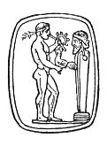
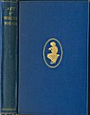

  
[Intangible Textual Heritage](../../index)  [Esoteric](../index) 
[Index](index)  [Next](aww01) 

------------------------------------------------------------------------

[Buy this Book at
Amazon.com](https://www.amazon.com/exec/obidos/ASIN/B002A9JOQK/internetsacredte)

------------------------------------------------------------------------

  
*The Art of Worldly Wisdom*, by Balthasar Gracian, tr. by Joseph Jacobs,
\[1892\], at Intangible Textual Heritage

------------------------------------------------------------------------

p. iii

<table data-border="0" width="40%">
<colgroup>
<col style="width: 100%" />
</colgroup>
<tbody>
<tr class="odd">
<td data-valign="top" width="655">Auf des Glückes großer Waage 
Steht die Zunge selten ein; 
Du mußt steigen oder sinken, 
Du mußt herrschen und gewinnen, 
Oder dienen und verlieren, 
Leiden oder triumphieren, 
Amboß oder Hammer sein. <a href="#fn_0">1</a> 
          GOETHE, <em>Ein Kophtisches Lied</em>.

<em>When you are an anvil, hold you still, 
When you are a hammer, strike your fill</em>. 
          G. HERBERT, <em>Jacula Prudentum</em>.
</td>
</tr>
</tbody>
</table>

# THE ART

###### OF

# WORLDLY WISDOM

###### BY

## BALTHASAR GRACIAN

##### TRANSLATED FROM THE SPANISH BY

### JOSEPH JACOBS

###### Corresponding Member of the Royal Academy of History, Madrid

 

#### MACMILLAN AND CO., LIMITED ST. MARTIN'S STREET, LONDON

#### \[1892\]

Scanned, Proofed, and formatted at Intangible Textual Heritage, June
2005, by John Bruno Hare. This text is in the public domain in the
United States because it was published prior to 1923.

 
[  
Click to enlarge](img/cover.jpg)  
Cover  

[Jump to start of text](aww10.htm#page_1)

------------------------------------------------------------------------

### Footnotes

[iii:1](#fr_0) Translation of the Goethe epigram,
above:

On the great scales of fortune,  
The balance rarely keeps still;  
You must rise or sink,  
You must rule and win  
Or serve and lose,  
Suffer or triumph,  
Be the anvil or the hammer.

—JBH.

------------------------------------------------------------------------

[Next: Dedication](aww01)
