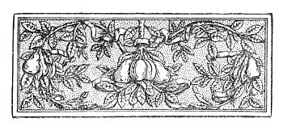

  
[Intangible Textual Heritage](../../index)  [Esoteric](../index.md) 
[Index](index)  [Previous](aww01)  [Next](aww03.md) 

------------------------------------------------------------------------

[Buy this Book at
Amazon.com](https://www.amazon.com/exec/obidos/ASIN/B002A9JOQK/internetsacredte.md)

------------------------------------------------------------------------

  
*The Art of Worldly Wisdom*, by Balthasar Gracian, tr. by Joseph Jacobs,
\[1892\], at Intangible Textual Heritage

------------------------------------------------------------------------

p. vii

 

# PREFACE

My attention was first drawn to the *Oráculo Manual* by Mr. (now Sir
Mountstuart) Grant Duff's admirable article on Balthasar Gracian in the
*Fortnightly Review* of March 1877. I soon after obtained a copy of
Schopenhauer's excellent version, and during a journey in Spain I
procured with some difficulty a villainously printed edition of
Gracian's works (Barcelona, 1734, "Por Joseph Giralt"), which contains
the *Oráculo Manual* towards the end of the first volume (pp. 431-494).

I have translated from this last, referring in the many doubtful places
of its text to the first Madrid edition of 1653, the earliest in the
British Museum. I have [throughout](errata.htm#0.md) had Schopenhauer's
version by my side, and have

p. viii

found it, as Sir Mountstuart Grant Duff says, "a most finished piece of
work," though I have pointed out in the Notes a few cases where he has
failed, in my opinion, to give Gracian's meaning completely or
correctly. I have little doubt that I am a fellow-sinner in this regard:
I know no prose style that offers such difficulty to a translator as
Gracian's laconic and artificial epigrams. It is not without reason that
he has been called the Intraducible. The two earlier English versions
miss his points time after time, and I found it useless to refer to
them. On the other hand, I have ventured to adopt some of Sir
Mountstuart Grant Duff's often very happy renderings in the extracts
contained in his *Fortnightly* article.

I have endeavoured to reproduce Gracian's Laconism and *Cultismo* in my
version, and have even tried to retain his many paronomasias and jingles
of similar sound. I may have here and there introduced others of my own
to redress the balance for cases where I found it impossible to produce
the same effect in English. In such cases I generally give the

p. ix

original in the Notes. Wherever possible I have replaced Spanish
proverbs and proverbial phrases by English ones, and have throughout
tried to preserve the characteristic rhythm and brevity of the Proverb.
In short, if I may venture to say so, I have approached my task rather
in the spirit of Fitzgerald than of Bohn.

The gem on the title, representing a votive offering to Hermes, the god
of Worldly Wisdom, is from a fine paste in the British Museum of the
best period of Greek glyptic art. I have to thank Mr. Cecil Smith of
that Institution for kind advice in the selection.

Let me conclude these prefatory words with a piece of advice as oracular
as my original: When reading this little book for the first time, read
only fifty maxims and then stop for the day.

JOSEPH JACOBS.

------------------------------------------------------------------------

[Next: Testimonia](aww03.md)
