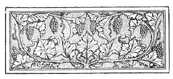

  
[Intangible Textual Heritage](../../index)  [Esoteric](../index) 
[Index](index)  [Previous](aww03)  [Next](aww05) 

------------------------------------------------------------------------

[Buy this Book at
Amazon.com](https://www.amazon.com/exec/obidos/ASIN/B002A9JOQK/internetsacredte)

------------------------------------------------------------------------

  
*The Art of Worldly Wisdom*, by Balthasar Gracian, tr. by Joseph Jacobs,
\[1892\], at Intangible Textual Heritage

------------------------------------------------------------------------

p. xvii

 

# INTRODUCTION

### I. Of Balthasar Gracian and his Works

WE may certainly say of Gracian what Heine by an amiable fiction said of
himself: he was one of the first men of his century. For he was born 8th
January 1601 N.S. [1](#fn_1) at Belmonte, a
suburb of Calatayud, in the kingdom of Aragon. Calatayud, properly Kalat
Ayoub, "Job's Town," is nearly on the site of the ancient Bilbilis,
Martial's birthplace. As its name indicates, it was one of the Moorish
settlements, and nearly one of the most northern. By Gracian's time it
had again been Christian and Spanish for many generations, and Gracian
himself was of noble birth. For a Spaniard of

p. xviii

noble birth only two careers were open, arms and the Church. In the
seventeenth century arms had yielded to the cassock, and Balthasar and
his three brothers all took orders. Felipe, his eldest, joined the order
of St. Francis; the next brother, Pedro, became a Trinitarian during his
short life; and the third, Raymundo, became a Carmelite [1](#fn_2). Balthasar himself tells us (*Agudeza*, c.
xxv.) that he was brought up in the house of his uncle, the licentiate
Antonio Gracian, at Toledo, from which we may gather that both his
father and his mother, a Morales, died in his early youth. He joined the
Company of Jesus in 1619, when in its most flourishing state, after the
organising genius of Acquaviva had given solid form to the bold
counter-stroke of Loyola to the Protestant Revolution. The [*Ratio
Studiorum*](errata.htm#2) was just coming into full force, and Gracian
was one of the earliest men in Europe to be educated on the system which
has dominated the secondary education of Europe almost down to our own
days. This point is of some importance, we shall see, in considering
Gracian's chief work.

Once enrolled among the ranks of the Jesuits, the individual disappears,
the Jesuit alone remains. There is scarcely anything to

p. xix

record of Gracian's life except that he was a Jesuit, and engaged in
teaching what passes with the Order for philosophy and sacred
literature, and became ultimately Rector of the Jesuit College at
Tarragona. His great friend was Don Vincencio Juan de Lastanosa, a
dilettante of the period, who lived at Huesca, and collected coins,
medals, and other archæological bric-a-brac. Gracian appears to have
shared his tastes, for Lastanosa mentions him in his description, of his
own cabinet. A long correspondence with him was once extant and seen by
Latassa, who gives the dates and places where the letters were written.
From these it would seem that Gracian moved about considerably from
Madrid to Zarogoza, and thence to Tarragona. From another source we
learn that Philip III. often had him to dinner to provide Attic salt to
the royal table. He preached, and his sermons were popular. In short, a
life of prudent prosperity came to an end when Balthasar Gracian, Rector
of the Jesuit College at Tarragona, died there 6th December 1658, at the
age of nearly fifty-eight years.

Of Gracian's works there is perhaps more to say even while leaving for
separate consideration that one which is here presented to the English
reader and forms his chief claim to

p. xx

attention. Spanish literature was passing into its period of swagger, a
period that came to all literatures of modern Europe after the training
in classics had given afresh the sense of style. The characteristic of
this period in a literature is suitably enough the appearance of
"conceits" or elaborate and far-fetched figures of speech. The process
began with Antonia Guevara, author of *El Libro Aureo*, from which,
according to some, the English form of the disease known as Euphuism was
derived. But it received a [further](errata.htm#3) impetus from the
success of the *stilo culto* of Gongora in poetry. [1](#fn_3) Gongorism drove "conceit" to its farthest
point: artificiality of diction could go no farther in verse: it was
only left for Gracian to apply it to prose.

He did this for the first time in 1630 in his first work, *El Heroe*.
This was published, like most of his other works, by his lifelong friend
Lastanosa, and under the name of Lorenzo Gracian, a supposititious
brother of Gracian's, who, so far as can be ascertained, never existed.
The whole of *El Heroe* exists, in shortened

p. xxi

form, in the *Oráculo Manual*. [1](#fn_4) The
form, however, is so shortened that it would be difficult to recognise
the original *primores*, as they are called, of *El Heroe*. Yet it is
precisely in the curtness of the sentences that the peculiarity of the
stilo culto consists. Generally elaborate metaphor and far-fetched
allusions go with long and involved sentences of the periodic type. But
with Gracian the aim is as much towards shortness as towards
elaboration. The embroidery is rich but the jacket is short, as he
himself might have said. As for the subject-matter, the extracts in the
*Oráculo* will suffice to give some notion of the lofty ideal or
character presented in *El Heroe*, the ideal indeed associated in the
popular mind with the term hidalgo. [2](#fn_5)

A later book, *El Discreto*, first published in 1647, gives the
counterpoise to *El Heroe* by drawing an ideal of the prudent courtier
as contrasted with the proud and spotless hidalgo. This too is fully
represented in the book before us, but the curtailment is still more
marked

p. xxii

than in the case of *El Heroe*. There is evidence that Gracian wrote a
similar pair of contrasts, termed respectively *El Galante* and *El
Varon Atento*, which were not published but were incorporated in the
Oráculo Manual by Lastanosa. The consequences of this utilisation of
contrasts will concern us later.

Reverting to Gracian's works somewhat more in their order, his *éloge*
of Ferdinand, the Magus of Columbus' epoch, need not much detain us. It
is stilted and conventional and does not betray much historical insight.
Gracian's *Agudeza y Arte de Ingenio* is of more importance and interest
as the formal exposition of the critical principles of *Cultismo*. It is
concerned more with verse than prose and represents the *Poetics* of
Gongorism. A curious collection of flowers of rhetoric in Spanish verse
could be made from it. Of still more restricted interest is the
*Comulgador* or sacred meditations for holy communion. I do not profess
to be a judge of this class of literature, if literature it can be
called, but the fact that the book was deemed worthy of an English
translation as lately as 1876 seems to show that it still answers the
devotional needs of Catholics. It has a personal interest for

p. xxiii

\[paragraph continues\] Gracian, as it was
the only book of his that appeared under his own name.

There remains only to be considered, besides the Oráculo Manual,
Gracian's *El Criticon*, a work of considerable value and at least
historic interest which appeared in the three parts dealing with Youth,
Maturity, and Old Age respectively during the years 1650-53. This is a
kind of philosophic romance or allegory depicting the education of the
human soul. A Spaniard named Critilo is wrecked on St: Helena, and there
finds a sort of Man Friday, [1](#fn_6) whom he
calls Andrenio. Andrenio, after learning to communicate with Critilo,
gives him a highly elaborate autobiography of his soul from the age of
three days or so. They then travel to Spain, where they meet Truth,
Valour, Falsehood, and other allegorical females and males, who are
labelled by Critilo for Andrenio's benefit in the approved and frigid
style of the allegorical teacher. Incidentally, however, the ideals and
aspirations of the Spaniard of the seventeenth century are brought out,
and from this point of view the book derives

p. xxiv

the parallel with the *Pilgrim's Progress* which Ticknor had made for
it. [1](#fn_7) It is certainly one of the most
characteristic products of Spanish literature, both for style and
subject-matter.

Nearly all these works of Gracian were translated into most of the
cultured languages of Europe, English not excepted. [2](#fn_8) Part of this ecumenical fame was doubtless
due to the fact that Gracian was a Jesuit, and brethren of his Order
translated the works of one of whom the Order was justly proud. But this
explanation cannot altogether account for the wide spread of Gracian's
works, and there remains a deposit of genuine ability and literary skill
involved in most of the works I have briefly referred to—ability and
skill of an entirely obsolete kind nowadays, but holding a rank of their
own in the seventeenth and eighteenth centuries, when didacticism was
all the rage. It is noteworthy that the *Testimonia* I have collected
for the most part pass over the *Oráculo*, the only work at which a
modern would care to cast a second glance, and go into raptures over *El
Criticon* and its fellows, or the reverse of raptures on

p. xxv

\[paragraph continues\] Gracian's style,
which after all was the most striking thing about his works.

That style reaches its greatest perfection in the *Oráculo Manual*, to
which we might at once turn but for a preliminary inquiry which it seems
worth while to make. It is a book of maxims as distinguished from a book
of aphorisms, and it is worth while for several reasons inquiring into
maxims in general and maxim literature in particular before dealing with
what is probably the most remarkable specimen of its class.

Before, however, doing this we may close this section of our
introductory remarks by "putting in," as the lawyers say, the Latin
inscription given by Latassa from the foot of the portrait of Gracian,
which once stood in the Jesuit College at Calatayud, a portrait of
which, alas! no trace can now be found. The lines sum up in sufficiently
forcible Latin all that need be known of Balthasar Gracian and his
works.

P. BALTHASAR GRACIAN VT IAM AB ORTV EMINERET  
IN BELLOMONTE NATVS EST PROPE BILBILIM  
CONFINIS MARTIALIS PATRIA PROXIMVS INGENIO,  
VT PROFVNDERET ADHVC CHRISTIANAS ARGVTIAS BILBILIS  
QVÆ PŒNE EXHAVSTA VIDEBATVR IN ETHNICIS.  
ERGO AVGENS NATALE INGENIVM INNATO ACVMINE SCRIPSIT p. xxvi  
ARTEM INGENII ET ARTE FACIT SCIBILE QVOD SCIBILES FACIT ARTES.  
SCRIPSIT ITEM ARTEM PRVDENTIAE ET A SE IPSO ARTEM DIDICIT.  
SCRIPSIT ORACVLVM ET VOCES SVAS PROTVLIT.  
SCRIPSIT DISERTVM VT SE IPSVM DESCRIBERET  
ET VT SCRIBERET HEROEM HEROICA PATRAVIT.  
HÆC ET ALIA EIVS SCRIPTA MOECENATES REGES HABVERVNT  
IVDICES ADMIRATIONEM LECTOREM MVNDVM  
TYPOGRAPHVM ÆTERNITATEM. PHILIPPVS III. SÆPE ILLIVS ARGVTIAS  
INTER PRANDIVM VERSABAT NE DEFICERENT SALES  
REGIIS DAPIBVS. SED QVI PLAVSVS EXCITAVERAT  
CALAMO DEDITVS MISSIONIBVS EXCITAVIT PLANCTVS VERBO  
EXCITATVRVS DESIDERIVM IN MORTE QVA RAPTVS FVIT  
VI. DECEMBRIS AN. MDCLVIII SED ALIQVANDO EXTINCTV3 ÆTERNVM
LVCEBIT.

 

------------------------------------------------------------------------

### Footnotes

[xvii:1](aww04.htm#fr_1) The ordinary authorities
vary between 1594 and 1604. I follow Latassa y Ortin, *Biblioteca nueva
de los escritores Aragoneses*, Pamplona, 1799, iii. 267 *seq.*,
practically the only original source for Gracian's life and works.

[xviii:1](aww04.htm#fr_2) Gracian mentions his
brothers in his *Agudeza*.

[xx:1](aww04.htm#fr_3) On Gongora and his
relation to *Cultismo* see Ticknor, *Hist. Span. Lit.* iii. 18 *seq.*;
also Appendix G, "On the origin of Cultismo." Ticknor is, however,
somewhat [prejudiced](errata.htm#4) against any form of Cultismo.

[xxi:1](aww04.htm#fr_4) See Notes to Maxims xxvi,
xxxviii, xl, xlii, xliv, xl, lxiii, lxv, lxvii, xciv, xcviii, cvi,
cxxvii.

[xxi:2](aww04.htm#fr_5) See Notes to Maxims ii,
xx, xxii, xxv, xlix, li, liii, lv, lvi, lix, lxix, lxxi, lxxvi, lxxxvii,
cxxii, cxxvii, cclxxvii, ccxcv.

[xxiii:1](aww04.htm#fr_6) It is not impossible
that the English translation of *The Critick* by Rycaut, 1681, may have
suggested the Friday incidents of *Robinson Crusoe*, which was intended
to be a more didactic book than it looks.

[xxiv:1](aww04.htm#fr_7) Ticknor also suggests
that the *Criticon* was derived from the *Euphormion* of Barclay, the
author of *Argenis*.

[xxiv:2](aww04.htm#fr_8) See the details in the
Bibliographical Appendix to this Introduction.

------------------------------------------------------------------------

[Next: II. Of Maxims](aww05)
