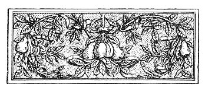

  
[Intangible Textual Heritage](../../index)  [Esoteric](../index.md) 
[Index](index)  [Previous](aww06)  [Next](aww08.md) 

------------------------------------------------------------------------

[Buy this Book at
Amazon.com](https://www.amazon.com/exec/obidos/ASIN/B002A9JOQK/internetsacredte.md)

------------------------------------------------------------------------

  
*The Art of Worldly Wisdom*, by Balthasar Gracian, tr. by Joseph Jacobs,
\[1892\], at Intangible Textual Heritage

------------------------------------------------------------------------

p. xlvii

 

# BIBLIOGRAPHICAL APPENDIX

THE best bibliographical account of Gracian's works is that of Backer,
*Bibliothèque des écrivains de la Compagnie de Jésus*, 1869, *sub voce*.
I have shortened the descriptions of the translations, etc., of the
other works of Gracian, adding a few items from the British Museum
Catalogue and other sources. The *Oráculo Manual* I have treated
separately and more fully.

### A. GRACIAN'S WORKS.

1\. El Heroe de Lorenço Gracian Infanzon. Dedicado al Rey N.S. En Huesca
por Juan Noguès, 1637, 8vo.

\[Published by Don Vincencio Juan de Lastanosa. According to Latassa the
first edition was published in Madrid, 1630. Other editions in Madrid,
1639 Barcelona, 1640; Amsterdam, 1659 (por Juan Blaeu); also in the
Biblioteca de autores españoles, 1873, t. lxv.

*French* translation (1) by Gervais, médecin du roy, Paris, 1645;
reprinted Amsterdam, 1659; (2) by P. de Courbeville, Paris, 1725.

*English* translation (1) by Sir J. Skeffington, Lond. 1652; (2) from
Courbeville's by a "gentleman of Oxford," Lond. 1726.\]

p. xlviii

2\. El politico Don Ferdinando el católico de Lorenzo Gracian. Al
excelentísimo Señor Duque de Nochera. En Zaragoza, 1640, 12°.

\[Published by Lastanosa. Reprinted Zaragoza, 1641, 16°; Huesca, 1646,
12°, Amsterdam, 1659.

*French* translation (1) by M. de S. (Silhouette, Chancellor of the Duc
d’Orleans), Paris, 1720; reprinted 1730, and Amsterdam, 1731; (2) by P.
de Courbeville, 1732, 120.

*German* translation by D. G. von Lohenstein.\]

3\. Agudeza y Acte de Ingenio en que se explican todos los modos y
diferencias de conceptos. Madrid, 1642, 8vo.

\[Also published by Lastanosa. Other editions at Huesca, 1646 and 1648
(the latter with Salinas' translation of Martial).

*Italian* translation by a Genoese who passed it off as his own (*Journ.
des Savants*, 1696, p. 333).\]

4\. El Discreto. Dedicado al serenísimo Señor Don Baltasar Carlos de
Austria. En Huesca por Juan Nogues, 1645, 8vo.

\[Published by Lastanosa. Republished Barcelona, 1647, 180; Brussels,
1665, 120; Amsterdam, 1665, 12°; also in Biblioteca de autores
españoles, 1873, t. lxv.

*French* translation by De Courbeville; 2nd ed. Rotterdam, 1729.

*English*, "The Compleat Gentleman," by T. Salkeld 2nd ed. London, 1730;
3rd, Dublin, 1760.

*German*, Der Vollkommene Menach. Augsburg, 1729, 8vo, from the French.

*Italian*, L’Uomo Universale. Venice, 1725, from the French.

*Polish* by Brzostowski. Wilna, 1762, from the French.\]

p. xlix

5\. El Criticon. Primera Parte en la Primavera de la Niñez y en el Estio
de la Juventad. En Madrid, 1650, 8vo—Segunda Parte Juyziosa y cortesana
Filosofia en el Otoño de la Varonil Edad. En Huesca, 1653, 8vo—Tercera
Parte en el Invierno de la Vejez. En Huesca, 1653, 8vo.

\[Reprinted Madrid, 1658, 8vo.

*English*, Pt. I., by P. Rycaut. Lond. 1681.

*French* translation by Maunony. Paris, 1696-1708, 12°. Reprinted at La
Hague, 1708, 1723, 1734; Rouen, 1709; Geneva, 1725.

*Italian*, by G. P. Cattaneo. Venice, 1685, 1698, 1709, 1720, 1745.

*Dutch*, by M. Smallegange. ’S Gravenhage, 1691, 120.

*German*, by C. Gottschling. Frankfurt, 1710; Halle, 1721.\]

6\. Oráculo Manual. See *infra* B.

7\. El Comulgador: varias meditaciones para . . . la sacrada communion.
Madrid, 1655, 12°.

\[Reprinted Zaragoza, 1655, 160; Amberes, 1725, 4to; Valencia, 1736,
12°; Madrid, 1757, 8vo, 1788, 16°, 1826, 8vo; Paris, 1840, 24°, 1851,
18°, 1854, 18°, 1857, 18°, 1860, 18°.

*English* translation by M. Monteiro, 1876, 8vo.

*French*, by Amelot de la Houssaie. Paris, 1693, 8vo.

*Italian*, by Castro and Inviziati.

*German*, anon. Frankfort, 1734, 8vo; reprinted Vienna, 1738; and
Nuremberg, 1751, with Appendix by W. Reithmeier, 1847.

*Latin*, anon. Munster, 1750-52, 120.\]

8\. Obras de Lorenzo Gracian. Amberes, 1652, 4to.

Reprinted Madrid, 1664, 4to; Barcelona, 1667. p.
l

4to; Amberes, 1669, 4to; Madrid, 1674, 4to; Barcelona, 1700, 4to (with
four idylls *Selvas de año*); Amberes, 1702, 4to, 1723, 4to; Madrid,
1720, 4to; Barcelona, 1734, 4to, 1748, 4to, 1757, 4to; Madrid 1773, 4to
all in two vols.

Latassa also mentions various poems and letters which are scattered
about, some in MS. For *El Varon Atento* and *El Galante* see supra [p.
xxii](aww04.htm#page_xxii.md).

### B. ORÁCULO MANUAL.

Early Spanish Bibliography is in a very bad state. One difficulty is
that each of the smaller kingdoms of Spain seems to have had the right
to reprint books published in any other division. We find this
difficulty with the *Editio Princeps* of the *Oráculo Manual*. Latassa
states that it was first published in Huesca, Aragon, in 1647, "Por Juan
Nogues" (like most of Gracian's works). No copy of this edition is known
to exist in any of the great libraries of Spain or other parts of
Europe, and the earliest known is that contained in the British Museum
with the following title:—

Oracvlo / Manval y Arte / de Prvdencia / Sacada de los a / forismos que
de discurren en / las obras de Lorenzo Gracian. / Publicala D. Vi /
cencio Juan de Lastanosa. Y la dedica / al Excelentissimo / Señor D.
Luis Mendez / de Haro. Con licencia. En Madrid por Maria de Oiñones ano
de 1653. / \[160 pp. in 240.\]

But in the Censor's licence to this there is a distinct reference to a
previous edition with which it is said to correspond \["coresponde con
el antes impresso . . . que otras vezes ha sido impresso "\]. This
confirms Latassa's date of 1647 for the ED. PR. But this makes it
difficult to understand Lastanosa's reference to the twelve books of
Gracian's, of which the *Oráculo* was the quintessence.

p. li

Four only had been published by that time, and the two unpublished would
make up only half a dozen. We must therefore leave the date of the ED.
PR. a variable between 1647 and 1653, to be fixed by the future Spanish
Lowndes or Hazlitt.

The *Oráculo* was reprinted at Amsterdam 1659, and henceforth it
appeared in all the editions of the *Obras*. It is curious that it has
never been reprinted separately in modern times in Spain, and can only
be obtained in *Biblioteca de autores españoles*, tomo lxv. It has,
however, been a book more honoured abroad than in its own country, as
the following list of Translations, taken mainly from Grisebach and the
British Museum Catalogue, will show

#### I. ITALIAN.

1\. Oracolo manuale, e Arte di Prudenza / Cavata dagl’ Aforismi, che si
discorrono nell’ Opre di Lorenzo Gratiano / Mandalo in Luce D. Vincenzo
Giovanni de Lastanosa. Diretto alla Nobiltá Venetiana e dedicato all’
Illustr. & Eccellentiss. Sig. Leonardo Pesaro . . . In Venetia MDCLXXIX.

\[Republished Venice, 1708, 1718, 1790.\]

2\. Huomo di Corte nuovamente tradotto dall’ Abbate Francesa Tosques.
Roma, 1698.

\[From the French. Republished Venice, 1730; Naples, 1740, 1761.\]

#### II. FRENCH.

1\. L’homme de cour de Baltasar Gracian. Traduit & commenté par le Sieur
Amelot de la Houssaie, cidevant Secrétaire de l’Ambassade de France à
Venise. Paris, 1684.

\[Reprinted La Hague, 1692; Lyons, 1693; Rotterdam, 1716, 1728; also
editions in Paris, 1691, 170Z, 1732, 1765, 1808.\]

p. lii

2\. Maximes de Baltazar Gracien, traduites de l’Espagnol \[par J. de
Courbeville\]. Paris, 1730.

#### III. ENGLISH.

1\. The / Courtier's / Oracle; / or the / Art of Prudence / . . .
Written originally in Spanish / And now done into English. London, 1694.

\[From the French of Amelot de la Houssaie.\]

2\. The Art of Prudence; or a Companion for a Man of Sense. Made English
. . and illustrated with the Sieur Amelot de la Houssaie's notes, by Mr.
Savage. London, 1702.

\[Two more editions, 1705, 1714. The hook was simply a revision of the
earlier translation.\]

#### IV. LATIN.

1\. Balthas. Graciani, Hispani, Aulicus sive de prudentia civili et
maxime aulica liber singularis olim hispanice conscriptus, postes et
Gallice, Italice, Germanice editus, nunc ex Ameloti versione Latine
redditus . . . Franc. Glarianus Meldenus, Constantiensis, recensuit,
latine vertit . . . et notis illustravit. Accessit Joh. Gottl. Heineccii
J.C. praefatio. Francofurti ad Viadrum MDCCXXXI.

\[A reprint at Vienna, 1750.\]

2\. Hominis Aulici notum Graciani oraculum prudentiae, depromptum in
sententiarum politicarum centurias III . . . Latinorum lingua loquens
per interpretem P. A. Ulrich. 1734.

#### V. HUNGARIAN.

1\. Bölts és figyelmetes udvari ember. Irta Spányol nyelven Grátzian B.
Forditotta Németbül Faludi F. . . . Posonyban, 1770, 1771.

p. liii

2\. Udvari Kátó Vagy is Grátzián B. nak Faludi F. által Magyarra
forditatott CCC Makszimai . . . Györölt, 1790.

\[In verse.\]

#### VI. POLISH.

Baltazar Gracyan doskonalacy dworskiego człowjeka przez 300 maxym . . .
Krakow, 1802.

\[By Count Sierakowski.\]

#### VII. GERMAN.

1\. L’Homme de cour Oder der heutige politische Welt- und Staats-Weife /
fürgestellet von Balthasar Gracian, Hispanieren Und wegen seiner hohen
Würde in unsre hochteutche Sprache übersetzet anitzo aus dem Original
vermehret, und zum Undernmahl herausgegeben von Joh Leonhard Sauter, J.
U. D. Franctfurth und Leipzig, 1687.

\[Pp. CXVIII, 775, 240.\]

2\. Balthasar Gracian's Homme de Cour, oder: Kluger Hof- und Weltmann,
nach Mr. Amelot de la Houssaie seiner französischen Version, in’s
Teutsche übersetzet von Selintes \[= C. Weissbach\]. Nebst Herrn C.
Thomasii judicio vom Gracian. Augsburg, 1711.

3\. Balthasar Gracians Oracul; d. i. Regeln der Klugheit. Aus dem
Spanischen von A. F. Müller. 2 Bände. Leipzig, 1715-1717.

\[Two thick volumes containing Spanish original, Germ. paraphrase, and
elaborate notes. Went into a second edition in 1733.\]

4\. Uomo di corte oder fluger Hof- und Weltmann. Nach der Italienischen
Uebersetzung ins Deutsche übersetzt \[von Christoph Heinrich
Freisleben\]. Ultenburg, 1723.

\[With the Italian text.\]

p. liv

5\. Die Kunst zu leben; vortressliche Regeln eines alten Weltmannes fürs
menschliche leben. Nach Balthasar Gracian \[von K. H. Heydenreich\],
Leipzig, 1786.

6\. Der Mann von Welt, eingeweiht in die Geheimnisse der Lebensflugheit,
ein nach Balthasar Gracian frei bearbeitetes vollständig hinterlassenes
Manuscript \[von K. H. Heydenreich\], Leipzig, Martini, 1803.

\[Reprinted Reutlingen, 1804.\]

7\. Dos schwarze Buch oder Lehren der Lebensweisheit Gracian's . . .
1826.

8\. Männerschule von B. Gracian. Aus dem Spanischen übersetzt von Fr.
Kölle. Stuttgart, 1838.

9\. Balthasar Gracian's Handorafel und Kunst der Weltlugheit, treu und
forgfältig übersetzt von Arthur Schopenhauer. Nachgelassenes, Leipzig,
1861.

\[Edited by Frauenstadt; reprinted 1862, 1877. Another edition from the
original MS. by Grisebach in the Reclam series, 1889.\]

#### VIII. DUTCH.

De Konst der Wysheit getrokken ujt de Spaensche van Gracian en nu
vertaalt door M. Smallegange In's Gravenhage, MDCXCVI.

------------------------------------------------------------------------

[Next: Leading Maxims](aww08.md)
