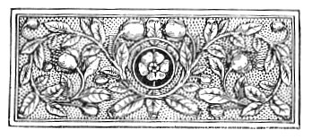

  
[Intangible Textual Heritage](../../index)  [Esoteric](../index.md) 
[Index](index)  [Previous](aww07)  [Next](aww09.md) 

------------------------------------------------------------------------

[Buy this Book at
Amazon.com](https://www.amazon.com/exec/obidos/ASIN/B002A9JOQK/internetsacredte.md)

------------------------------------------------------------------------

  
*The Art of Worldly Wisdom*, by Balthasar Gracian, tr. by Joseph Jacobs,
\[1892\], at Intangible Textual Heritage

------------------------------------------------------------------------

p. lv

 

# LEADING MAXIMS

|                        |                                                                                                                                                                                                          |                           |
|------------------------|----------------------------------------------------------------------------------------------------------------------------------------------------------------------------------------------------------|---------------------------|
| i                      | Everything is at its Acme (*Todo está ya en su punto*)                                                                                                                                                   | [1](aww10.htm#page_1.md)     |
| ii                     | Character and Intellect (*Genio y ingenio*)                                                                                                                                                              | [1](aww10.htm#page_1.md)     |
| iii                    | Keep Matters for a Time in Suspense (*Llevar sus cosas con suspencion*)                                                                                                                                  | [2](aww10.htm#page_2.md)     |
| iv                     | Knowledge and Courage (*El saber y el valor*)                                                                                                                                                            | [3](aww10.htm#page_3.md)     |
| v                      | Create a Feeling of Dependence (*Hazer depender*)                                                                                                                                                        | [3](aww10.htm#page_3.md)     |
| vi                     | A Man at his Highest Point (*Hombre en su pinto*)                                                                                                                                                        | [3](aww10.htm#page_3.md)     |
| vii                    | Avoid Victories over Superiors (*Escusar vitorias del patron*)                                                                                                                                           | [4](aww10.htm#page_4.md)     |
| viii                   | To be without Passions (*Hombre inapasionable*)                                                                                                                                                          | [5](aww10.htm#page_5.md)     |
| ix                     | Avoid the Faults of your Nation (*Desmentir los achaques de su nation*)                                                                                                                                  | [5](aww10.htm#page_5.md)     |
| x                      | Fortune and Fame (*Fortuna y Fama*)                                                                                                                                                                      | [6](aww10.htm#page_6.md)     |
| xi                     | Cultivate those who can teach you (*Tratar* *con quien se pueda aprender*)                                                                                                                               | [6](aww10.htm#page_6.md)     |
| xii                    | Nature and Art (*Naturaleza y Arte*)                                                                                                                                                                     | [7](aww10.htm#page_7.md)     |
|                        | p. lvi                                                                                                                                                                        |                           |
| xiii                   | Act sometimes on Second Thoughts, sometimes on First Impulse (*Obrar de intencion, ya segunda y ya primera*)                                                                                             | [7](aww10.htm#page_7.md)     |
| xiv                    | The Thing Itself and the Way it is done (*La realidad ye el modo*)                                                                                                                                       | [8](aww10.htm#page_8.md)     |
| xv                     | Keep Ministering Spirits (*Tener ingenios auxiliares*)                                                                                                                                                   | [9](aww10.htm#page_9.md)     |
| xvi                    | Knowledge and Good Intentions (*Saber con recta intention*)                                                                                                                                              | [10](aww10.htm#page_10.md)   |
| xvii                   | Vary the Mode of Action (*Variar de tenor en el obrar*)                                                                                                                                                  | [10](aww10.htm#page_10.md)   |
| xviii                  | Application and Ability (*Aplicacion y Minerva*)                                                                                                                                                         | [11](aww10.htm#page_11.md)   |
| xix                    | Arouse no Exaggerated Expectations on entering (*No entrar con sobrada expectation*)                                                                                                                     | [11](aww10.htm#page_11.md)   |
| xx                     | A Man of the Age (*Hombre en su siglo*)                                                                                                                                                                  | [12](aww10.htm#page_12.md)   |
| xxi                    | The Art of being Lucky (*Arte para ser dichoso*)                                                                                                                                                         | [13](aww10.htm#page_13.md)   |
| xxii                   | A Man of Knowledge to the Point (*Hombre de plausibles noticias*)                                                                                                                                        | [13](aww10.htm#page_13.md)   |
| xxiii                  | Be Spotless (*No tener algun desdoro*)                                                                                                                                                                   | [14](aww10.htm#page_14.md)   |
| xxiv                   | Keep the Imagination under Control (*Templar la imaginacion*)                                                                                                                                            | [14](aww10.htm#page_14.md)   |
| xxv                    | Know how to take a Hint (*Buen entendedor*)                                                                                                                                                              | [15](aww10.htm#page_15.md)   |
| xxvi                   | Find out each Man's Thumbscrew (*Hallarle su torcedor á cada uno*)                                                                                                                                       | [15](aww10.htm#page_15.md)   |
| xxvii                  | Prize Intensity more than Extent (*Pagarse mas de Intenciones que de Extenciones*)                                                                                                                       | [16](aww10.htm#page_16.md)   |
| xxviii                 | Common in Nothing (*En nada vulgar*)                                                                                                                                                                     | [16](aww10.htm#page_16.md)   |
| xxix                   | A Man of Rectitude (*Hombre de entereza*)                                                                                                                                                                | [17](aww10.htm#page_17.md)   |
| xxx                    | Have naught to do with Occupations of Ill-repute (*No hazer profesion de empleos desautorizados*)                                                                                                        | [18](aww10.htm#page_18.md)   |
|                        | p. lvii                                                                                                                                                                      |                           |
| xxxi                   | Select the Lucky and avoid the Unlucky (*Conocer los afortunados para la election y los desdichados para la fuga*)                                                                                       | [18](aww10.htm#page_18.md)   |
| xxxii                  | Have the Reputation of being Gracious (*Estar en opinion de dár gusto*)                                                                                                                                  | [19](aww10.htm#page_19.md)   |
| xxxiii                 | Know how to Withdraw (*Saber abstraer*)                                                                                                                                                                  | [19](aww10.htm#page_19.md)   |
| xxxiv                  | Know your strongest Point (*Conocer su realce Rey*)                                                                                                                                                      | [20](aww10.htm#page_20.md)   |
| xxxv                   | Think over Things, most over the most Important (*Hazer concepto y mas de lo que importa mas*)                                                                                                           | [20](aww10.htm#page_20.md)   |
| xxxvi                  | In Acting or Refraining, weigh your Luck (*Tener tanteada su Fortuna, para el proceder, para desempeñarse*)                                                                                              | [21](aww10.htm#page_21.md)   |
| xxxvii                 | Keep a Store of Sarcasms, and know how to use them (*Conocer y saber usar de las varrillas*)                                                                                                             | [22](aww10.htm#page_22.md)   |
| xxxviii                | Leave your Luck while Winning (*Saberse dexar ganando con la fortuna*)                                                                                                                                   | [23](aww10.htm#page_23.md)   |
| xxxix                  | Recognise when Things are ripe, and then enjoy them (*Conocer las cosas en su punto, en su sazon y saberlas lograr*)                                                                                     | [23](aww10.htm#page_23.md)   |
| xl                     | The Goodwill of People (*Gracia de las gentes*)                                                                                                                                                          | [24](aww10.htm#page_24.md)   |
| xli                    | Never Exaggerate (*Nunca exagerar*)                                                                                                                                                                      | [24](aww10.htm#page_24.md)   |
| xlii                   | Born to command (*Del natural Imperio*)                                                                                                                                                                  | [25](aww10.htm#page_25.md)   |
| xliii                  | Think with the Few and speak with the Many (*Sentir con los menos y hablar con los mas*)                                                                                                                 | [25](aww10.htm#page_25.md)   |
| xliv                   | Sympathy with great Minds (*Simpatía con los grandes varones*)                                                                                                                                           | [26](aww10.htm#page_26.md)   |
| xiv                    | Use, but do not abuse, Cunning (*Usar, no abusar de las reflexas*)                                                                                                                                       | [27](aww10.htm#page_27.md)   |
|                        | p. lviii                                                                                                                                                                    |                           |
| xlvi                   | Master your Antipathies (*Corregir su antipatia*)                                                                                                                                                        | [27](aww10.htm#page_27.md)   |
| xlvii                  | Avoid "Affairs of Honour" (*Huir los empeño*)                                                                                                                                                            | [28](aww10.htm#page_28.md)   |
| xlviii                 | Be Thorough (*Hombre con fondos*)                                                                                                                                                                        | [28](aww10.htm#page_28.md)   |
| xlix                   | Observation and judgment (*Hombre juyzioso y notante*)                                                                                                                                                   | [29](aww10.htm#page_29.md)   |
| l                      | Never lose Self-respect (*Nunca perderse el respeto á sí mism*o)                                                                                                                                         | [29](aww10.htm#page_29.md)   |
| li                     | Know how to Choose well (*Hombre de buena electio*n)                                                                                                                                                     | [30](aww11.htm#page_30.md)   |
| lii                    | Never be put out (*Nunca descomponerse*)                                                                                                                                                                 | [30](aww11.htm#page_30.md)   |
| liii                   | Diligent and Intelligent (*Diligente y inteligente*)                                                                                                                                                     | [31](aww11.htm#page_31.md)   |
| liv                    | Know how to show your Teeth (*Tener brios á lo cuerd*o)                                                                                                                                                  | [31](aww11.htm#page_31.md)   |
| lv                     | Wait (*Hombre de espera*)                                                                                                                                                                                | [32](aww11.htm#page_32.md)   |
| lvi                    | Have Presence of Mind (*Tener buenos repentes*)                                                                                                                                                          | [33](aww11.htm#page_33.md)   |
| lvii                   | Slow and Sure (*Mas seguros son los pensados*)                                                                                                                                                           | [33](aww11.htm#page_33.md)   |
| lviii                  | Adapt Yourself to your Company (*Saberse atemperar*)                                                                                                                                                     | [34](aww11.htm#page_34.md)   |
| lix                    | Finish off well (*Hombre de buen dexo*)                                                                                                                                                                  | [34](aww11.htm#page_34.md)   |
| lx                     | A Sound judgment (*Buenos dictamenes*)                                                                                                                                                                   | [35](aww11.htm#page_35.md)   |
| lxi                    | To Excel in what is Excellent (*Eminencia en lo mejor*)                                                                                                                                                  | [35](aww11.htm#page_35.md)   |
| lxii                   | Use good Instruments (*Obrar con buenos instrumentos*)                                                                                                                                                   | [36](aww11.htm#page_36.md)   |
| lxiii                  | To be the First of the Kind is an Excellence (*Excelencia de primero*)                                                                                                                                   | [36](aww11.htm#page_36.md)   |
| lxiv                   | Avoid Worry (*Saberse escusar pesares*)                                                                                                                                                                  | [37](aww11.htm#page_37.md)   |
| lxv                    | Elevated Taste (*Gusto relevante*)                                                                                                                                                                       | [37](aww11.htm#page_37.md)   |
| lxvi                   | See that Things end well (*Atencion que salgan bien las cosas*)                                                                                                                                          | [38](aww11.htm#page_38.md)   |
|                        | p. lix                                                                                                                                                                        |                           |
| lxvii                  | Prefer Callings en Evidence (*Preferir los empleos plausibles*)                                                                                                                                          | [39](aww11.htm#page_39.md)   |
| lxviii                 | It is better to help with Intelligence than with Memory (*Dar entendimiento es de mas primor que el dár memoria*)                                                                                        | [39](aww11.htm#page_39.md)   |
| lxix                   | Do not give way to every common Impulse (*No rendirse á un vulgar humor*)                                                                                                                                | [40](aww11.htm#page_40.md)   |
| lxx                    | Know how to Refuse (*Saber negar*)                                                                                                                                                                       | [41](aww11.htm#page_41.md)   |
| lxxi                   | Do not Vacillate (*No ser desigual*)                                                                                                                                                                     | [42](aww11.htm#page_42.md)   |
| lxxii                  | Be Resolute (*Hombre de resolution*)                                                                                                                                                                     | [42](aww11.htm#page_42.md)   |
| lxxiii                 | Utilise Slips (*Saber usar del desliz*)                                                                                                                                                                  | [43](aww11.htm#page_43.md)   |
| lxxiv                  | Do not be Unsociable (*No ser intratable*)                                                                                                                                                               | [43](aww11.htm#page_43.md)   |
| lxxv                   | Choose an Heroic Ideal (*Elegir idea heroyca*)                                                                                                                                                           | [44](aww11.htm#page_44.md)   |
| lxxvi                  | Do not always be jesting (*No estár siempre de burlas*)                                                                                                                                                  | [45](aww11.htm#page_45.md)   |
| lxxvii                 | Be all Things to all Men (*Saber hazerse á todos*)                                                                                                                                                       | [45](aww11.htm#page_45.md)   |
| lxxviii                | The Art of undertaking Things (*Arte en el intentar*)                                                                                                                                                    | [46](aww11.htm#page_46.md)   |
| lxxix                  | A Genial Disposition (*Genio genial*)                                                                                                                                                                    | [46](aww11.htm#page_46.md)   |
| lxxx                   | Take care to get Information (*Atencion al informarse*)                                                                                                                                                  | [47](aww11.htm#page_47.md)   |
| lxxxi                  | Renew your Brilliance (*Usar el renovar su lucimiento*)                                                                                                                                                  | [47](aww11.htm#page_47.md)   |
| lxxxii                 | Drain Nothing to the Dregs, neither Good nor Ill (*Nunca apurar, ni el mal, ni el bien*)                                                                                                                 | [48](aww11.htm#page_48.md)   |
| lxxxiii                | Allow Yourself some venial Fault (*Permitese algun venial desliz*)                                                                                                                                       | [48](aww11.htm#page_48.md)   |
| lxxxiv                 | Make use of your Enemies (*Saber usar de los enemigos*)                                                                                                                                                  | [49](aww11.htm#page_49.md)   |
| lxxxv                  | Do not play Manille (*No ser malilla*)                                                                                                                                                                   | [50](aww11.htm#page_50.md)   |
| lxxxvi                 | Prevent Scandal (*Prevenir las malas vozes*)                                                                                                                                                             | [50](aww11.htm#page_50.md)   |
|                        | p. lx                                                                                                                                                                          |                           |
| lxxxvii                | Culture and Elegance (*Cultura y aliño*)                                                                                                                                                                 | [51](aww11.htm#page_51.md)   |
| lxxxviii               | Let your Behaviour be Fine and Noble (*Sea el trato por mayor procurando la sublimida en él*)                                                                                                            | [52](aww11.htm#page_52.md)   |
| lxxxix                 | Know Yourself (*Comprehension de sí*)                                                                                                                                                                    | [52](aww11.htm#page_52.md)   |
| xc                     | The Secret of Long Life (*Arte para vivir mucho*)                                                                                                                                                        | [53](aww11.htm#page_53.md)   |
| xci                    | Never set to work at Anything if you have any Doubts of its Prudence (*Obrar siempre sin escrupolos de imprudencia*)                                                                                     | [53](aww11.htm#page_53.md)   |
| xcii                   | Transcendant Wisdom (*Seso transcendental*)                                                                                                                                                              | [54](aww11.htm#page_54.md)   |
| xciii                  | Versatility (*Hombre universal*)                                                                                                                                                                         | [54](aww11.htm#page_54.md)   |
| xciv                   | Keep the extent of your Abilities unknown (*Incomprehensibilidad de caudal*)                                                                                                                             | [55](aww11.htm#page_55.md)   |
| xcv                    | Keep Expectation alive (*Saber entretenir la expectation*)                                                                                                                                               | [55](aww11.htm#page_55.md)   |
| xcvi                   | The highest Discretion (*De la gran sinderesis*)                                                                                                                                                         | [55](aww11.htm#page_55.md)   |
| xcvii                  | Obtain and preserve a Reputation (*Conseguir y conservar la reputation*)                                                                                                                                 | [56](aww11.htm#page_56.md)   |
| xcviii                 | Write your Intentions in Cypher (*Cifrar la voluntad*)                                                                                                                                                   | [56](aww11.htm#page_56.md)   |
| xcix                   | Reality and Appearance (*Realidad y aparencia*)                                                                                                                                                          | [57](aww11.htm#page_57.md)   |
| c                      | A Man without Illusions, a wise Christian, a philosophic Courtier (*Varon desengañado, Christiana sabio, Cortesano filosofo*)                                                                            | [57](aww11.htm#page_57.md)   |
| ci                     | One half of the World laughs at the other, and Fools are they all (*La mitad del mundo se está riendo á la otra mitad, con necedad de todos*)                                                            | [58](aww12.htm#page_58.md)   |
| cii                    | Be able to stomach big slices of Luck (*Estomago para grander bocados de la fortuna*)                                                                                                                    | [58](aww12.htm#page_58.md)   |
|                        | p. lxi                                                                                                                                                                        |                           |
| ciii                   | Let each keep up his Dignity (*Cada uno la magestad en su modo*)                                                                                                                                         | [59](aww12.htm#page_59.md)   |
| civ                    | Try your hand at Office (*Tener tomado el pulso á los empleos*)                                                                                                                                          | [59](aww12.htm#page_59.md)   |
| cv                     | Don't be a Bore (*No cansar*)                                                                                                                                                                            | [60](aww12.htm#page_60.md)   |
| cvi                    | Do not parade your Position (*No afectar la fortuna*)                                                                                                                                                    | [61](aww12.htm#page_61.md)   |
| cvii                   | Show no Self-satisfaction (*No mostrar satisfaccion de sí*)                                                                                                                                              | [62](aww12.htm#page_62.md)   |
| cviii                  | The Path to Greatness is along with Others (*Atajo para ser persona, saber ladear*)                                                                                                                      | [62](aww12.htm#page_62.md)   |
| cix                    | Be not Censorious (*No ser acriminador*)                                                                                                                                                                 | [63](aww12.htm#page_63.md)   |
| cx                     | Do not wait till you are a Sinking Sun (*No aguardar á ser sol que se pone*)                                                                                                                             | [63](aww12.htm#page_63.md)   |
| cxi                    | Have Friends (*Tener amigos*)                                                                                                                                                                            | [64](aww12.htm#page_64.md)   |
| cxii                   | Gain Good-will (*Ganar la pia aficcion*)                                                                                                                                                                 | [65](aww12.htm#page_65.md)   |
| cxiii                  | In Prosperity prepare for Adversity (*Prevenirse en la fortuna prospera para la adversa*)                                                                                                                | [65](aww12.htm#page_65.md)   |
| cxiv                   | Never Compete (*Nunca competir*)                                                                                                                                                                         | [66](aww12.htm#page_66.md)   |
| cxv                    | Get used to the Failings of your Familiars (*Hazerse á las malas condiciones de los familiares*)                                                                                                         | [66](aww12.htm#page_66.md)   |
| cxvi                   | Only act with Honourable Men (*Tratar* *siempre con gente de obligaciones*)                                                                                                                              | [67](aww12.htm#page_67.md)   |
| cxvii                  | Never talk of Yourself (*Nunca hablar de sí*)                                                                                                                                                            | [67](aww12.htm#page_67.md)   |
| cxviii                 | Acquire the Reputation of Courtesy (*Cobrar fama de cortés*)                                                                                                                                             | [68](aww12.htm#page_68.md)   |
| cxix                   | Avoid becoming Disliked (*No hazerse de mal querer*)                                                                                                                                                     | [69](aww12.htm#page_69.md)   |
| cxx                    | Live Practically (*Vivir á lo platico*)                                                                                                                                                                  | [69](aww12.htm#page_69.md)   |
|                        | p. lxii                                                                                                                                                                      |                           |
| cxxi                   | Do not make a Business of what is no Business (*No hazar negocio del no negocio*)                                                                                                                        | [70](aww12.htm#page_70.md)   |
| cxxii                  | Distinction in Speech and Action (*Señorio en el dezir y en el hazar*)                                                                                                                                   | [71](aww12.htm#page_71.md)   |
| cxxiii                 | Avoid Affectation (*Hombre desafectado*)                                                                                                                                                                 | [71](aww12.htm#page_71.md)   |
| cxxiv                  |  Get Yourself missed (*Llegar á ser deseados*)                                                                                                                                                           | [72](aww12.htm#page_72.md)   |
| cxxv                   | Do not be a Black List (*No ser libro verde*)                                                                                                                                                            | [73](aww12.htm#page_73.md)   |
| cxxvi                  | Folly consists not in committing Folly, but in not hiding it when committed (*No es necio el que haze la necedad, sino el que hecha no la sabe encubrir*)                                                | [73](aww12.htm#page_73.md)   |
| cxxvii                 | Grace in Everything (*El despojo en todo*)                                                                                                                                                               | [74](aww12.htm#page_74.md)   |
| cxxviii                | Highmindedness (*Alteza de animo*)                                                                                                                                                                       | [74](aww12.htm#page_74.md)   |
| cxxix                  | Never Complain (*Nunca quexarse*)                                                                                                                                                                        | [75](aww12.htm#page_75.md)   |
| cxxx                   | Do and be seen Doing (*Hazer y hazer parecer*)                                                                                                                                                           | [76](aww12.htm#page_76.md)   |
| cxxxi                  | Nobility of Feeling (*Galantería de condition*)                                                                                                                                                          | [76](aww12.htm#page_76.md)   |
| cxxxii                 | Revise your Judgments (*Usar del reconsejo*)                                                                                                                                                             | [77](aww12.htm#page_77.md)   |
| cxxxiii                | Better Mad with the rest of the World than Wise alone (*Antes loco con todos que cuerdo á solas*)                                                                                                        | [77](aww12.htm#page_77.md)   |
| cxxxiv                 | Double your Resources (*Doblar los requisitos de la vida*)                                                                                                                                               | [78](aww12.htm#page_78.md)   |
| cxxxv                  | Do not nourish the Spirit of Contradiction (*No tenga espiritu de contradicion*)                                                                                                                         | [79](aww12.htm#page_79.md)   |
| cxxxvi                 | Post Yourself in the Centre of Things (*Ponerse bien en las materias*)                                                                                                                                   | [79](aww12.htm#page_79.md)   |
| cxxxvii                | The Sage should be Self-sufficing (*Bastase á sí mismo el sabio*)                                                                                                                                        | [80](aww12.htm#page_80.md)   |
| cxxxviii               | The Art of letting Things alone (*Arte de dexar estár*)                                                                                                                                                  | [80](aww12.htm#page_80.md)   |
|                        | p. lxiii                                                                                                                                                                    |                           |
| cxxxix                 | Recognise unlucky Days (*Conocer el dia aziago*)                                                                                                                                                         | [81](aww12.htm#page_81.md)   |
| cxl                    | Find the Good in a Thing at once (*Hallar luego con lo buena en cada cosa*)                                                                                                                              | [82](aww12.htm#page_82.md)   |
| cxli                   | Do not listen to Yourself (*No escucharse*)                                                                                                                                                              | [82](aww12.htm#page_82.md)   |
| cxlii                  | Never from Obstinacy take the Wrong Side because your Opponent has anticipated you in taking the Right One (*Nunca por tema seguir el peor partido porque el contrario se adelantó y escogeó el mejor*)  | [83](aww12.htm#page_83.md)   |
| cxliii                 | Never become Paradoxical in order to avoid the Trite (*No dár en paradoxo por huir de vulgar*)                                                                                                           | [84](aww12.htm#page_84.md)   |
| cxliv                  | Begin with Another's to end with your Own (*Entrar con la agena para salir con la suya*)                                                                                                                 | [85](aww12.htm#page_85.md)   |
| cxlv                   | Do not show your wounded Finger (*No descubrir el dedo mal*o)                                                                                                                                            | [85](aww12.htm#page_85.md)   |
| cxlvi                  | Look into the Interior of Things (*Mirar por dentro*)                                                                                                                                                    | [86](aww12.htm#page_86.md)   |
| cxlvii                 | Do not be Inaccessible (*No ser inaccessible*)                                                                                                                                                           | [86](aww12.htm#page_86.md)   |
| cxlviii                | Have the Art of Conversation (*Tener el arte de conversar*)                                                                                                                                              | [87](aww12.htm#page_87.md)   |
| cxlix                  | Know how to put off Ills on Others (*Saber declinar á otro los males*)                                                                                                                                   | [88](aww12.htm#page_88.md)   |
| cl                     | Know how to get your Price for Things (*Saber vender sus cosas*)                                                                                                                                         | [89](aww12.htm#page_89.md)   |
| cli                    | Think beforehand (*Pensar anticipado*)                                                                                                                                                                   | [89](aww12.htm#page_89.md)   |
| clii                   | Never have a Companion who casts you in the Shade (*Nunca acompañarse con quien que pueda deslucir*)                                                                                                     | [90](aww13.htm#page_90.md)   |
|                        | p. lxiv                                                                                                                                                                      |                           |
| cliii                  | Beware of entering where there is a great Gap to be filled (*Huya de entrar á llenar grandes vacios*)                                                                                                    | [91](aww13.htm#page_91.md)   |
| cliv                   | Do not Believe, or Like, lightly (*No ser facil en creer ni en querer*)                                                                                                                                  | [91](aww13.htm#page_91.md)   |
| clv                    | The Art of getting into a Passion (*Arte en el apassionarse*)                                                                                                                                            | [92](aww13.htm#page_92.md)   |
| clvi                   | Select your friends (*Amigos de eleccion*)                                                                                                                                                               | [93](aww13.htm#page_93.md)   |
| clvii                  | Do not make Mistakes about Character (*No engañarse en las personas*)                                                                                                                                    | [94](aww13.htm#page_94.md)   |
| clviii                 | Make use of your Friends (*Saber usar de los amigos*)                                                                                                                                                    | [94](aww13.htm#page_94.md)   |
| clix                   | Put up with Fools (*Saber sufrir necios*)                                                                                                                                                                | [95](aww13.htm#page_95.md)   |
| clx                    | Be careful in Speaking (*Hablar de atento*)                                                                                                                                                              | [96](aww13.htm#page_96.md)   |
| clxi                   | Know your pet Faults (*Conocer los defectos dulces*)                                                                                                                                                     | [96](aww13.htm#page_96.md)   |
| clxii                  | How to triumph over Rivals and Detractors (*Saber triunfar de la emulation y malevolencia*)                                                                                                              | [97](aww13.htm#page_97.md)   |
| clxiii                 | Never, from Sympathy with the unfortunate, involve Yourself in his Fate (*Nunca por la compassion del infeliz se ha de incurrir en la desgracia del afortunado*)                                         | [97](aww13.htm#page_97.md)   |
| clxiv                  | Throw Straws in the Air (*Echar al ayre algunas cosas*)                                                                                                                                                  | [98](aww13.htm#page_98.md)   |
| clxv                   | Wage War Honourably (*Hazer buena guerra*)                                                                                                                                                               | [98](aww13.htm#page_98.md)   |
| clxvi                  | Distinguish the Man of Words from the Man of Deeds (*Diferenciar el hombre de palabras del de obras*)                                                                                                    | [99](aww13.htm#page_99.md)   |
| clxvii                 | Know how to take your own Part (*Saber se ayudar*)                                                                                                                                                       | [100](aww13.htm#page_100.md) |
|                        | p. lxv                                                                                                                                                                        |                           |
| clxviii                | Do not indulge in the Eccentricities of Folly (*No dár en monstruo de la necedad*)                                                                                                                       | [100](aww13.htm#page_100.md) |
| clxix                  | Be more careful not to Miss once than to Hit a hundred times (*Atencion á no errar una mas que á acertar ciento*)                                                                                        | [101](aww13.htm#page_101.md) |
| clxx                   | In all Things keep Something in Reserve (*Usar del retén en todas las cosas*)                                                                                                                            | [101](aww13.htm#page_101.md) |
| clxxi                  | Waste not Influence (*No gastar el favor*)                                                                                                                                                               | [102](aww13.htm#page_102.md) |
| clxxii                 | Never contend with a Man who has nothing to Lose (*No empeñarse con quien no tiene que perder*)                                                                                                          | [103](aww13.htm#page_103.md) |
| clxxiii                | Do not be Glass in Intercourse, still less in Friendship (*No ser de vitrio en el trato y menos en la amistad*)                                                                                          | [103](aww13.htm#page_103.md) |
| clxxiv                 | Do not live in a Hurry (*No vivir apriesa*)                                                                                                                                                              | [104](aww13.htm#page_104.md) |
| clxxv                  | A Solid Man (*Hombre substancial*)                                                                                                                                                                       | [105](aww13.htm#page_105.md) |
| clxxvi                 | Have Knowledge, or know those that have Knowledge (*Saber o escuchar á quien sabe*)                                                                                                                      | [106](aww13.htm#page_106.md) |
| clxxvii                | Avoid Familiarities in Intercourse (*Escusar llanezas en el trato*)                                                                                                                                      | [106](aww13.htm#page_106.md) |
| clxxviii               | Trust your Heart (*Creer al coraçon*)                                                                                                                                                                    | [107](aww13.htm#page_107.md) |
| clxxix                 | Reticence is the Seal of Capacity (*La retentiva es el sello de la capacidad*)                                                                                                                           | [107](aww13.htm#page_107.md) |
| clxxx                  | Never guide the Enemy to what he has to do (*Nunca regirse por lo que el enemigo avia de hazer*)                                                                                                         | [108](aww13.htm#page_108.md) |
| clxxxi                 | The Truth, but not the whole Truth (*Sin mentir, no dezir todas las verdades*)                                                                                                                           | [108](aww13.htm#page_108.md) |
| clxxxii                | A Grain of Boldness in Everything (*Un grano de audacia con todo*)                                                                                                                                       | [109](aww13.htm#page_109.md) |
|                        | p. lxvi                                                                                                                                                                      |                           |
| clxxxiii               | Do not hold your Views too firmly (*No aprender fuertemente*)                                                                                                                                            | [110](aww13.htm#page_110.md) |
| clxxxiv                | Do not be Ceremonious (*No ser ceremonial*)                                                                                                                                                              | [110](aww13.htm#page_110.md) |
| clxxxv                 | Never stake your Credit on a single Cast (*Nunca exponer el credito á la prueba de sola una ve*z)                                                                                                        | [111](aww13.htm#page_111.md) |
| clxxxvi                | Recognise Faults, however high placed (*Conocer los defectos por mas autorizados que ester*)                                                                                                             | [111](aww13.htm#page_111.md) |
| clxxxvii               | Do pleasant Things Yourself, unpleasant things through Others (*Todo lo favorable, obrarlo por sí, todo lo odioso, por terceros*)                                                                        | [112](aww13.htm#page_112.md) |
| clxxxviii              | Be the Bearer of Praise (*Traer que alabar*)                                                                                                                                                             | [113](aww13.htm#page_113.md) |
| clxxxix                | Utilise Another's Wants (*Valerse de la privacion agena*)                                                                                                                                                | [114](aww13.htm#page_114.md) |
| cxc                    | Find Consolation in all Things (*Hallar el consuelo en todo*)                                                                                                                                            | [114](aww13.htm#page_114.md) |
| cxci                   | Do not take Payment in Politeness (*No pagarse de la mucha cortesia*)                                                                                                                                    | [114](aww13.htm#page_114.md) |
| cxcii                  | Peaceful Life, a long Life (*Hombre de gran paz hombre de mucha vida*)                                                                                                                                   | [115](aww13.htm#page_115.md) |
| cxciii                 | Watch him that begins with Another's to end with his Own (*Atencion al que entra con agena por salir á la suya*)                                                                                         | [115](aww13.htm#page_115.md) |
| cxciv                  | Have reasonable Views of Yourself and of your Affairs (*Concebir de sí y de sus cosas cuerdamente*)                                                                                                      | [116](aww13.htm#page_116.md) |
| cxcv                   | Know how to Appreciate (*Saber estimar*)                                                                                                                                                                 | [117](aww13.htm#page_117.md) |
| cxcvi                  | Know your ruling Star (*Conocer su estrella*)                                                                                                                                                            | [117](aww13.htm#page_117.md) |
| cxcvii                 | Do not carry Fools on your Back (*Nunca embaraçarse con los necios*)                                                                                                                                     | [118](aww13.htm#page_118.md) |
|                        | p. lxvii                                                                                                                                                                    |                           |
| cxcvii                 | Know how to transplant Yourself (*Saberse transplantar*)                                                                                                                                                 | [119](aww13.htm#page_119.md) |
| cxcix                  | To find a proper Place by Merit, not by Presumption (*Saberse hazer lugar á lo cuerdo, no á lo entremetido*)                                                                                             | [120](aww13.htm#page_120.md) |
| cc                     | Leave Something to wish for (*Tener que desear*)                                                                                                                                                         | [120](aww13.htm#page_120.md) |
| cci                    | They are all Fools who seem so besides half the rest (*Son tontos todos los que lo parecen y la mitad de los que no le parecen*)                                                                         | [121](aww14.htm#page_121.md) |
| ccii                   | Words and Deeds make the Perfect Man (*Dichos y hechos hazen un varon consumado*)                                                                                                                        | [121](aww14.htm#page_121.md) |
| cciii                  | Know the great Men of your Age (*Conocer las eminencias de su siglo*)                                                                                                                                    | [122](aww14.htm#page_122.md) |
| cciv                   | Attempt easy Tasks as if they were difficult, and difficult as if they were easy (*Lo facil se ha de emprender como dificultoso y lo dificultoso como facil*)                                            | [122](aww14.htm#page_122.md) |
| ccv                    | Know how to play the Card of Contempt (*Saber jugar del desprechio*)                                                                                                                                     | [123](aww14.htm#page_123.md) |
| ccvi                   | Know that there are vulgar Natures everywhere (*Sepase que ay vulgo en todas partes*)                                                                                                                    | [124](aww14.htm#page_124.md) |
| ccvii                  | Be Moderate (*Usar del reporte*)                                                                                                                                                                         | [124](aww14.htm#page_124.md) |
| ccviii                 | Do not die of the Fools' Disease (*No morir de achaque de necio*)                                                                                                                                        | [125](aww14.htm#page_125.md) |
| ccix                   | Keep Yourself free from common Follies (*Librarse de las comunes necedades*)                                                                                                                             | [126](aww14.htm#page_126.md) |
| ccx                    | Know how to play the Card of Truth (*Saber jugar de la verdad*)                                                                                                                                          | [126](aww14.htm#page_126.md) |
| ccxi                   | In Heaven all is bliss (*En el cielo todo es contento*)                                                                                                                                                  | [127](aww14.htm#page_127.md) |
|                        | p. lxviii                                                                                                                                                                  |                           |
| ccxii                  | Keep to Yourself the final Touches of your Art (*Reservarse siempre las ultimas tretas del arte*)                                                                                                        | [128](aww14.htm#page_128.md) |
| ccxiii                 | Know how to Contradict (*Saber contradecir*)                                                                                                                                                             | [128](aww14.htm#page_128.md) |
| ccxiv                  | Do not turn one Blunder into two (*No hazer de una necedad dos*)                                                                                                                                         | [129](aww14.htm#page_129.md) |
| ccxv                   | Watch him that acts on Second Thoughts (*Atencion al que llega de segunda intencion*)                                                                                                                    | [129](aww14.htm#page_129.md) |
| ccxvi                  | Be Expressive (*Tener la declarativa*)                                                                                                                                                                   | [130](aww14.htm#page_130.md) |
| ccxvii                 | Neither Love nor Hate for ever (*No se ha de querer ni aborrecer para siempre*)                                                                                                                          | [131](aww14.htm#page_131.md) |
| ccxviii                | Never act from Obstinacy but from Knowledge (*Nunca obrar por tema sino por intencion*)                                                                                                                  | [131](aww14.htm#page_131.md) |
| ccxix                  | Do not pass for a Hypocrite (*No ser tenido por hombre de artificio*)                                                                                                                                    | [132](aww14.htm#page_132.md) |
| ccxx                   | If you cannot clothe yourself in Lionskin use Foxpelt (*Quando no puede uno vestirse la piel del Leon, vestase la de la Vulpeja*)                                                                        | [133](aww14.htm#page_133.md) |
| ccxxi                  | Do not seize Occasions to embarrass Yourself or Others (*No ser ocasionado ni para empeñarse, ni para empeñar*)                                                                                          | [133](aww14.htm#page_133.md) |
| ccxxii                 | Reserve is proof of Prudence (*Hombre detenido evidencia de prudente*)                                                                                                                                   | [134](aww14.htm#page_134.md) |
| ccxxiii                | Be not Eccentric (*No ser muy individuado*)                                                                                                                                                              | [134](aww14.htm#page_134.md) |
| ccxxiv                 | Never take Things against the Grain (*Saber tomar las cosas nunca al repelo*)                                                                                                                            | [135](aww14.htm#page_135.md) |
| ccxxv                  | Know your chief Fault (*Conocer su defecto Rey*)                                                                                                                                                         | [136](aww14.htm#page_136.md) |
| ccxxvi                 | Take care to be Obliging (*Atencion á obligar*)                                                                                                                                                          | [136](aww14.htm#page_136.md) |
| ccxxvii                | Do not be the Slave of First Impressions (*No ser de primera Impression*)                                                                                                                                | [137](aww14.htm#page_137.md) |
|                        | p. lxix                                                                                                                                                                      |                           |
| ccxxviii               | Do not be a Scandalmonger (*No tener voz de mala voz*)                                                                                                                                                   | [137](aww14.htm#page_137.md) |
| ccxxix                 | Plan out your Life wisely (*Saber repartir su vida á lo discreto*)                                                                                                                                       | [138](aww14.htm#page_138.md) |
| ccxxx                  | Open your Eyes betimes (*Abrir los ojos con tiempo*)                                                                                                                                                     | [139](aww14.htm#page_139.md) |
| ccxxxi                 | Never let Things be seen half-finished (*Nunca permitir á medio hazer las cosas*)                                                                                                                        | [139](aww14.htm#page_139.md) |
| ccxxxii                | Have a Touch of the Trader (*Tener un punto de negociante*)                                                                                                                                              | [140](aww14.htm#page_140.md) |
| ccxxxiii               | Let not the proffered Morsel be distasteful (*No errarle el golpe al gusto*)                                                                                                                             | [141](aww14.htm#page_141.md) |
| ccxxxiv                | Never trust your Honour to another, unless you have his in Pledge (*Nunca fiar reputacion sin prendas de honra agena*)                                                                                   | [141](aww14.htm#page_141.md) |
| ccxxxv                 | Know how to Ask (*Saber pedi*r)                                                                                                                                                                          | [142](aww14.htm#page_142.md) |
| ccxxxvi                | Make an Obligation beforehand of what would have to be a Reward afterwards (*Hazer obligation antes de lo que havia de ser premio despues*)                                                              | [143](aww14.htm#page_143.md) |
| ccxxxvii               | Never share the Secrets of your Superiors (*Nunca partir secretos con mayore*s)                                                                                                                          | [143](aww14.htm#page_143.md) |
| ccxxxviii              | Know what is wanting in Yourself (*Conocer la pieza que falta*)                                                                                                                                          | [144](aww14.htm#page_144.md) |
| ccxxxix                | Do not be Captious (*No ser reagudo*)                                                                                                                                                                    | [145](aww14.htm#page_145.md) |
| ccxl                   | Make use of Folly (*Saber usar de la necedad*)                                                                                                                                                           | [145](aww14.htm#page_145.md) |
| ccxli                  | Put up with Raillery, but do not practise it (*Las burlas sufrirlas, pero no usarlas*)                                                                                                                   | [146](aww14.htm#page_146.md) |
| ccxlii                 | Push Advantages (*Seguir los alcançes*)                                                                                                                                                                  | [146](aww14.htm#page_146.md) |
|                        | p. lxx                                                                                                                                                                        |                           |
| ccxliii                | Do not be too much of a Dove (*No ser todo colombino*)                                                                                                                                                   | [147](aww14.htm#page_147.md) |
| ccxliv                 | Create a feeling of Obligation (*Saber obligar*)                                                                                                                                                         | [147](aww14.htm#page_147.md) |
| ccxlv                  | Original and out-of-the-way Views (*Discurrir tal vez á lo singular y fuera de lo comun*)                                                                                                                | [148](aww14.htm#page_148.md) |
| ccxlvi                 | Never offer Satisfaction unless it is demanded (*Nunca dár satisfacion á quien no la pedia*)                                                                                                             | [149](aww14.htm#page_149.md) |
| ccxlvii                | Know a little more, Live a little less (*Saber un poco mas, y vivir un poco menos*)                                                                                                                      | [149](aww14.htm#page_149.md) |
| ccxlviii               | Do not go with the last Speaker (*No se le lleve el ultimo*)                                                                                                                                             | [150](aww14.htm#page_150.md) |
| [ccxlix](errata.htm#6) | Never begin Life with what should end it (*No començar á vivir por donde se ha de acabar*)                                                                                                               | [150](aww14.htm#page_150.md) |
| ccl                    | When to change the Conversation (*Quando se ha de discurrir a reves*)                                                                                                                                    | [151](aww14.htm#page_151.md) |
| ccli                   | Use human Means as if there were no divine ones, and divine as if there were no human ones (*Hanse de procurar los medios humanos como sino huviesse Divinos, y los Divinos como sino huviesse humanos*) | [151](aww14.htm#page_151.md) |
| cclii                  | Neither belong entirely to Yourself nor entirely to Others (*Ni todo suyo ni todo ageno*)                                                                                                                | [151](aww14.htm#page_151.md) |
| ccliii                 | Do not Explain overmuch (*No allanarse sobrado en el concepto*)                                                                                                                                          | [152](aww15.htm#page_152.md) |
| ccliv                  | Never despise an Evil, however small (*No despreciar el mal por poco*)                                                                                                                                   | [153](aww15.htm#page_153.md) |
|                        | p. lxxi                                                                                                                                                                      |                           |
| cclv                   | Do Good a little at a time, but often (*Saber hazer el bien poco y muchas veze*s)                                                                                                                        | [154](aww15.htm#page_154.md) |
| cclvi                  | Go armed against Discourtesy (*Ir siempre prevenido contra los discorteses*)                                                                                                                             | [154](aww15.htm#page_154.md) |
| cclvii                 | Never let Matters come to a Rupture (*Nunca llegar á rompimiento*)                                                                                                                                       | [155](aww15.htm#page_155.md) |
| cclviii                | Find out some one to share your Troubles (*Buscar quien le ayude a llevar las infelicidades*)                                                                                                            | [156](aww15.htm#page_156.md) |
| cclix                  | Anticipate Injuries and turn them into Favours (*Prevenir las injurias y hazar dellas favores*)                                                                                                          | [156](aww15.htm#page_156.md) |
| cclx                   | We belong to none and none to us entirely (*Ni será ni tendrá á ninguno todo por suyo*)                                                                                                                  | [157](aww15.htm#page_157.md) |
| cclxi                  | Do not follow up a Folly (*No proseguir la necedad*)                                                                                                                                                     | [157](aww15.htm#page_157.md) |
| cclxii                 | Be able to Forget (*Saber olvidar*)                                                                                                                                                                      | [158](aww15.htm#page_158.md) |
| cclxiii                | Many Things of Taste one should not possess oneself (*Muchas cosas de gusto no se han de poseer en propricdad*)                                                                                          | [158](aww15.htm#page_158.md) |
| cclxiv                 | Have no careless Days (*No tenga dias de descuydo*)                                                                                                                                                      | [159](aww15.htm#page_159.md) |
| cclxv                  | Set those under you difficult Tasks (*Saber empeñar los dependientes*)                                                                                                                                   | [159](aww15.htm#page_159.md) |
| cclxvi                 | Do not become Bad from sheer Goodness (*No ser malo de puro bueno*)                                                                                                                                      | [160](aww15.htm#page_160.md) |
| cclxvii                | Silken Words, Sugared Manners (*Palabras de seda con suavidad de condition*)                                                                                                                             | [161](aww15.htm#page_161.md) |
| cclxviii               | The Wise does at once what the Fool does at last (*Haga al principio el cuerdo lo que el necio al fin*)                                                                                                  | [161](aww15.htm#page_161.md) |
|                        | p. lxxii                                                                                                                                                                    |                           |
| cclxix                 | Make use of the Novelty of your Position (*Valgase de su novedad*)                                                                                                                                       | [162](aww15.htm#page_162.md) |
| cclxx                  | Do not condemn alone that which pleases all (*No condenar solo lo que á muchos agrada*)                                                                                                                  | [162](aww15.htm#page_162.md) |
| cclxxi                 | In every Occupation if you know little stick to the safest (*El que supiere poco tengase siempre á lo mas seguro en toda profession*)                                                                    | [162](aww15.htm#page_162.md) |
| cclxxii                | Sell The Things the Tariff of Courtesy (*Vender las cosas á precio de cortesia*)                                                                                                                         | [163](aww15.htm#page_163.md) |
| cclxxiii               | Comprehend their Dispositions with whom you deal (*Comprehension de los genios con quien trata*)                                                                                                         | [163](aww15.htm#page_163.md) |
| cclxxiv                | Be Attractive (*Tener la atractiva*)                                                                                                                                                                     | [164](aww15.htm#page_164.md) |
| cclxxv                 | Join in the Game as far as Decency permits (*Corriente pero no indecente*)                                                                                                                               | [164](aww15.htm#page_164.md) |
| cclxxvi                | Know how to renew your Character (*Saber renovar el genio*)                                                                                                                                              | [165](aww15.htm#page_165.md) |
| cclxxvii               | Display Yourself (*Hombre de ostentacion*)                                                                                                                                                               | [166](aww15.htm#page_166.md) |
| cclxxviii              | Avoid Notoriety in all Things (*Huir la nota en toda*)                                                                                                                                                   | [166](aww15.htm#page_166.md) |
| cclxxix                | Do not contradict the Contradicter (*No dezir al contradezir*)                                                                                                                                           | [168](aww15.htm#page_168.md) |
| cclxxx                 | Be Trustworthy (*Hombre de ley*)                                                                                                                                                                         | [168](aww15.htm#page_168.md) |
| cclxxxi                | Find Favour with Men of Sense (*Gracia con los entendidos*)                                                                                                                                              | [169](aww15.htm#page_169.md) |
| cclxxxii               | Make use of Absence to make more esteemed or yourself valued (*Usar de la ausencia á para el respecta, ó para la estimation*)                                                                            | [170](aww15.htm#page_170.md) |
|                        | p. lxxiii                                                                                                                                                                  |                           |
| cclxxxiii              |  Have the Gift of Discovery (*Hombre de Inventiva*)                                                                                                                                                      | [170](aww15.htm#page_170.md) |
| cclxxxiv               | Do not be Importunate (*No ser entremedido*)                                                                                                                                                             | [171](aww15.htm#page_171.md) |
| cclxxxv                | Never die of another's Ill-luck (*No perecer de desdicha agena*)                                                                                                                                         | [171](aww15.htm#page_171.md) |
| cclxxxvi               | Do not become responsible for all or for every one (*No dexarse obligar del todo ni de todos*)                                                                                                           | [172](aww15.htm#page_172.md) |
| cclxxxvii              | Never act in a Passion (*Nunca obrar apassionado*)                                                                                                                                                       | [172](aww15.htm#page_172.md) |
| cclxxxviii             | Live for the Moment (*Vivir á la ocasion*)                                                                                                                                                               | [173](aww15.htm#page_173.md) |
| cclxxxix               | Nothing depreciates a Man more than to show he is a Man like other Men (*El mayor desdoro de un hombre es dár muestras de que es hombre*)                                                                | [173](aww15.htm#page_173.md) |
| ccxc                   | ’Tis a piece of Good Fortune to combine Men's Love and Respect (*Es felicidad juntar el aprecio con el afecta*)                                                                                          | [174](aww15.htm#page_174.md) |
| ccxci                  | Know how to Test (*Saber hazer la tentativa*)                                                                                                                                                            | [174](aww15.htm#page_174.md) |
| ccxcii                 | Let your personal Qualities surpass those of your Office (*Vença el natural las obligaciones del empleo*)                                                                                                | [175](aww15.htm#page_175.md) |
| ccxciii                | Maturity (*De la madurez*)                                                                                                                                                                               | [175](aww15.htm#page_175.md) |
| ccxciv                 | Be moderate in your Views (*Moderarse en el sentir*)                                                                                                                                                     | [176](aww15.htm#page_176.md) |
| ccxcv                  | Do not Affect what you have not effected (*No hazañero sino hazañoso*)                                                                                                                                   | [176](aww15.htm#page_176.md) |
| ccxcvi                 | Noble Qualities (*Varon de prendas y magestuosas*)                                                                                                                                                       | [177](aww15.htm#page_177.md) |
| ccxcvii                | Act always as if your Acts were seen (*Obrar siempre como á vista*)                                                                                                                                      | [178](aww15.htm#page_178.md) |
|                        | p. lxxiv                                                                                                                                                                    |                           |
| ccxcviii               | Three Things go to a Prodigy (*Tres cosas hazer un prodigio*)                                                                                                                                            | [178](aww15.htm#page_178.md) |
| ccxcix                 | Leave off Hungry (*Dexar con hambre*)                                                                                                                                                                    | [179](aww15.htm#page_179.md) |
| ccc                    | In one word, be a Saint (*En una palabra santo*)                                                                                                                                                         | [179](aww15.htm#page_179.md) |

 

------------------------------------------------------------------------

[Next: To the Reader](aww09.md)
