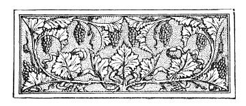

  
[Intangible Textual Heritage](../../index)  [Esoteric](../index) 
[Index](index)  [Previous](aww15) 

------------------------------------------------------------------------

[Buy this Book at
Amazon.com](https://www.amazon.com/exec/obidos/ASIN/B002A9JOQK/internetsacredte)

------------------------------------------------------------------------

  
*The Art of Worldly Wisdom*, by Balthasar Gracian, tr. by Joseph Jacobs,
\[1892\], at Intangible Textual Heritage

------------------------------------------------------------------------

p. 181 p. 182
p. 183

 

# NOTES

ORIG. refers to the Spanish original, generally from the Barcelona
edition of 1734, though I have occasionally referred to the Madrid
edition of 1653, and at times used the text of the *Biblioteca de
autores epañoles*. This may have occasioned some inconsistencies,
especially with regard to accentuation. Schop. refers to Schopenhauer's
translation; I have used Grisebach's edition in the Reclam series.
M.G.D. is prefixed to quotations from Sir M. Grant Duff's renderings in
Fort. Rev., March 1877; Eng. I. and II. refer to the English
translations of 1694 and Savage's of 1902 respectively.

<table data-border="0" width="100%">
<colgroup>
<col style="width: 33%" />
<col style="width: 33%" />
<col style="width: 33%" />
</colgroup>
<tbody>
<tr class="odd">
<td data-valign="top" width="48">
Page
</td>
<td data-valign="top" width="77">
Max.
</td>
<td data-valign="top" width="694">
 
</td>
</tr>
<tr class="even">
<td data-valign="top" width="48">
<a href="aww10.htm#page_1">1</a>
</td>
<td data-valign="top" width="77">
ii
</td>
<td data-valign="top" width="694">
<em>character and intellect</em>—Orig. "Genio y ingenio"; Schop. "Herz und Kopf"; Eng. I. "Wit and a Genius." The first section of El Discreto has the same title.

<em>two poles</em>—Orig. "los dos exes del lucimiento de prendas"; M.G.D. "The two axes of the brilliance of our accomplishments."
</td>
</tr>
<tr class="odd">
<td data-valign="top" width="48">
<a href="aww10.htm#page_2">2</a>
</td>
<td data-valign="top" width="77">
iii
</td>
<td data-valign="top" width="694">
<em>when you explain</em>; cf. ccliii.

<em>the Divine way</em>; cf. "It is the glory of God to conceal a thing," Prov. xxv. 2.
</td>
</tr>
<tr class="even">
<td data-valign="top" width="48">
 
</td>
<td data-valign="top" width="77">
 
</td>
<td data-valign="top" width="694">
p. 184
</td>
</tr>
<tr class="odd">
<td data-valign="top" width="48">
<a href="aww10.htm#page_3">3</a>
</td>
<td data-valign="top" width="77">
v
</td>
<td data-valign="top" width="694">
<em>Not he that adorns</em>—Orig. "No hace el númen el que lo dora sino el que lo adora"; Schop. "Den Götzen macht nicht der Vergolder sondern der Anbeter."

<em>golden platter</em>—Orig. "del oro al lodo"; lit. from the gold to the mire.
</td>
</tr>
<tr class="even">
<td data-valign="top" width="48">
 
</td>
<td data-valign="top" width="77">
vi
</td>
<td data-valign="top" width="694">
<em>A Man</em>; from <em>El Discreto</em>.
</td>
</tr>
<tr class="odd">
<td data-valign="top" width="48">
<a href="aww10.htm#page_5">5</a>
</td>
<td data-valign="top" width="77">
ix
</td>
<td data-valign="top" width="694">
<em>strata</em>—so Schop. "Schichten"; Orig. "venas donde pasa."
</td>
</tr>
<tr class="even">
<td data-valign="top" width="48">
<a href="aww10.htm#page_7">7</a>
</td>
<td data-valign="top" width="77">
xiii
</td>
<td data-valign="top" width="694">
<em>Second Thoughts</em>—Orig. "intencion segunda." The expression and idea is derived from scholastic logic. Terms of second intention, <em>i.e.</em> logical technical terms, are doubly abstract, being abstractions of terms of first intention.

<em>warfare against malice</em>—Orig. "milicia . . . contra la malicia."
</td>
</tr>
<tr class="odd">
<td data-valign="top" width="48">
<a href="aww10.htm#page_8">8</a>
</td>
<td data-valign="top" width="77">
xiv
</td>
<td data-valign="top" width="694">
<em>accident</em>—Orig. "circumstancia"; again a scholastic term referring to the modes of real being.
</td>
</tr>
<tr class="even">
<td data-valign="top" width="48">
<a href="aww10.htm#page_9">9</a>
</td>
<td data-valign="top" width="77">
 
</td>
<td data-valign="top" width="694">
<em>joy in life</em>; cf. Emerson: "Beautiful behaviour is the finest of the fine arts."
</td>
</tr>
<tr class="odd">
<td data-valign="top" width="48">
 
</td>
<td data-valign="top" width="77">
xv
</td>
<td data-valign="top" width="694">
<em>make use of the wise</em>—"Make friends of the wise," said the Seven Sages, <em>ap</em>. Stobaeus, <em>Flor</em>. iii. 80.

<em>great thing to know</em>—Orig. "Ay mucho que saber y es poco el vivir"; Schop. takes it as a variant of Hippocrates' maxim, "Art is long," etc., and renders "Das Wissen ist lang, das Leben kurz." See, however, ccxlvii.
</td>
</tr>
<tr class="even">
<td data-valign="top" width="48">
<a href="aww10.htm#page_10">10</a>
</td>
<td data-valign="top" width="77">
xvi
</td>
<td data-valign="top" width="694">
<em>Knowledge without sense</em>—"Ciencia sin seso locura doble"; cf. Span. prov. "Ciencia es Locura si buen seso no la cura."
</td>
</tr>
<tr class="odd">
<td data-valign="top" width="48">
 
</td>
<td data-valign="top" width="77">
xvii
</td>
<td data-valign="top" width="694">
<em>impulse</em>—Orig. "intencion," a reference to xiii, where see Note.
</td>
</tr>
<tr class="even">
<td data-valign="top" width="48">
 
</td>
<td data-valign="top" width="77">
 
</td>
<td data-valign="top" width="694">
p. 185
</td>
</tr>
<tr class="odd">
<td data-valign="top" width="48">
<a href="aww10.htm#page_11">11</a>
</td>
<td data-valign="top" width="77">
xviii
</td>
<td data-valign="top" width="694">
<em>Application and Ability</em>. Galton, <em>Hereditary Genius</em>, p. 38, adds zeal or energy.
</td>
</tr>
<tr class="even">
<td data-valign="top" width="48">
 
</td>
<td data-valign="top" width="77">
xix
</td>
<td data-valign="top" width="694">
<em>Arouse</em>, etc.; from <em>El Heroe</em>, § 16.
</td>
</tr>
<tr class="odd">
<td data-valign="top" width="48">
<a href="aww10.htm#page_12">12</a>
</td>
<td data-valign="top" width="77">
xx
</td>
<td data-valign="top" width="694">
<em>The sage has one advantage</em>. A favourite maxim of Schopenhauer, quoted by him in his <em>Wille in d. Natur</em>, 1836, p. 34, and written on his own copy of <em>Die Welt als Wille</em>, obviously applying it to himself. (See Grisebach, <em>Edita and Inedita</em>, p. 104.)
</td>
</tr>
<tr class="even">
<td data-valign="top" width="48">
<a href="aww10.htm#page_14">14</a>
</td>
<td data-valign="top" width="77">
xxiii
</td>
<td data-valign="top" width="694">
<em>soon finds out</em>—Orig. "para luego y aun repara."
</td>
</tr>
<tr class="odd">
<td data-valign="top" width="48">
<a href="aww10.htm#page_15">15</a>
</td>
<td data-valign="top" width="77">
xxv
</td>
<td data-valign="top" width="694">
<em>Know how</em>, etc.—Orig. "Been entendedor"; from <em>El Discreto</em>. Eng. I. "A good Pryer"; Eng. II. "A good Understanding." The reference is to the Span. prov. "A buen entendedor pocas palabras," <em>Don Quixote</em>, ii. cc. 37, 60. Sly uses the later half in <em>Taming of Shrew</em> Induction, "Therefore <em>pocas palabras</em>, let the world slide, sessa!"
</td>
</tr>
<tr class="even">
<td data-valign="top" width="48">
<a href="aww10.htm#page_16">16</a>
</td>
<td data-valign="top" width="77">
xxvii
</td>
<td data-valign="top" width="694">
<em>giants are real dwarfs</em>; cf. Bacon's apophthegm, "Nature did never put her jewels in garrets."

<em>try the brawn</em>. A slight embellishment. Orig. "para exercitar antes los braços que los ingenios."
</td>
</tr>
<tr class="odd">
<td data-valign="top" width="48">
 
</td>
<td data-valign="top" width="77">
xxviii
</td>
<td data-valign="top" width="694">
<em>great and wise</em>—Phocion; ap. Plutarch, <em>Reg. et Imp. Apophthegm</em>. Phocion, 4.
</td>
</tr>
<tr class="even">
<td data-valign="top" width="48">
<a href="aww10.htm#page_17">17</a>
</td>
<td data-valign="top" width="77">
 
</td>
<td data-valign="top" width="694">
<em>chameleons of popularity</em>; cf. ccxcv.
</td>
</tr>
<tr class="odd">
<td data-valign="top" width="48">
 
</td>
<td data-valign="top" width="77">
xxix
</td>
<td data-valign="top" width="694">
<em>Many praise it</em>; cf. "Probitas laudatur et alget," Juv. <em>Sat</em>. i. 74.
</td>
</tr>
<tr class="even">
<td data-valign="top" width="48">
<a href="aww10.htm#page_18">18</a>
</td>
<td data-valign="top" width="77">
xxxi
</td>
<td data-valign="top" width="694">
<em>Select the Lucky</em>. Quoted by Addison in Spectator, No. 293. The Rothschilds are said to act on this principle in their business relations.

<em>Never open</em>; cf. ccliv.
</td>
</tr>
<tr class="odd">
<td data-valign="top" width="48">
<a href="aww10.htm#page_19">19</a>
</td>
<td data-valign="top" width="77">
 
</td>
<td data-valign="top" width="694">
<em>win the odd trick</em>—Orig. merely "hallan con la ventura."
</td>
</tr>
<tr class="even">
<td data-valign="top" width="48">
 
</td>
<td data-valign="top" width="77">
 
</td>
<td data-valign="top" width="694">
p. 186
</td>
</tr>
<tr class="odd">
<td data-valign="top" width="48">
<a href="aww10.htm#page_19">19</a>
</td>
<td data-valign="top" width="77">
xxxii
</td>
<td data-valign="top" width="694">
<em>Those make friends</em>; cf. xl, cxi.

 
</td>
</tr>
<tr class="even">
<td data-valign="top" width="48">
 
</td>
<td data-valign="top" width="77">
xxxiii
</td>
<td data-valign="top" width="694">
<em>One is not obliged</em>; cf. cclx.
</td>
</tr>
<tr class="odd">
<td data-valign="top" width="48">
<a href="aww10.htm#page_20">20</a>
</td>
<td data-valign="top" width="77">
xxxv
</td>
<td data-valign="top" width="694">
<em>All fools</em>; cf. Stevenson, Kidnapped, c. xiv. as: "I have seen wicked men and fools, a great many of them; and I believe they both got paid in the end; but the fools first."
</td>
</tr>
<tr class="even">
<td data-valign="top" width="48">
<a href="aww10.htm#page_21">21</a>
</td>
<td data-valign="top" width="77">
xxxvi
</td>
<td data-valign="top" width="694">
f<em>avours the bold</em>; cf. Span. prov. "Al hombre osado la Fortuna lada la mano."
</td>
</tr>
<tr class="odd">
<td data-valign="top" width="48">
<a href="aww10.htm#page_22">22</a>
</td>
<td data-valign="top" width="77">
xxxvii
</td>
<td data-valign="top" width="694">
<em>Keep a Store of Sarcasms</em>, etc.—Eng. I. and II. "To guess at the meaning of the little Hints that are given us by the bye, and to know how to make the best of them."
</td>
</tr>
<tr class="even">
<td data-valign="top" width="48">
<a href="aww10.htm#page_24">24</a>
</td>
<td data-valign="top" width="77">
xl
</td>
<td data-valign="top" width="694">
From <em>El Heroe</em>, § 12.
</td>
</tr>
<tr class="odd">
<td data-valign="top" width="48">
<a href="aww10.htm#page_25">25</a>
</td>
<td data-valign="top" width="77">
xliii
</td>
<td data-valign="top" width="694">
From <em>El Discreto</em>, "Hombre juizio."
</td>
</tr>
<tr class="even">
<td data-valign="top" width="48">
<a href="aww10.htm#page_26">26</a>
</td>
<td data-valign="top" width="77">
xliv
</td>
<td data-valign="top" width="694">
<em>for mystery and for use</em>—Orig. "por lo culto y por lo ventojoso."
</td>
</tr>
<tr class="odd">
<td data-valign="top" width="48">
<a href="aww10.htm#page_28">28</a>
</td>
<td data-valign="top" width="77">
xlvii
</td>
<td data-valign="top" width="694">
<em>One affair</em>—Orig. has a play upon "empeño" and "despeño," which I have tried to reproduce.
</td>
</tr>
<tr class="even">
<td data-valign="top" width="48">
<a href="aww10.htm#page_29">29</a>
</td>
<td data-valign="top" width="77">
xlviii
</td>
<td data-valign="top" width="694">
<em>no use boring</em>—Orig. "No ay en estos donde parar ó todo para."
</td>
</tr>
<tr class="odd">
<td data-valign="top" width="48">
 
</td>
<td data-valign="top" width="77">
xlix
</td>
<td data-valign="top" width="694">
From <em>El Discreto</em>, c. xviii.
</td>
</tr>
<tr class="even">
<td data-valign="top" width="48">
<a href="aww11.htm#page_30">30</a>
</td>
<td data-valign="top" width="77">
li
</td>
<td data-valign="top" width="694">
<em>Know how</em>, etc.; from <em>El Discreto</em>, c. ix.
</td>
</tr>
<tr class="odd">
<td data-valign="top" width="48">
<a href="aww11.htm#page_31">31</a>
</td>
<td data-valign="top" width="77">
liii
</td>
<td data-valign="top" width="694">
From <em>El Discreto,</em> c. xx.

<em>Festina lente</em>—Orig. "Correr á espacio." This is not given in Dielitz' elaborate work on <em>Wahl-und Denksprüche</em>, Gorlitz, 1884, so I suspect it was Gracian's version of Augustus' motto, σπεῦδε βραχέως, generally translated <em>Festina lente</em>.
</td>
</tr>
<tr class="even">
<td data-valign="top" width="48">
<a href="aww11.htm#page_32">32</a>
</td>
<td data-valign="top" width="77">
lv
</td>
<td data-valign="top" width="694">
<em>Wait</em>; from <em>El Discreto</em>, c. iii, mainly from the end. It is called an <em>Allegoria</em>.
</td>
</tr>
<tr class="odd">
<td data-valign="top" width="48">
 
</td>
<td data-valign="top" width="77">
 
</td>
<td data-valign="top" width="694">
p. 187
</td>
</tr>
<tr class="even">
<td data-valign="top" width="48">
<a href="aww11.htm#page_32">32</a>
</td>
<td data-valign="top" width="77">
lv
</td>
<td data-valign="top" width="694">
<em>He spake</em>. Charles V. according to <em>El Discreto</em>, I.e. Schop. attributes the saying to Philip II.
</td>
</tr>
<tr class="odd">
<td data-valign="top" width="48">
<a href="aww11.htm#page_33">33</a>
</td>
<td data-valign="top" width="77">
lvi
</td>
<td data-valign="top" width="694">
<em>Have Presence of Mind</em>; from <em>El Discreto</em>, c. xiv.

<em>natures of Antiperistasis</em>. The energy aroused by opposition. Johnson gives example from Cowley (M.G.D.) It occurs also in Bacon (<em>Colours</em>, vii.) and Browne (<em>Rel. Med.</em> II. x.) Macaulay also uses it in his essay on Bacon (Oxford Diet.)

<em>work best in an emergency</em>. So Galton, <em>Hereditary Genius</em>, p. 48, who speaks of men "formed to shine under exceptional circumstances," as in the Indian Mutiny.
</td>
</tr>
<tr class="even">
<td data-valign="top" width="48">
 
</td>
<td data-valign="top" width="77">
lvii
</td>
<td data-valign="top" width="694">
<em>Quickly done</em>; cf. Herbert, <em>Jacula Prudentum</em>, "Good and quickly seldom meet."
</td>
</tr>
<tr class="odd">
<td data-valign="top" width="48">
<a href="aww11.htm#page_34">34</a>
</td>
<td data-valign="top" width="77">
lix
</td>
<td data-valign="top" width="694">
<em>Finish off well</em>; from <em>El Discreto</em>, c. xi.

<em>think of the finish</em>; cf. lxvi.

<em>Few in life</em>—Orig. "Que son raros los deseados."
</td>
</tr>
<tr class="even">
<td data-valign="top" width="48">
<a href="aww11.htm#page_35">35</a>
</td>
<td data-valign="top" width="77">
 
</td>
<td data-valign="top" width="694">
<em>warmly as</em>—Orig. "lo que se muesta de cumplida con los que vienen de descortes con los que van." M.G.D. "Seldom does fortune conduct a parting guest to the threshold."
</td>
</tr>
<tr class="odd">
<td data-valign="top" width="48">
 
</td>
<td data-valign="top" width="77">
lx
</td>
<td data-valign="top" width="694">
<em>by the helm of state</em>. So Schop. "Solche Leute verdienen am Staatsruder zu stehen, sei es zur Lenkung oder zum Rath"; Orig. "Merecen estos la asistencia al gobernarle ó para exercicio ó para consejo."
</td>
</tr>
<tr class="even">
<td data-valign="top" width="48">
 
</td>
<td data-valign="top" width="77">
lxi
</td>
<td data-valign="top" width="694">
<em>To Excel</em>; from <em>El Heroe</em>, p. vi.
</td>
</tr>
<tr class="odd">
<td data-valign="top" width="48">
<a href="aww11.htm#page_36">36</a>
</td>
<td data-valign="top" width="77">
lxii
</td>
<td data-valign="top" width="694">
<em>Use good Instruments</em>. Chap. iii. of Sir H. Taylor's <em>The Statesman</em> is entitled "A Statesman's most pregnant Function lies in the Choice and Use of Instruments."
</td>
</tr>
<tr class="even">
<td data-valign="top" width="48">
 
</td>
<td data-valign="top" width="77">
 
</td>
<td data-valign="top" width="694">
p. 188
</td>
</tr>
<tr class="odd">
<td data-valign="top" width="48">
<a href="aww11.htm#page_36">36</a>
</td>
<td data-valign="top" width="77">
lxii
</td>
<td data-valign="top" width="694">
<em>all the blame</em>; cf. Sir A. Helps's <em>Essays in Intervals of Business</em> (Macmillan, 1890), p. 44: "You have to choose persons for whose faults you are to be punished, to whom you are to be the whipping boy."
</td>
</tr>
<tr class="even">
<td data-valign="top" width="48">
 
</td>
<td data-valign="top" width="77">
lxiii
</td>
<td data-valign="top" width="694">
<em>To be the First</em>; from <em>El Heroe</em>, primor vii.
</td>
</tr>
<tr class="odd">
<td data-valign="top" width="48">
<a href="aww11.htm#page_37">37</a>
</td>
<td data-valign="top" width="77">
lxv
</td>
<td data-valign="top" width="694">
<em>Elevated Taste</em>; from <em>El Heroe</em>, primor v. Eng. II. "The Fine Taste," and so quoted by Addison, Spectator, No. 40n.
</td>
</tr>
<tr class="even">
<td data-valign="top" width="48">
<a href="aww11.htm#page_38">38</a>
</td>
<td data-valign="top" width="77">
lxvi
</td>
<td data-valign="top" width="694">
<em>See that Things end well</em>; cf. lix.

<em>A good end gilds</em>. Here the Jesuit speaks.
</td>
</tr>
<tr class="odd">
<td data-valign="top" width="48">
<a href="aww11.htm#page_39">39</a>
</td>
<td data-valign="top" width="77">
lxvii
</td>
<td data-valign="top" width="694">
<em>Prefer Callings "en Evidence"</em>; from <em>El Heroe</em>, primor viii.

<em>kings of Aragon</em>. Gracian was himself an Aragonese.
</td>
</tr>
<tr class="even">
<td data-valign="top" width="48">
<a href="aww11.htm#page_40">40</a>
</td>
<td data-valign="top" width="77">
lxix
</td>
<td data-valign="top" width="694">
<em>Do not give way</em>, etc.; from <em>El Discreto</em>, c. xiii.
</td>
</tr>
<tr class="odd">
<td data-valign="top" width="48">
<a href="aww11.htm#page_45">45</a>
</td>
<td data-valign="top" width="77">
lxxi
</td>
<td data-valign="top" width="694">
<em>Do not Vacillate</em>; from <em>El Discreto</em>, c. vi.
</td>
</tr>
<tr class="even">
<td data-valign="top" width="48">
<a href="aww11.htm#page_45">45</a>
</td>
<td data-valign="top" width="77">
lxxvi
</td>
<td data-valign="top" width="694">
<em>Do not always be Jesting</em>; from <em>El Discreto</em>, c. ix.

<em>A continual jest</em>—Orig. "No ay mayor desayre que el continuo donayre."
</td>
</tr>
<tr class="odd">
<td data-valign="top" width="48">
 
</td>
<td data-valign="top" width="77">
lxxvii
</td>
<td data-valign="top" width="694">
<em>Be all Things to all Men</em>. A touch of Gracian's training as Jesuit.
</td>
</tr>
<tr class="even">
<td data-valign="top" width="48">
<a href="aww11.htm#page_46">46</a>
</td>
<td data-valign="top" width="77">
 
</td>
<td data-valign="top" width="694">
<em>universal genius</em>—Orig. "varon universal de ingenio en noticias y de genio en gustos" cf. ii.
</td>
</tr>
<tr class="odd">
<td data-valign="top" width="48">
 
</td>
<td data-valign="top" width="77">
lxxix
</td>
<td data-valign="top" width="694">
<em>Join in the fun</em>; cf. cclxxv.
</td>
</tr>
<tr class="even">
<td data-valign="top" width="48">
<a href="aww11.htm#page_48">48</a>
</td>
<td data-valign="top" width="77">
lxxxi
</td>
<td data-valign="top" width="694">
mediocrity that's new; cf. cclxix.

<em>Change the scene</em>; cf. cxcviii.
</td>
</tr>
<tr class="odd">
<td data-valign="top" width="48">
 
</td>
<td data-valign="top" width="77">
lxxxii
</td>
<td data-valign="top" width="694">
<em>A sage</em>—Aristotle.
</td>
</tr>
<tr class="even">
<td data-valign="top" width="48">
<a href="aww11.htm#page_49">49</a>
</td>
<td data-valign="top" width="77">
lxxxiii
</td>
<td data-valign="top" width="694">
<em>leave your cloak</em>—an image taken from the bull-fight, when the matador allows the bull to rush at his cloak held sideways. Gracian uses the same image in El Criticon, i. 3.

lxxxiv <em>blade which cuts</em>; cf. ccxxiv.
</td>
</tr>
<tr class="odd">
<td data-valign="top" width="48">
 
</td>
<td data-valign="top" width="77">
 
</td>
<td data-valign="top" width="694">
p. 189
</td>
</tr>
<tr class="even">
<td data-valign="top" width="48">
<a href="aww11.htm#page_50">50</a>
</td>
<td data-valign="top" width="77">
lxxxv
</td>
<td data-valign="top" width="694">
<em>Manille</em>. Schop. suggests that this is the Manillio of Hombre, the second best trump (cf. Pope, <em>Rape of Lock</em>, iii. 51). But there is a game mentioned by Littré <em>s.v.</em>, which is obviously the one referred to by Gracian. In this the nine of diamonds, called Manille, can be made any value the player wishes. Manille thus means a combination of a jack of all Trades and a universal drudge.
</td>
</tr>
<tr class="odd">
<td data-valign="top" width="48">
<a href="aww11.htm#page_51">51</a>
</td>
<td data-valign="top" width="77">
lxxxvii
</td>
<td data-valign="top" width="694">
<em>Culture and Elegance</em>; from <em>El Discreto</em>, c. xvii.
</td>
</tr>
<tr class="even">
<td data-valign="top" width="48">
<a href="aww11.htm#page_53">53</a>
</td>
<td data-valign="top" width="77">
xc
</td>
<td data-valign="top" width="694">
<em>The Secret</em>; cf. Fuller, "He lives long who lives well."

<em>have not the will</em>. So, it is said, negroes and savages die in circumstances where Europeans keep alive simply because they have "the will to live, the competence to be."
</td>
</tr>
<tr class="odd">
<td data-valign="top" width="48">
<a href="aww11.htm#page_54">54</a>
</td>
<td data-valign="top" width="77">
xcii
</td>
<td data-valign="top" width="694">
<em>an ounce of wisdom</em>—Orig. "Mas vale un grano de cordura que arrobas de sutileza."
</td>
</tr>
<tr class="even">
<td data-valign="top" width="48">
<a href="aww11.htm#page_55">55</a>
</td>
<td data-valign="top" width="77">
xciv
</td>
<td data-valign="top" width="694">
<em>Keep the extent</em>, etc.; from <em>El Heroe</em>, i.
</td>
</tr>
<tr class="odd">
<td data-valign="top" width="48">
 
</td>
<td data-valign="top" width="77">
xcv
</td>
<td data-valign="top" width="694">
<em>single cast</em>; cf. clxxxv.
</td>
</tr>
<tr class="even">
<td data-valign="top" width="48">
 
</td>
<td data-valign="top" width="77">
xcvi
</td>
<td data-valign="top" width="694">
<em>The highest Discretion</em>—Orig. "la gran sinderesis."
</td>
</tr>
<tr class="odd">
<td data-valign="top" width="48">
<a href="aww11.htm#page_56">56</a>
</td>
<td data-valign="top" width="77">
xcviii
</td>
<td data-valign="top" width="694">
<em>Write your Intentions in Cypher</em>; from <em>El Heroe</em>, ii.
</td>
</tr>
<tr class="even">
<td data-valign="top" width="48">
<a href="aww11.htm#page_57">57</a>
</td>
<td data-valign="top" width="77">
 
</td>
<td data-valign="top" width="694">
<em>adopt the policy</em>—Orig. "A linces de discurso gibias de interioridad," I have omitted the lynxes, who have little to do with cuttle-fish (pl. of Sp. <em>jibia</em>).
</td>
</tr>
<tr class="odd">
<td data-valign="top" width="48">
 
</td>
<td data-valign="top" width="77">
xcix
</td>
<td data-valign="top" width="694">
<em>Things pass</em>, etc. A favourite expression of Gracian's; cf. cxxx, cxlvi; cf. also the German proverb, "Was scheint, das gilt."
</td>
</tr>
<tr class="even">
<td data-valign="top" width="48">
<a href="aww12.htm#page_58">58</a>
</td>
<td data-valign="top" width="77">
ci
</td>
<td data-valign="top" width="694">
<em>What one pursues</em>—Orig. "Lo que este sigue, el otro persigue."
</td>
</tr>
<tr class="odd">
<td data-valign="top" width="48">
<a href="aww12.htm#page_59">59</a>
</td>
<td data-valign="top" width="77">
cii
</td>
<td data-valign="top" width="694">
<em>find their proper place</em>—Orig. "No caben en si porque no cabe en ellos la suerte."
</td>
</tr>
<tr class="even">
<td data-valign="top" width="48">
 
</td>
<td data-valign="top" width="77">
 
</td>
<td data-valign="top" width="694">
p. 190
</td>
</tr>
<tr class="odd">
<td data-valign="top" width="48">
<a href="aww12.htm#page_60">60</a>
</td>
<td data-valign="top" width="77">
cv
</td>
<td data-valign="top" width="694">
<em>gains by courtesy</em>—Orig. "gana por lo cortés lo que pierde por lo corta."
</td>
</tr>
<tr class="even">
<td data-valign="top" width="48">
<a href="aww12.htm#page_63">63</a>
</td>
<td data-valign="top" width="77">
cix
</td>
<td data-valign="top" width="694">
<em>prison</em>—Orig. "galera," a sort of Bridewell.
</td>
</tr>
<tr class="odd">
<td data-valign="top" width="48">
<a href="aww12.htm#page_64">64</a>
</td>
<td data-valign="top" width="77">
cxi
</td>
<td data-valign="top" width="694">
<em>way to gain friendly feelings</em>; cf. xxxii, xl.
</td>
</tr>
<tr class="even">
<td data-valign="top" width="48">
<a href="aww12.htm#page_65">65</a>
</td>
<td data-valign="top" width="77">
cxii
</td>
<td data-valign="top" width="694">
<em>Service Road</em>—Orig. "Es grande el rodeo de solos los meritos sino se ayudan del favor."
</td>
</tr>
<tr class="odd">
<td data-valign="top" width="48">
<a href="aww12.htm#page_69">69</a>
</td>
<td data-valign="top" width="77">
cxix
</td>
<td data-valign="top" width="694">
to be esteemed—Orig. "el que quiere hacer casa hace caso."
</td>
</tr>
<tr class="even">
<td data-valign="top" width="48">
<a href="aww12.htm#page_71">71</a>
</td>
<td data-valign="top" width="77">
cxxii
</td>
<td data-valign="top" width="694">
<em>Distinction</em>; from <em>El Discreto</em>, c. ii.
</td>
</tr>
<tr class="odd">
<td data-valign="top" width="48">
<a href="aww12.htm#page_73">73</a>
</td>
<td data-valign="top" width="77">
cxxvi
</td>
<td data-valign="top" width="694">
<em>wise try to hide</em>; cf. Prov. xii. 16 "A fool's vexation is speedily known, but the prudent man concealeth shame."

<em>live chastely</em>—Orig. "Si no es uno casto, sea cauto"; Schop. turns neatly into Latin, <em>caute nisi caste</em>.
</td>
</tr>
<tr class="even">
<td data-valign="top" width="48">
<a href="aww12.htm#page_74">74</a>
</td>
<td data-valign="top" width="77">
 
</td>
<td data-valign="top" width="694">
<em>learn to forget</em>; cf. cclxii.
</td>
</tr>
<tr class="odd">
<td data-valign="top" width="48">
 
</td>
<td data-valign="top" width="77">
cxxvii
</td>
<td data-valign="top" width="694">
<em>Grace in Everything</em>; from <em>El Heroe</em>, c. xiii.
</td>
</tr>
<tr class="even">
<td data-valign="top" width="48">
<a href="aww12.htm#page_75">75</a>
</td>
<td data-valign="top" width="77">
cxxix
</td>
<td data-valign="top" width="694">
<em>Never complain</em>. "I make it a point never to complain," Mr. Disraeli once said in the House; cf. cxlv.
</td>
</tr>
<tr class="odd">
<td data-valign="top" width="48">
<a href="aww12.htm#page_76">76</a>
</td>
<td data-valign="top" width="77">
cxxx
</td>
<td data-valign="top" width="694">
<em>Even the Right</em>; cf. xcix.

<em>things are judged by their rackets</em>—Orig. merely "juzganse las cosas por fuera."
</td>
</tr>
<tr class="even">
<td data-valign="top" width="48">
<a href="aww12.htm#page_77">77</a>
</td>
<td data-valign="top" width="77">
cxxxiii
</td>
<td data-valign="top" width="694">
<em>Better Mad</em>, etc.; cf. "In action wisdom goes by majorities," from "The Pilgrim's Scrip" in <em>Richard Feverel</em>.
</td>
</tr>
<tr class="odd">
<td data-valign="top" width="48">
<a href="aww12.htm#page_78">78</a>
</td>
<td data-valign="top" width="77">
 
</td>
<td data-valign="top" width="694">
<em>the aphorism</em>; from Aristotle, <em>Pol.</em> i. s; also Heraclitus; cf. Grisebach, Schopenhauer's <em>Inedita</em>, 78. Also Bacon, <em>Essays</em>.
</td>
</tr>
<tr class="even">
<td data-valign="top" width="48">
<a href="aww12.htm#page_80">80</a>
</td>
<td data-valign="top" width="77">
cxxxvii
</td>
<td data-valign="top" width="694">
<em>resembles the brute beast</em>. See preceding note.
</td>
</tr>
<tr class="odd">
<td data-valign="top" width="48">
<a href="aww12.htm#page_88">88</a>
</td>
<td data-valign="top" width="77">
cxlvii
</td>
<td data-valign="top" width="694">
<em>the sage said</em>—Socrates.
</td>
</tr>
<tr class="even">
<td data-valign="top" width="48">
<a href="aww13.htm#page_90">90</a>
</td>
<td data-valign="top" width="77">
cli
</td>
<td data-valign="top" width="694">
<em>The pillow is a silent</em>; quoted by Morley, <em>Aphorisms</em>.
</td>
</tr>
<tr class="odd">
<td data-valign="top" width="48">
 
</td>
<td data-valign="top" width="77">
 
</td>
<td data-valign="top" width="694">
p. 191
</td>
</tr>
<tr class="even">
<td data-valign="top" width="48">
<a href="aww13.htm#page_90">90</a>
</td>
<td data-valign="top" width="77">
clii
</td>
<td data-valign="top" width="694">
<em>The more he does</em>—Orig. "Tanto por mas, quanta por menos." Schop. takes it differently: "Sei es dadurch lass er über uns oder class er unter uns stehe."

<em>the cunning Fabula</em>—Martial, <em>Epigr.</em> viii. 79.
</td>
</tr>
<tr class="odd">
<td data-valign="top" width="48">
<a href="aww13.htm#page_91">91</a>
</td>
<td data-valign="top" width="77">
cliii
</td>
<td data-valign="top" width="694">
<em>Beware of entering</em>. The great Jewish teacher Hillel gave braver advice: "'Where there is no man, dare to be a man" (<em>Ethics of the Fathers</em>).
</td>
</tr>
<tr class="even">
<td data-valign="top" width="48">
<a href="aww13.htm#page_93">93</a>
</td>
<td data-valign="top" width="77">
clv
</td>
<td data-valign="top" width="694">
<em>synteresis</em>; defined in Doctor and Student, Dial. I. ch. xiv., as: "The natural power of the soul set in the highest part thereof, moving it and stirring it to good and abhorring evil"; cf. Milton, <em>Common-place Book</em>, ed. Horwood, § 79; and cf. Saunder, transl. of Schopenhauer, <em>Aphorismen zur Lebensweisheit</em>, c. v. § 34.

"<em>wise on horseback</em>"; cf. "Nadie es cuerdo á caballo," Span. prov. quoted by Schop.
</td>
</tr>
<tr class="odd">
<td data-valign="top" width="48">
 
</td>
<td data-valign="top" width="77">
clvi
</td>
<td data-valign="top" width="694">
<em>Only after</em>, etc.—Orig. "Que lo han de ser á examen de la discretion y á prueba de la fortuna, graduados no solo de la voluntad sino del entendimiento."

<em>Intelligence brings friends</em>; cf. Stevenson, Dr. Jekyll: "It is the mark of a modest man to accept his friends ready made at the hands of opportunity."
</td>
</tr>
<tr class="even">
<td data-valign="top" width="48">
<a href="aww13.htm#page_95">95</a>
</td>
<td data-valign="top" width="77">
clviii
</td>
<td data-valign="top" width="694">
<em>Being in general</em>; the scholastic maxim running "Quodlibet ens est unum, verum, bonum."
</td>
</tr>
<tr class="odd">
<td data-valign="top" width="48">
 
</td>
<td data-valign="top" width="77">
clix
</td>
<td data-valign="top" width="694">
<em>to put up with things</em>; ἀνέχεσθαι καὶ ἀπέχεσθαι, the great Epicurean maxim.
</td>
</tr>
<tr class="even">
<td data-valign="top" width="48">
<a href="aww13.htm#page_96">96</a>
</td>
<td data-valign="top" width="77">
clx
</td>
<td data-valign="top" width="694">
<em>Be careful in Speaking</em>; cf. Prov. xxix. 20. "Seest thou a man that is hasty in his words there is more hope of a fool than of him."
</td>
</tr>
<tr class="odd">
<td data-valign="top" width="48">
 
</td>
<td data-valign="top" width="77">
 
</td>
<td data-valign="top" width="694">
p. 192
</td>
</tr>
<tr class="even">
<td data-valign="top" width="48">
<a href="aww13.htm#page_97">97</a>
</td>
<td data-valign="top" width="77">
clxii
</td>
<td data-valign="top" width="694">
<em>enough to despise them</em>; cf. ccv.

<em>who speaks well</em>. "It's poor foolishness," says Adam Bede, "to run down your enemies", cf. Goethe.
</td>
</tr>
<tr class="odd">
<td data-valign="top" width="48">
<a href="aww13.htm#page_98">98</a>
</td>
<td data-valign="top" width="77">
clxiv
</td>
<td data-valign="top" width="694">
<em>Throw Straws</em>—Orig. "Echar al ayre algunas cosas" merely refers to feigned blows; cf. xiii.
</td>
</tr>
<tr class="even">
<td data-valign="top" width="48">
<a href="aww13.htm#page_99">99</a>
</td>
<td data-valign="top" width="77">
clxv
</td>
<td data-valign="top" width="694">
<em>poisoned arrows</em>; rather an embellishment on the orig., which has merely "pero no mala (guerra)."
</td>
</tr>
<tr class="odd">
<td data-valign="top" width="48">
<a href="aww13.htm#page_100">100</a>
</td>
<td data-valign="top" width="77">
clxvi
</td>
<td data-valign="top" width="694">
<em>polite deceit</em>; cf. cxci.
</td>
</tr>
<tr class="even">
<td data-valign="top" width="48">
<a href="aww13.htm#page_104">104</a>
</td>
<td data-valign="top" width="77">
clxxiii
</td>
<td data-valign="top" width="694">
<em>Motes offend them</em>—Orig. "Ofendenla las motas que no son menester yá notas."

<em>the Amant is half adamant</em>. This seems the only way of retaining the "conceit" and jingle of the orig.: "La condition del Amante tiene la mitad de diamante en el durar y en el resistir."
</td>
</tr>
<tr class="odd">
<td data-valign="top" width="48">
<a href="aww13.htm#page_105">105</a>
</td>
<td data-valign="top" width="77">
clxxv
</td>
<td data-valign="top" width="694">
<em>Only Truth—profit</em>; omitted by Schop.
</td>
</tr>
<tr class="even">
<td data-valign="top" width="48">
<a href="aww13.htm#page_109">109</a>
</td>
<td data-valign="top" width="77">
clxxxii
</td>
<td data-valign="top" width="694">
<em>A Grain of Boldness</em>; cf. the opening of Bacon's Essay "Of Boldnesse," and Mrs. Poyser's aphorism, "It's them as take advantage that get advantage in this world, I think."
</td>
</tr>
<tr class="odd">
<td data-valign="top" width="48">
<a href="aww13.htm#page_112">112</a>
</td>
<td data-valign="top" width="77">
clxxxvii
</td>
<td data-valign="top" width="694">
<em>it is the privilege</em>; cf. cclxxxvi.

<em>Have some one</em>; cf. Bacon, "Of Envy": "The wiser Sort of Great Persons bring in ever upon the Stage some Body upon whom to derive the Envy that would come upon themselves."
</td>
</tr>
<tr class="even">
<td data-valign="top" width="48">
<a href="aww13.htm#page_115">115</a>
</td>
<td data-valign="top" width="77">
cxc
</td>
<td data-valign="top" width="694">
<em>The unlucky thinks</em>—Orig. has a play upon the words "suerte" and "muerte."
</td>
</tr>
<tr class="odd">
<td data-valign="top" width="48">
 
</td>
<td data-valign="top" width="77">
cxci
</td>
<td data-valign="top" width="694">
<em>Theirs is the Bank of Elegance</em>. I have no excuse for this. Orig. simply "Hacen precio con la honra."
</td>
</tr>
<tr class="even">
<td data-valign="top" width="48">
 
</td>
<td data-valign="top" width="77">
cxcii
</td>
<td data-valign="top" width="694">
<em>no greater perversit</em>y—Orig. "No ay mayor desproposito que tomar lo todo de proposito."
</td>
</tr>
<tr class="odd">
<td data-valign="top" width="48">
 
</td>
<td data-valign="top" width="77">
 
</td>
<td data-valign="top" width="694">
p. 193
</td>
</tr>
<tr class="even">
<td data-valign="top" width="48">
<a href="aww13.htm#page_116">116</a>
</td>
<td data-valign="top" width="77">
cxciii
</td>
<td data-valign="top" width="694">
<em>Be intent</em>—Orig. "Al intendido un buen entendedor."

<em>their chestnuts</em>—Orig. simply "Sacar del fuego el provecho ageno."
</td>
</tr>
<tr class="odd">
<td data-valign="top" width="48">
<a href="aww13.htm#page_117">117</a>
</td>
<td data-valign="top" width="77">
cxcvi
</td>
<td data-valign="top" width="694">
<em>ruling Star</em>. There are some grounds for believing that great adventurers, like Napoleon, have a subjective star, hallucinatory of course, which appears to them at moments of great excitement; cf. Gallon, <em>Human Faculty</em>, 175-176.
</td>
</tr>
<tr class="even">
<td data-valign="top" width="48">
<a href="aww13.htm#page_119">119</a>
</td>
<td data-valign="top" width="77">
cxcviii
</td>
<td data-valign="top" width="694">
<em>native land a stepmother</em>; cf. <em>contra</em> Galton, <em>Hered. Gen.</em>, 360 "As a rule the very ablest men are strongly disinclined to emigrate," and Prov. xxvii. 8.
</td>
</tr>
<tr class="odd">
<td data-valign="top" width="48">
<a href="aww13.htm#page_120">120</a>
</td>
<td data-valign="top" width="77">
cc
</td>
<td data-valign="top" width="694">
<em>Leave Something</em>; cf. lxxxii, ccxcix.

<em>The body must respire</em>—Orig. "Espira el cuerpo y anhela el espiritu."
</td>
</tr>
<tr class="even">
<td data-valign="top" width="48">
<a href="aww14.htm#page_121">121</a>
</td>
<td data-valign="top" width="77">
ccii
</td>
<td data-valign="top" width="694">
<em>Former are feminine</em>; cf. Span. prov. "Palabras hembras son hechos machos." Howell, <em>Fam. Letters</em>, quotes the saying as Italian; cf. my edition, p. 270 and <em>n</em>. Herbert also gives it in his <em>Jacula Prudentum</em>.

<em>Eminent deeds endure</em>. Schop. has characteristically expressed his dissent by annotating his own copy of the <em>Oráculo</em> at this point with a pithy "vale el contrario."
</td>
</tr>
<tr class="odd">
<td data-valign="top" width="48">
<a href="aww14.htm#page_122">122</a>
</td>
<td data-valign="top" width="77">
cciv
</td>
<td data-valign="top" width="694">
<em>Attempt easy Tasks as if they were difficult</em>. Approved by Mr. Morley, <em>Aphorisms</em>.
</td>
</tr>
<tr class="even">
<td data-valign="top" width="48">
<a href="aww14.htm#page_133">133</a>
</td>
<td data-valign="top" width="77">
ccxx
</td>
<td data-valign="top" width="694">
<em>If you cannot</em>, etc. There may be here a reference to Lysander's saying in Plutarch: "If the lion's skin [of Hercules] is not long enough, we must stitch on to it a fox's skin.
</td>
</tr>
<tr class="odd">
<td data-valign="top" width="48">
 
</td>
<td data-valign="top" width="77">
 
</td>
<td data-valign="top" width="694">
p. 194
</td>
</tr>
<tr class="even">
<td data-valign="top" width="48">
<a href="aww14.htm#page_133">133</a>
</td>
<td data-valign="top" width="77">
ccxxi
</td>
<td data-valign="top" width="694">
<em>They are always on the point of some stupidity</em>—omitted by Schop.
</td>
</tr>
<tr class="odd">
<td data-valign="top" width="48">
<a href="aww14.htm#page_134">134</a>
</td>
<td data-valign="top" width="77">
 
</td>
<td data-valign="top" width="694">
<em>meet with them easily</em>—Orig. "Encuentranse con gran facilidad y rompen con infelicidad."
</td>
</tr>
<tr class="even">
<td data-valign="top" width="48">
 
</td>
<td data-valign="top" width="77">
ccxxii
</td>
<td data-valign="top" width="694">
<em>Reserve is proof</em>; cf. clxxix.
</td>
</tr>
<tr class="odd">
<td data-valign="top" width="48">
<a href="aww14.htm#page_135">135</a>
</td>
<td data-valign="top" width="77">
ccxxiii
</td>
<td data-valign="top" width="694">
<em>more defects</em>—so Orig. "Que son mas defectos que diferencias."
</td>
</tr>
<tr class="even">
<td data-valign="top" width="48">
 
</td>
<td data-valign="top" width="77">
ccxxiv
</td>
<td data-valign="top" width="694">
<em>taken by the blade</em>; cf. lxxxiv.
</td>
</tr>
<tr class="odd">
<td data-valign="top" width="48">
<a href="aww14.htm#page_136">136</a>
</td>
<td data-valign="top" width="77">
ccxxv
</td>
<td data-valign="top" width="694">
<em>Know your chief Fault</em>; cf. xxxiv.
</td>
</tr>
<tr class="even">
<td data-valign="top" width="48">
<a href="aww14.htm#page_137">137</a>
</td>
<td data-valign="top" width="77">
ccxxvii
</td>
<td data-valign="top" width="694">
<em>new casks</em>; cf. the Span. prov. "A la vasija nueva dura el resabio."
</td>
</tr>
<tr class="odd">
<td data-valign="top" width="48">
<a href="aww14.htm#page_143">143</a>
</td>
<td data-valign="top" width="77">
ccxxxvii
</td>
<td data-valign="top" width="694">
<em>share pears</em>—Orig. "Pensará partir peras y partirá piedras." Schop. "Man glaubt Kirschen mit ihnen zu essen, wird aber nur die steine erhalten."
</td>
</tr>
<tr class="even">
<td data-valign="top" width="48">
<a href="aww14.htm#page_144">144</a>
</td>
<td data-valign="top" width="77">
ccxxxviii
</td>
<td data-valign="top" width="694">
<em>communicates his secret</em>; cf. Span. prov. "A quien dizes poridad á esse tu das la liberdad," neither tell secrets nor listen to them—Eng. I. puts it rather neatly: "Tis a maxim for secrets Neither to hear them nor to tell them"; cf. the maxim of the Seven Sages, ap. Stobaeus, Flor. iii. 80: "Tell none a secret."
</td>
</tr>
<tr class="odd">
<td data-valign="top" width="48">
 
</td>
<td data-valign="top" width="77">
ccxxxviii
</td>
<td data-valign="top" width="694">
<em>something wanting</em>; cf. xxxiv, ccxxv.
</td>
</tr>
<tr class="even">
<td data-valign="top" width="48">
<a href="aww14.htm#page_145">145</a>
</td>
<td data-valign="top" width="77">
ccxl
</td>
<td data-valign="top" width="694">
<em>Speak to each</em>; cf. Prov. xxvi. 5, "Answer a fool according to his folly."
</td>
</tr>
<tr class="odd">
<td data-valign="top" width="48">
<a href="aww14.htm#page_146">146</a>
</td>
<td data-valign="top" width="77">
ccxlii
</td>
<td data-valign="top" width="694">
<em>Everything stops</em>—Orig. "Todo para en parar." Schop. omits.
</td>
</tr>
<tr class="even">
<td data-valign="top" width="48">
<a href="aww14.htm#page_149">149</a>
</td>
<td data-valign="top" width="77">
ccxlvi
</td>
<td data-valign="top" width="694">
<em>To excuse oneself</em>—Orig. "El escusarse antes de ocasion es culparse"; cf. Fr. prov. "Qui s’excuse s’accuse."
</td>
</tr>
<tr class="odd">
<td data-valign="top" width="48">
<a href="aww14.htm#page_150">150</a>
</td>
<td data-valign="top" width="77">
ccli
</td>
<td data-valign="top" width="694">
<em>Use human Means</em>, etc.; cf. "Human wit ought to be exhausted before we presume to invoke Divine interposition" (B. Disraeli, <em>Tancred</em>).
</td>
</tr>
<tr class="even">
<td data-valign="top" width="48">
 
</td>
<td data-valign="top" width="77">
 
</td>
<td data-valign="top" width="694">
p. 195
</td>
</tr>
<tr class="odd">
<td data-valign="top" width="48">
<a href="aww15.htm#page_152">152</a>
</td>
<td data-valign="top" width="77">
cclii
</td>
<td data-valign="top" width="694">
<em>berth and burthen</em>—Orig. "Renuncie el cargo con la carga." The story goes that an old woman met Hadrian with a petition. He repulsed her, saying he had no time. "Then give up your berth," retorted the beldam. Hadrian recognised the justice of the rebuke and decided the petition on the spot.

<em>slaves of all</em>; cf. "Men in great Place are thrice servants" (Bacon, Essay "Of Great Place"). There is something like this in <em>El Criticon</em>, i. 7.
</td>
</tr>
<tr class="even">
<td data-valign="top" width="48">
 
</td>
<td data-valign="top" width="77">
ccliii
</td>
<td data-valign="top" width="694">
<em>Do not Explain overmuch</em>; cf. "Let the wise be warned against too great readiness of explanation" (G. Eliot, <em>Middlemarch</em>).

<em>do not esteem what they understand</em>; cf.—

       "Was man nicht weiss, das eben brauchte man, 
       Und was man weiss kann man nicht brauchen." 
                               GOETHE, Faust, Th. I.
</td>
</tr>
<tr class="odd">
<td data-valign="top" width="48">
<a href="aww15.htm#page_153">153</a>
</td>
<td data-valign="top" width="77">
 
</td>
<td data-valign="top" width="694">
<em>venerate the unknown</em>; cf. "Omne ignotum pro magnifico."
</td>
</tr>
<tr class="even">
<td data-valign="top" width="48">
 
</td>
<td data-valign="top" width="77">
ccliv
</td>
<td data-valign="top" width="694">
<em>they never come alone</em>; cf. Span. prov. <em>ap</em>. <em>Don Quixote</em>, i. 28, "Un mal llama á otro," and Shakespeare, "When sorrows come, they come not single spies, But in battalions," <em>Hamlet</em>, iv. 5.

<em>Do not wake Misfortune</em>; cf. Span. prov. "Quando la mala Fortuna se duerme, nadie la despierte."

<em>One slip is a little thing</em>; cf. Stevenson, <em>Dr. Jekyll</em>.
</td>
</tr>
<tr class="odd">
<td data-valign="top" width="48">
<a href="aww15.htm#page_158">158</a>
</td>
<td data-valign="top" width="77">
cclxii
</td>
<td data-valign="top" width="694">
<em>The things we remember best are those better forgotten</em>.—quoted by Mr. Morley in <em>Aphorisms</em>.
</td>
</tr>
<tr class="even">
<td data-valign="top" width="48">
<a href="aww15.htm#page_159">159</a>
</td>
<td data-valign="top" width="77">
cclxiv
</td>
<td data-valign="top" width="694">
<em>Have no careless Days</em>. D’Artagnan acts on this principle in keeping always on guard over the king during journeys. <em>Vicomte de Bragelonne</em>, c. xii.
</td>
</tr>
<tr class="odd">
<td data-valign="top" width="48">
 
</td>
<td data-valign="top" width="77">
 
</td>
<td data-valign="top" width="694">
p. 196
</td>
</tr>
<tr class="even">
<td data-valign="top" width="48">
<a href="aww15.htm#page_160">160</a>
</td>
<td data-valign="top" width="77">
cclxv
</td>
<td data-valign="top" width="694">
<em>The Great Captain</em>—Orig. "El gran Capitan," a reference to Gonsalvo de Cordova (1443-1515), who commanded the Spanish land forces against Chas. VIII. in Italy, and received his title "el gran Capitan" July 1496.
</td>
</tr>
<tr class="odd">
<td data-valign="top" width="48">
<a href="aww15.htm#page_161">161</a>
</td>
<td data-valign="top" width="77">
cclxvii
</td>
<td data-valign="top" width="694">
<em>Silken Words</em>. Parysatis, mother of the younger Cyrus, advised one who was about to have an audience with a king to use words wrapped in fine linen; cf. Paley, <em>Greek Wit</em>, i. No. 152.

<em>mouth full of sugar</em>; cf. <em>contra</em> Spurgeon's <em>John Ploughman's Talk</em>, "Do not be all sugar, or the world will suck you down."
</td>
</tr>
<tr class="even">
<td data-valign="top" width="48">
 
</td>
<td data-valign="top" width="77">
cclxviii
</td>
<td data-valign="top" width="694">
<em>Wise does at once</em>; cf. Span. prov. "Lo que hace el loco á la postre, hace sabio al principio (quoted by Trench, <em>Proverbs</em>5, 116).
</td>
</tr>
<tr class="odd">
<td data-valign="top" width="48">
<a href="aww15.htm#page_163">163</a>
</td>
<td data-valign="top" width="77">
cclxxi
</td>
<td data-valign="top" width="694">
<em>Let little knowledge</em>—Orig. "A poco saber camino real."
</td>
</tr>
<tr class="even">
<td data-valign="top" width="48">
<a href="aww15.htm#page_164">164</a>
</td>
<td data-valign="top" width="77">
cclxxiii
</td>
<td data-valign="top" width="694">
<em>If a man laughs always</em>—Orig. "Conosca al que siempre rie por falto y al que nunca por falso."
</td>
</tr>
<tr class="odd">
<td data-valign="top" width="48">
<a href="aww15.htm#page_166">166</a>
</td>
<td data-valign="top" width="77">
cclxxvi
</td>
<td data-valign="top" width="694">
<em>At twenty</em>; cf. the ages in <em>Ethics of the Jewish Fathers</em>, ed. C. Taylor, p. 111; L. Löw, <em>Die Lebensalter</em>, p. 22 and <em>n</em>.; and Shakespeare in <em>As You Like It</em>.
</td>
</tr>
<tr class="even">
<td data-valign="top" width="48">
 
</td>
<td data-valign="top" width="77">
cclxxvii
</td>
<td data-valign="top" width="694">
From <em>El Discreto</em>, c. xii.
</td>
</tr>
<tr class="odd">
<td data-valign="top" width="48">
<a href="aww15.htm#page_168">168</a>
</td>
<td data-valign="top" width="77">
cclxxix
</td>
<td data-valign="top" width="694">
<em>comes from cunning</em>; cf. ccxiii.
</td>
</tr>
<tr class="even">
<td data-valign="top" width="48">
<a href="aww15.htm#page_169">169</a>
</td>
<td data-valign="top" width="77">
cclxxxi
</td>
<td data-valign="top" width="694">
<em>you cannot make a meal</em>—Orig. "Porque regueldos de aristas no alientan." Schop. omits.
</td>
</tr>
<tr class="odd">
<td data-valign="top" width="48">
<a href="aww15.htm#page_170">170</a>
</td>
<td data-valign="top" width="77">
cclxxxii
</td>
<td data-valign="top" width="694">
<a href="errata.htm#8"><em>ridiculous</em></a>

<em>result</em>—Orig. "Ridiculo parto de los mantes," a reference to Horace's "Parturiunt montes, nascetur ridiculus mus."
</td>
</tr>
<tr class="even">
<td data-valign="top" width="48">
 
</td>
<td data-valign="top" width="77">
 
</td>
<td data-valign="top" width="694">
p. 197
</td>
</tr>
<tr class="odd">
<td data-valign="top" width="48">
<a href="aww15.htm#page_171">171</a>
</td>
<td data-valign="top" width="77">
cclxxxv
</td>
<td data-valign="top" width="694">
<em>Never die</em>—Schop. adds to his copy "y mucho menos de necedad y ruindad agena."
</td>
</tr>
<tr class="even">
<td data-valign="top" width="48">
<a href="aww15.htm#page_172">172</a>
</td>
<td data-valign="top" width="77">
cclxxxvi
</td>
<td data-valign="top" width="694">
<em>you can do more good</em>; cf. clxxxvii; cf. "Power to doe good is the true and lawfull end of Aspiring" (Bacon, "Of Great Place").
</td>
</tr>
<tr class="odd">
<td data-valign="top" width="48">
<a href="aww15.htm#page_173">173</a>
</td>
<td data-valign="top" width="77">
cclxxxviii
</td>
<td data-valign="top" width="694">
<em>steering by the wind</em>. The derangement of metaphors is mine; orig. has simply "En portarse à la ocasion."
</td>
</tr>
<tr class="even">
<td data-valign="top" width="48">
<a href="aww15.htm#page_174">174</a>
</td>
<td data-valign="top" width="77">
ccxci
</td>
<td data-valign="top" width="694">
<em>The care of the wise</em>, etc.—Orig. "Compita la atencion del juyzioso can la detencion del recatado."
</td>
</tr>
<tr class="odd">
<td data-valign="top" width="48">
<a href="aww15.htm#page_176">176</a>
</td>
<td data-valign="top" width="77">
ccxcv
</td>
<td data-valign="top" width="694">
From <em>El Discreto</em>, c. xix.
</td>
</tr>
<tr class="even">
<td data-valign="top" width="48">
<a href="aww15.htm#page_177">177</a>
</td>
<td data-valign="top" width="77">
ccxcvi
</td>
<td data-valign="top" width="694">
<em>Noble qualities make noblemen</em>—Orig. "Las primeras hazen los primeros hombres."
</td>
</tr>
<tr class="odd">
<td data-valign="top" width="48">
<a href="aww15.htm#page_179">179</a>
</td>
<td data-valign="top" width="77">
ccc
</td>
<td data-valign="top" width="694">
<em>Three HHH's</em>—Orig. "Tres eses hazen dichoso, Santo, Sano y Sabio." Schop. "Drei Dinge die in Spanischen mit einem S anfangen machen glücklich —Heiligkeit, Gesundheit, and Weisheit." M.G.D. "Three SSS render a man happy, Sanctity, Soundness of body, and Sageness."
</td>
</tr>
</tbody>
</table>

THE END

 

 

 

*Printed in Great Britain by* R. & R. CLARK,
LIMITED, *Edinburgh*.

 

 
