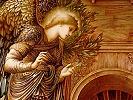

  
[Intangible Textual Heritage](../../index)  [Esoteric](../index.md) 
[Index](index)  [Previous](cc14)  [Next](cc16.md) 

------------------------------------------------------------------------

  
*Cosmic Consciousness*, by Richard Maurice Bucke, \[1901\], at
Intangible Textual Heritage

------------------------------------------------------------------------

### CHAPTER 6.

*Dante*.

Born 1265; Died 1321.

Balzac \[9: 241 and 263\] clearly intimates his conviction that Dante
was a "Specialist," which is his name for a man who has

p. 131

\[paragraph continues\] Cosmic
Consciousness. Balzac probably knew Dante very thoroughly, and could not
be mistaken on this point, he being himself a "Specialist"; for as a
musician knows of another man whether or not he is a musician, as a poet
knows of another man whether or not he is a poet, as a painter knows of
another man whether or not he is a painter, as a man with the sense of
sight living in a country inhabited with men nearly all of whom are
blind must know who among his acquaintances can see and who cannot, so
to-day, and all days, a man who has the Cosmic Sense will know of any
given man with whom he is acquainted, either personally or by his works,
whether or not he also has it. We could therefore accept with confidence
Balzac's word that Dante had the Cosmic Sense, but let us not do so—let
us try to see for ourselves.

##### I.

Dante's outward life and personality are as good as lost to us of the
nineteenth century. It seems clear, however, and the character of his
writings would indicate the same thing, that, as Boccaccio says
\[81:809\], even as a young man he was:

Taken by the sweetness of knowing the truth of the things concealed in
heaven, and finding no other pleasure dearer to him in life, he left all
other worldly care and gave himself to this alone, and, that no part of
philosophy might remain unseen by him, he plunged with acute intellect
into the deepest recesses of theology, and so far succeeded in his
design that, caring nothing for heat or cold, or watchings, or fastings,
or any other bodily discomforts, by assiduous study he came to know of
the divine essence and of the other separate intelligences all that the
human intellect can comprehend.

And Leonardo Bruni says of him that:

By study of philosophy, of theology, astrology, arithmetic and geometry,
by reading of history, by the turning over many curious books, watching
and sweating in his studies, he acquired the science which he was to
adorn and explain in his verses.

All which means that Dante was of a thoughtful, studious, earnest
nature, and we may interpret this fact to mean either that

p. 132

in his case such a life led up to a high poetic genius *within the
limits of self consciousness*, or that it led up (as claimed here) to
Cosmic Consciousness. In any case, Dante's youth seems to have been such
as we often find in men who attain illumination.

##### II.

Now, as to the outward man, Boccaccio says \[111: 200\]:

Our poet was of middle height, and after reaching mature years he went
somewhat stooping; his gait was grave and sedate; always clothed in the
most becoming garments, his dress was suited to the ripeness of his
years; his face was long, his nose aquiline, his eyes rather large than
small, his jaw heavy and his under lip prominent; his complexion was
dark, and his hair and beard thick, black and crisp, and his countenance
was always sad and thoughtful. . . . His manners, whether in public or
at home, were wonderfully composed and restrained, and in all his ways
he was more courteous and civil than any one else.

Again Charles E. Norton \[111: 204\] says of an undoubtedly authentic
death-mask of the poet:

The face is one of the most pathetic upon which human eyes ever looked,
for it exhibits in its expression the conflict between the strong nature
of the man and the hard dealings of fortune—between the idea of his life
and its practical experience. Strength is the most striking attribute of
the countenance, displayed alike in the broad forehead, the masculine
nose, the firm lips, the heavy jaw and wide chin; and this strength,
resulting from the main forms of the features, is enforced by the
strength of the lines of expression. The look is grave and stern almost
to grimness; there is a scornful lift to the eyebrows, and a contraction
of the forehead as from painful thought; but obscured under this look,
yet not lost, are the marks of tenderness, refinement and self-mastery,
which, in combination with more obvious characteristics, give to the
countenance of the dead poet an ineffable dignity and melancholy. There
is neither weakness nor failure here. It is the image of the strong
fortress, of a strong soul "buttressed on conscience and impregnable
will," battered by the blows of enemies without and within, bearing upon
its walls the dints of many a siege, but standing firm and unshaken
against all attacks until the warfare was at an end.

##### III.

As to the quality of Dante's mind and of his work, it will be well to
quote here, briefly, perhaps as high an authority as has lived in recent
times. He says:

p. 133

The Dantesque account of Hell, purgatory and Paradise is not an
arbitrary or fantastic dream, but the vivid and substantial embodiment
of a profound philosophy[\*](cc15.htm#an_133-1.md) \[179: 104\].

Meanwhile, leaving antiquarians to elucidate the pedigree of Dante's
ideas, we may observe that from his earliest boyhood he was familiar
with dreams and visions, and that he hints himself, at the end of the
"Vita Nuova," that the vision of the "Comedy" came to him as a
revelation, while he was pondering on the thought of death and upon the
memory of Beatrice[\*](cc15.htm#an_133-2.md) \[179: 109\].

The object of the whole work (he writes to Can Grande) is to make those
who live in this life leave their state of misery and to lead them to a
state of happiness[†](cc15.htm#an_133-3.md) \[179:110\].

\* This is of course necessarily true of
every book that springs from, is dictated by, the Cosmic Sense.

\* The writer, while knowing nothing about
Cosmic Consciousness, adopts, as it were perforce, the same theory of
Dante and his work as that propounded here.

† The main object in life in the case of
every (?) man having the Cosmic Sense is to bestow it upon the race, and
each feels in himself some power to so bestow it.

##### IV.

In the "Divine Comedy" (a book strictly parallel to the "Comédie
Humaine," or the "Leaves of Grass," in the sense that it is a picture of
the world from the point of view of the writer), Dante tells, first, in
the "Inferno," of human life as seen among ill-doers, the "sinful," the
"wicked." Then, in the "Purgatorio"—"that second realm where the human
spirit is purified and becomes worthy to ascend to heaven" \[71: 1\]—he
speaks of human life as seen in those who are struggling towards the
light—who are trying to lead good lives but are so far overburdened by
hereditary flaws, faults committed, bad habits formed, unfortunate
surroundings and other adverse circumstances. These are the better
people—short of illumination. But in the "Paradiso" Dante treats of the
new world of the Cosmic Sense—of the kingdom of God—Nirvâna.

Beatrice—"Making Happy"—is the Cosmic Sense (which, in fact, alone,
makes happy). The name may have been suggested by a beautiful girl (so
named). If so, the coincidence is curious.

That the meaning is as here said, seems clear from a hundred passages.
Take one. Virgil says to Dante: "So much as reason seeth here can I tell
thee; beyond that \[beyond reason, the self

p. 134

conscious mind\] awaits still for Beatrice" \[71:114\]. What is beyond
reason—the self conscious mind—but Cosmic Consciousness?

Dante wanders through the self conscious world ("Inferno" and
"Purgatorio") guided by Virgil (chosen as a splendid example and type of
the self conscious mind, and also probably because he had really been
one of Dante's principal guides before his illumination). But Virgil was
not a case of Cosmic Consciousness, and of course he cannot enter into
Paradise. Beatrice (the Cosmic Sense) leads Dante into that realm and is
his guide there.

Dante's "Vita Nuova," written at the end of the thirteenth century, was
first published in 1309, when he was forty-four years of age. At the
very end of it he seems to speak of the oncoming of Cosmic
Consciousness.

The "Divine Comedy" was finished in 1321, the time of the action being
strictly confined to the end of March and the beginning of April, 1300
\[81: 815\] at which time Dante was thirty-five years old. It seems
almost certain that this was the date of his illumination. It would be
at the typical age and in the typical season, and there seems nothing
against the supposition. It is a reasonable presumption that the earlier
book, "Vita Nuova," was being written up to the early spring of 1300;
that when illumination took place it was closed to give place to a
greater work then to be begun; that the latter book, the "Divine
Comedy," was actually begun at that date.

##### V.

The "Vita Nuova" \[68\] closes as follows:

After this sonnet a wonderful vision appeared to me, in which I saw
things which made me resolve to speak no more of this blessed one
(Beatrice) until I could more worthily treat of her. And, to attain to
this, I study to the utmost of my power, as she truly knows. So that, if
it shall please Him through whom all things live, that my life be
prolonged for some years, I hope to say of her what was never said of
any woman.

p. 135

##### VI.

We will now follow Dante's experience as closely as possible in his own
words, using always, as we have done above, the translation of Charles
Elliot Norton. And we take first from the "Purgatorio" passages
descriptive of Dante's approach to the divine land. When Dante is about
to enter Cosmic Consciousness Virgil says of him:

Expect no more or word or sign from me.[\*](cc15.htm#an_135-1.md) Free,
upright and sane in thine own free will, and it would be wrong not to
act according to its pleasure; wherefore thee over thyself I crown and
mitre \[71: 176\].

\* There are two points here well worthy of
being noted: (1) When the Cosmic Sense comes the rules and standards
belonging to self consciousness are suspended. "Confronted, turned back,
laid away" \[193: 153\], is Whitman's expression. No man with the Cosmic
Sense will take direction (in the affairs of the soul) from any other
man or any so-called God. In his own heart he holds the highest
accessible standard, and to that he will and must adhere; that only can
he obey. (2) The other is the duplication of the individual: "Thee over
thyself." Compare with these words "The other I am," of Whitman: "’Tis
thee (myself) that for myself I praise," of "Shakespeare" \[176: 62\];
"If any man is in Christ he is a new creature," of Paul; "Except a man
be born anew," of Jesus. A new individual must be born within the old
one, and, being so born, will live its own distinct life.

Virgil withdraws. The self conscious mind abdicates its sovereignty in
presence of the greater authority. Dante comes into immediate relation
with Beatrice—Cosmic Consciousness.

A lady appeared to me robed[\*](cc15.htm#an_135-2.md) with the color of
living flame. I turned me to the left with the confidence with which the
little child runs to his mother when he is frightened, or when he is
troubled, to say to Virgil: "Less than a drachm of blood remains in me
that does not tremble, I recognize the signals of the ancient flame;"
but Virgil had left us deprived of himself \[71:191\].

And as my face stretched upward my eyes saw
Beatrice.[\*](cc15.htm#an_135-3.md) Beneath her veil and beyond the stream
she seemed to me more to surpass her ancient self than she surpassed the
others here when she was here \[71:198\].

\* The Cosmic Sense robed with the subjective
light. At the threshold of the new sense Virgil (the type here of human
faculty short of it) leaves Dante. Not that simple and self
consciousness leave us when we enter Cosmic Consciousness, *but they do
cease to guide us*—"the eyesight has another eyesight, the hearing
another hearing, and the voice another voice" \[193: 342\].

\* The new world is still veiled and far off,
but even so its glory far transcends anything in the old world of mere
self consciousness.

p. 136

When I was near the blessed shore the beautiful lady
\[nature?\][\*](cc15.htm#an_136-1.md) opened her arms, clasped my head and
plunged me in where it behooved that I should swallow the water
\[71:199\].

Oh, splendor of living light eternal who hath
become so pallid under the shadow of Parnassus, or hath so drunk at its
cistern that he would not seem to have his mind encumbered, trying to
represent thee as thou didst appear there, where in harmony the heaven
overshadows thee when in thn open air thou didst thyself disclose
\[71:201\]?

\* "The drinking of the waters of Lethe,
which obliterate the memory of sin."—Norton's note. There is no sense of
sin in Cosmic Consciousness.

\* The best prepared poet (on the level of
self consciousness) by study and practice could not portray the new
world, when it freely (in the open air) discloses itself. "No shuttered
room or school can commune with me," says the Cosmic Sense by the tongue
of Whitman \[193:75\].

Beatrice (the Cosmic Sense) says to Dante:

Thou shalt be with me[\*](cc15.htm#an_136-3.md) without end a citizen of
that Rome whereof Christ is a Roman \[71:206\].

\* Dante enters into equality with Jesus.
Compare Whitman's "To him who was crucified" \[193:298\].

Again Beatrice says to him:

[\*](cc15.htm#an_136-4.md) From fear and from shame I wish that thou
henceforth divest thyself \[71:211\].

\* Compare Balzac's "Jesus was a Specialist,"
and Paul's "Heirs of God and joint heirs with Christ." Neither fear nor
shame can exist along with the Cosmic Sense.

##### VII.

So much for the approach to the Cosmic Sense. Let us see next what Dante
says of it after having entered into it.

The glory of Him[\*](cc15.htm#an_136-5.md) who moves everything penetrates
through the universe and shines in one part more and in another less. In
the heaven that receives most of its light I have been, and have seen
things which he who descends from there above neither knows how nor is
able to recount \[72:1\].

On a sudden day[\*](cc15.htm#an_136-6.md) seemed to be added to day as if
he who is able had adorned the heaven with another sun \[72:4\].

\* So Paul heard "unspeakable words," and
Whitman when he "tried to tell the best" of that which he had seen
became dumb.

\* "As in a swoon, one instant, another sun,
ineffable, full dazzles me" \[192: 207\].

This is, of course, the subjective light seen by Mohammed, Paul and
others at the moment of entrance into the Cosmic Sense.

p. 137

Beatrice was standing with her eyes wholly fixed on the eternal wheels,
and on her I fixed my eyes from there above removed. Looking at her, I
inwardly became such as Glaucus[\*](cc15.htm#an_137-1.md) became on tasting
of the herb which made him consort in the sea of the other gods.
Transhumanizing cannot be signified in words; therefore, let the
example[†](cc15.htm#an_137-2.md) suffice for him to whom grace reserves
experience. If I were only what of me thou didst last
create,[‡](cc15.htm#an_137-3.md) O love that governest the heavens, thou
knowest, who with thy light didst lift me.

When the revolution which thou, being desired, makest eternal
[§](cc15.htm#an_137-4.md) made me attent unto itself with the harmony which
thou attunest and modulatest, so much of the heaven then seemed to me
enkindled by the flame of the sun, that rain or river never made so
broad a lake \[72:4\].

\* Glaucus—the steersman of the ship Argo—who
was changed into a god.

† Of Glaucus.

‡ If I continued to be a mere man.

§ The desire for God leads a man from self to
Cosmic Consciousness, and that revolution, when effected, is eternal.

When Dante awoke into the Cosmic Sense, into the new Cosmos, the first
thing to strike him (as it is and must be the first thing to strike
every one who so awakes) was the vision of the ''Eternal Wheels"—the
"Chain of Causation"—the universal order—a vision infinitely beyond
expression by human words. His new self—Beatrice—had its eyes fixed on
this, the Cosmic unfolding. Gazing thereupon the Cosmic vision and the
Cosmic rapture transhumanized him into a god. It is this vision of the
universal order coming instantaneously, lighting the world as lightning
illumines the landscape, but, unlike lightning, remaining, that has led
the present writer to adopt the name "Cosmic Consciousness"—a
Consciousness of the Cosmos. Compare with Dante's Gautama's experience
as given in the Maha Vegga \[163: 208\]: "During the first watch of the
night he fixed his mind upon the chain of causation; during the second
watch he did the same; during the third he did the same." And, as
already shown, this is among the very earliest and most reliable
accounts of the illumination of the Buddha.

After illumination Dante wrote the "Divine Comedy." In it (as a whole)
must be sought the expression, such as Dante could give, of the Cosmic
vision. It is, therefore, a parallel statement with the Qur’an, the
Upanishads, Suttas, the Pauline Epistles, the words of Jesus, the
"Comédie Humaine," the "Leaves of Grass," the "Shakespeare" drama and
"Sonnets," the works of Behmen, and "Towards Democracy."

To sum up, we have in this case:

*a*. The characteristic suddenness that belongs to the oncoming of the
Cosmic Sense.

*b*. Illumination occurs at the typical age and time of year.

p. 138

*c*. The subjective light is a strongly marked feature.

*d*. Intellectual illumination.

*e*. Moral elevation.

*f*. The sense of immortality.

*g*. The extinction of the sense of sin and of shame and of fear of
death.

------------------------------------------------------------------------

[Next: Chapter 7. Bartolomé Las Casas](cc16.md)
