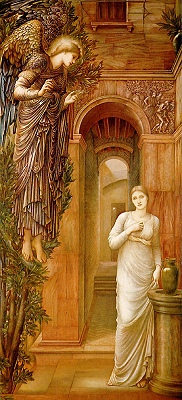

  
[Intangible Textual Heritage](../../index)  [Esoteric](../index.md) 

------------------------------------------------------------------------

<table width="75%">
<colgroup>
<col style="width: 50%" />
<col style="width: 50%" />
</colgroup>
<tbody>
<tr class="odd">
<td width="50%" data-valign="TOP"> 
The Anunciation, by Edward Burne-Jones [1876-9] (Public Domain Image)</td>
<td width="50%" data-valign="CENTER"><h1 id="cosmic-consciousness" data-align="CENTER">Cosmic Consciousness</h1>
<h2 id="by-richard-maurice-bucke" data-align="CENTER">by Richard Maurice Bucke</h2>
<h4 id="section" data-align="CENTER">[1901]</h4></td>
</tr>
</tbody>
</table>

------------------------------------------------------------------------

[Contents](#contents)    [Start Reading](cc00.md)    [Page
Index](pageidx)    [Text \[Zipped\]](cc.txt.gz.md)

------------------------------------------------------------------------

This is an attempted scientific study of illuminated individuals. Bucke
provides three dozen very consistent examples of 'cosmic consciousness.'
Some of these are the usual suspects, and others are contemporary
case-histories which Bucke collected. Bucke proposed that these
enlightened figures are evolutionary jumps, the precedecessor of a more
advanced species.

Production Notes: Cosmic Consciousness is laid out in a very advanced
fashion which made the creation of an etext of it complicated. Bucke
used three levels of type in this book so as to allow two level nested
comments. In the book, relationships between the two levels of comments
are often implicit based on their position on the page. In this etext
the blocks of the two kinds of comment text have been linearized and
cross-referenced using HTML links. The first level of comments are
displayed in indented blue type, and the second level of comments are
displayed in a more indented purple type. Blackletter
type is rendered using Lucida Blackletter if present on your
system.

------------------------------------------------------------------------

 [Title Page](cc00.md)  
[Dedication from the first edition](cc01.md)  
[Notice](cc02.md)  
[A List of Some of the Works Quoted and Referred to in This
Volume](cc03.md)  
[Table of Contents](cc04.md)  

### Part I.

[First Words](cc05.md)  

### Part II. Evolution and Devolution

[Chapter 1. To Self Consciousness](cc06.md)  
[Chapter 2. On the Plane of Self Consciousness](cc07.md)  
[Chapter 3. Devolution](cc08.md)  
[Part III. From Self to Cosmic Consciousness](cc09.md)  

### Part IV. Instances of Cosmic Consciousness

[Chapter 1. Gautama the Buddha](cc10.md)  
[Chapter 2. Jesus the Christ](cc11.md)  
[Chapter 3. Paul](cc12.md)  
[Chapter 4. Plotinus](cc13.md)  
[Chapter 5. Mohammed](cc14.md)  
[Chapter 6. Dante](cc15.md)  
[Chapter 7. Bartolomé Las Casas](cc16.md)  
[Chapter 8. John Yepes (Called St. John of the Cross)](cc17.md)  
[Chapter 9. Francis Bacon](cc18.md)  
[Chapter 10. Jacob Behmen](cc19.md)  
[Chapter 11. William Blake](cc20.md)  
[Chapter 12. Honoré de Balzac](cc21.md)  
[Chapter 13. Walt Whitman](cc22.md)  
[Chapter 14. Edward Carpenter](cc23.md)  

### Part V. Additional

[Chapter 1. The Twilight](cc24.md)  
[Chapter 2. Moses](cc25.md)  
[Chapter 3. Gideon, Surnamed Jerubbaal](cc26.md)  
[Chapter 4. Isaiah](cc27.md)  
[Chapter 5. The Case of Lî R](cc28.md)  
[Chapter 6. Socrates](cc29.md)  
[Chapter 7. Roger Bacon](cc30.md)  
[Chapter 8. Blaise Pascal](cc31.md)  
[Chapter 9. Benedict Spinoza](cc32.md)  
[Chapter 10. Colonel James Gardiner](cc33.md)  
[Chapter 11. Swedenborg](cc34.md)  
[Chapter 12. William Wordsworth](cc35.md)  
[Chapter 13. Charles G. Finney](cc36.md)  
[Chapter 14. Alexander Pushkin](cc37.md)  
[Chapter 15. Ralph Waldo Emerson](cc38.md)  
[Chapter 16. Alfred Tennyson](cc39.md)  
[Chapter 17. J. B. B.](cc40.md)  
[Chapter 18. Henry David Thoreau](cc41.md)  
[Chapter 19. J. B.](cc42.md)  
[Chapter 20. C. P.](cc43.md)  
[Chapter 21. The Case of H. B. in His Own Words](cc44.md)  
[Chapter 22. R. P. S.](cc45.md)  
[Chapter 23. E. T.](cc46.md)  
[Chapter 24. Case of Ramakrishna Paramahansa](cc47.md)  
[Chapter 25. Case of J. H. J.](cc48.md)  
[Chapter 26. T. S. R.](cc49.md)  
[Chapter 27. W. H. W.](cc50.md)  
[Chapter 28. Richard Jefferies](cc51.md)  
[Chapter 29. Case of C. M. C. in Her Own Words](cc52.md)  
[Chapter 30. The Case of M. C. L. in His Own Words](cc53.md)  
[Chapter 31. Case of J. W. W., Largely in His Own Words](cc54.md)  
[Chapter 32. Case of J. William Lloyd, in His Own Words](cc55.md)  
[Chapter 33. Horace Traubel](cc56.md)  
[Chapter 34. The Case of Paul Tyner, in His Own Words](cc57.md)  
[Chapter 35. The Case of C. Y. E., in Her Own Words](cc58.md)  
[Chapter 36. Case of A. J. S.](cc59.md)  
[Part VI. Last Words](cc60.md)  
