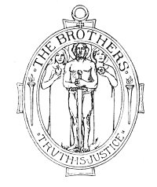
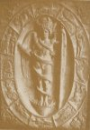

  
[Intangible Textual Heritage](../../index)  [Esoteric](../index) 
[Index](index)  [Next](cdg01) 

------------------------------------------------------------------------

[Buy this Book at
Amazon.com](https://www.amazon.com/exec/obidos/ASIN/1564592014/internetsacredte)

------------------------------------------------------------------------

*Comte de Gabalis* \[1913\], at Intangible Textual Heritage

------------------------------------------------------------------------

# COMTE DE GABALIS

###### BY THE

### ABBÉ N. DE MONTFAUCON DE VILLARS.

 

##### RENDERED OUT OF FRENCH INTO ENGLISH

##### WITH A

##### COMMENTARY.

"*When a thing is hidden away with so much pains, merely to repeal it is
to destroy it*." TERTULLIAN.

PUBLISHED BY THE BROTHERS,

 

*and printed at The Old Bourne Press,  
under the supervision of W. H. Broome*,  
15 *Holhorn, London, E.C.*

#### \[1913\]

Scanned at Intangible Textual Heritage, August-October 2006. Proofed and
formatted by John Bruno Hare. This text is in the public domain in the
United States because it was published prior to January 1st, 1923. These
files may be used for any non-commercial purpose, provided this notice
of attribution is left intact in all copies.

  [  
Click to enlarge](img/cover.jpg)  
Front Cover and Spine  

  [  
Click to enlarge](img/endp.jpg)  
End Papers  

  [  
Click to enlarge](img/title.jpg)  
Title Page  

 
[  
Click to enlarge](img/front.jpg)  
Frontispiece  

*This ancient monument of the Mysteries portrays the action of the Solar
Flame in and about the God-enlightened man. When governed and directed
upward this Flame becomes the instrument which the soul uses to build up
its deathless Solar or Spiritual Body*.

*Compare Note [XXXVI](cdg05.htm#fn_49), page [50](cdg05.htm#page_50)*.

p. vii

INVOCATION TO THE FLAME.

|                      |
|----------------------|
|  |

CALL UPON THEE, O LIVING GOD, RADIANT WITH ILLUMINATING FIRE. O UNSEEN
PARENT OF THE SUN! POUR FORTH THY LIGHT GIVING POWER AND ENERGISE THY
DIVINE SPARK. ENTER INTO THIS FLAME AND LET IT BE AGITATED BY THE
BREATHS OF THY HOLY SPIRIT. MANIFEST THY 11? POWER AND OPEN FOR ME THE
TEMPLE OF ALMIGHTY GOD WHICH IS WITHIN THIS FIRE! MANIFEST THY LIGHT FOR
MY REGENERATION, AND LET THE BREADTH, HEIGHT, FULLNESS AND CROWN OF THE
SOLAR RADIANCE APPEAR, AND MAY THE GOD WITHIN SHINE FORTH

 

 

 

 

 

 

 

 

p. viii

*WARNING*.

This book is for the student who seeks to illuminate his intelligence by
the Torch of his own divinity. Let him whose quest is the gratification
of a selfish intellectualism beware its pages, for this is a book of
hidden mystery and power. Therefore let the mind be pure that it may
invite the approach of the Pilgrim Soul and come into a new realisation
of God's Omnipotence and Justice.

  [  
Click to enlarge](img/_00800.jpg)  
*The Polish Rider, by courtesy of the Berlin Photographic Company,
London and New York*.  

"*A nobleman of high rank and a great Cabalist, whose lands lie towards
the frontiers of Poland*." PAGE [9](cdg04.htm#page_9).

PAINTED BY

Rembrandt,

1606 A.D.--1669 A.D.

------------------------------------------------------------------------

[Next: The Book](cdg01)
